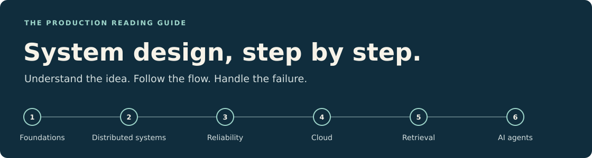
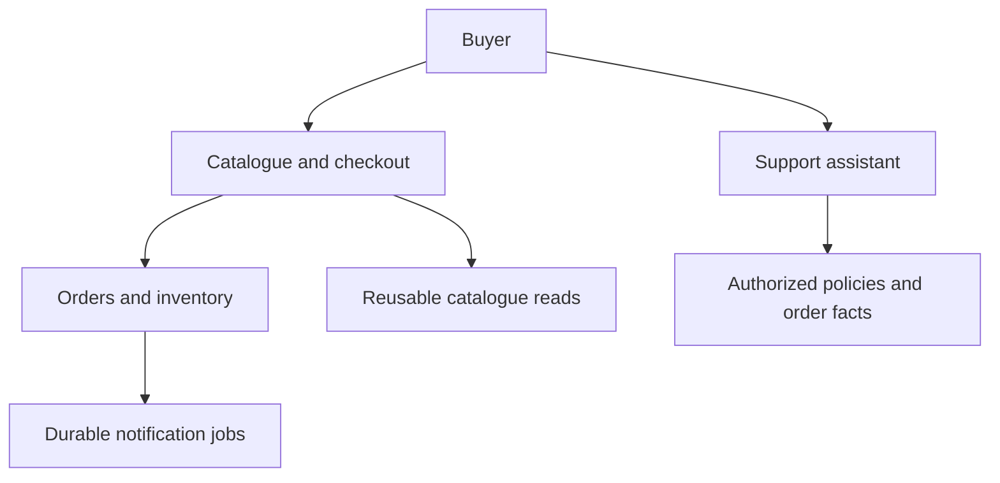

# System design, step by step

**26 weeks · 89 topics · simple explanations + production explanations**

Learn what happens behind a request, how a system grows, and how it stays correct when something fails. This is a reading guide with diagrams, concrete examples, and small exercises.

**[Start with the roadmap →](roadmap.md)** · **[Look up a term](glossary.md)** · **[Read the complete PDF](complete-guide.pdf)**

## Read in order

| Weeks | Chapter | What you will understand |
|---|---|---|
| 1–4 | [01 · Foundations](chapters/01-foundations.md) | How requests travel, data is stored, and programs use CPU and memory. |
| 5–10 | [02 · Core system design](chapters/02-core-system-design.md) | How to scale, coordinate copies of data, and process work reliably. |
| 11–16 | [03 · Reliability, security, and component design](chapters/03-reliability-security-and-lld.md) | How to contain failures, recover, investigate problems, and protect access. |
| 17–20 | [04 · Cloud and infrastructure](chapters/04-cloud-and-infrastructure.md) | How to run, store, and release systems with clear operational boundaries. |
| 21–23 | [05 · AI fundamentals and RAG](chapters/05-ai-fundamentals-and-rag.md) | How models generate text and retrieve useful, authorized evidence. |
| 24–26 | [06 · Agents and AI production systems](chapters/06-agents-and-ai-production.md) | How to control tools, memory, model traffic, quality, and cost. |
| After the chapters | [07 · Production walkthroughs and case studies](chapters/07-production-walkthroughs-and-case-studies.md) | How the concepts connect in checkout, document Q&A, and documented company systems. |

Keep the [glossary](glossary.md) nearby. Chapter contents and previous/next links let you move through the material without guessing where to go.

## How each lesson works

**Simple explanation** gives you the idea in familiar words. **Production explanation** covers the mechanism, trade-offs, and guarantees. **Production example** puts it into a realistic system. **Failure to handle** names a specific problem and response. **Try it** gives you a small exercise with an observable result.

Read the simple explanation first, follow the diagram where provided, then work through the production details. Move on when you can explain the choice and what happens when it fails.

## One example connects the chapters

**ShopStream** is a teaching marketplace. Buyers browse and order products; merchants manage stock; workers send notifications; a support assistant reads policies and authorized order data. A **tenant** is a separate merchant or organization whose private data must stay isolated.

The arrows show where requests and data go. The database owns business facts; cached descriptions and AI answers use those facts under their own freshness and permission rules.

The examples keep four requirements visible: stock stays nonnegative, retries preserve one effective charge, tenants remain isolated, and accepted durable work can be recovered. Exercise numbers are teaching assumptions to measure. Company case studies cite actual published engineering accounts.

## Read offline

- [Complete reading guide — PDF](complete-guide.pdf)
- [26-week roadmap — PDF](roadmap.pdf)

## Pace and background

Start with basic programming, Git, and SQL. Use a backend language you already know. **7–8 hours per week** supports reading and small experiments; deeper implementations can extend the schedule. In week 26, implement one AI design and review the other four on paper.

## Sources

This guide expands the [implementation curriculum](https://system-design-24-week.vercel.app/) inspected on 1 October 2026, with its [mental-model companion](https://system-design-12-week.vercel.app/). The source URL contains “24-week,” but the actual curriculum has 26 weeks and 89 topics. Technical references appear beside the relevant explanations; company case studies describe systems at their publication time.
