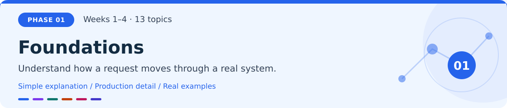
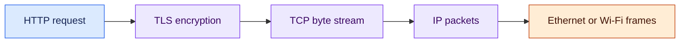
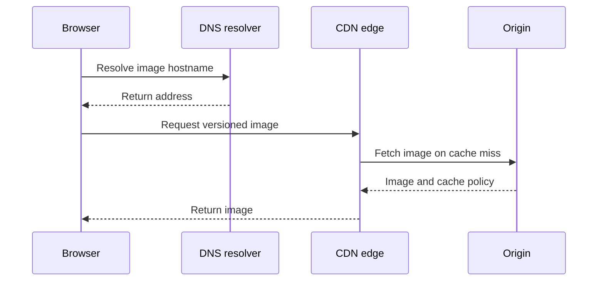
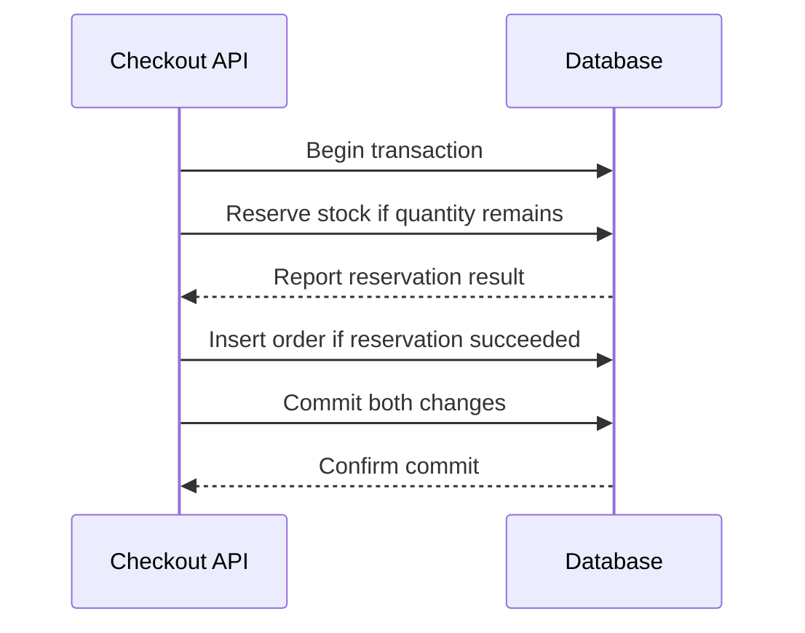
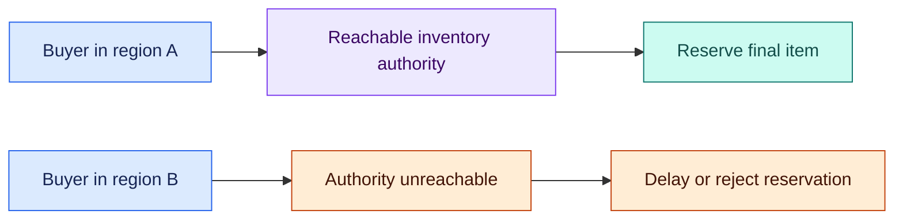

# Phase 1 · Foundations

**Weeks 1–4 · Topics 1–13**

[Roadmap](../roadmap.md) · [Glossary](../glossary.md) · [Next phase →](02-core-system-design.md)

A checkout request crosses networks, application code, operating-system resources, and a database. Learn what each part guarantees before distributing it across many machines.

**After this phase:** you can follow one request end to end, choose an API and datastore, protect an inventory update, and diagnose basic latency or resource failures.

> **Example context:** ShopStream is an illustrative marketplace used throughout this guide. Its scenarios describe realistic engineering decisions, not a claim about a particular company's infrastructure.

## In this chapter

| Network and APIs | Data and consistency | Operating systems |
|---|---|---|
| [1. OSI & TCP/IP model](#topic-1) | [6. Relational DBs (SQL)](#topic-6) | [11. Processes & threads](#topic-11) |
| [2. HTTP / HTTPS / HTTP2 / HTTP3](#topic-2) | [7. NoSQL DBs](#topic-7) | [12. Memory management](#topic-12) |
| [3. DNS & CDN](#topic-3) | [8. CAP theorem](#topic-8) | [13. I/O & file systems](#topic-13) |
| [4. WebSockets & SSE](#topic-4) | [9. ACID vs BASE](#topic-9) | |
| [5. REST vs GraphQL vs gRPC](#topic-5) | [10. Database indexing](#topic-10) | |

---

## 1. OSI & TCP/IP model

> [!NOTE]
> **Simple explanation**
>
> A network request is wrapped in several layers, like a letter placed inside addressed envelopes. HTTP describes the message your application understands. TCP moves an ordered stream of bytes. IP finds a route between networks. Ethernet or Wi-Fi carries data over the local connection. Separating those jobs helps you locate the cause of a failed request.

### 🟣 Production explanation

The OSI model names seven layers: physical, data link, network, transport, session, presentation, and application. TCP/IP uses four practical groups: link, internet, transport, and application. These models organize responsibilities; real implementations do not always fit neatly into every box.

TCP retransmits lost data, preserves byte order, and controls sending rate. It does not preserve application message boundaries, so an application protocol must identify complete messages. UDP sends individual datagrams without TCP's reliability guarantees; a protocol above UDP can add reliability. IP packets can follow changing routes. One HTTP request can span multiple packets, and many requests may share one connection. A successful TCP connection proves that a transport path exists, not that a checkout transaction completed or a database is healthy.

*Arrows show how an HTTPS-over-TCP message is wrapped for transmission. HTTP/3 uses QUIC over UDP instead of this TCP path.*

> [!TIP]
> **Production example**
>
> In ShopStream, a buyer sees checkout time out. The engineer first checks name resolution, then whether the destination and port are reachable, then TLS negotiation, then application logs and database timing. If a firewall blocks the port, changing an SQL index cannot help. If HTTP reaches the application but inventory queries stall, packet retransmission statistics alone do not explain the delay.

> [!WARNING]
> **Failure to handle**
>
> A service dashboard reports “API down” whenever a request fails, hiding the failing layer. Record separate DNS, connect, TLS, and application timings so responders can target the actual dependency.

### 🛠️ Try it

Use `curl -v` against an HTTPS endpoint and inspect connection establishment, TLS, and HTTP separately. Compare a valid URL, a nonexistent hostname, and an unreachable port. Expected result: three different failure stages, with a clear explanation of which stages never ran.

---

## 2. HTTP / HTTPS / HTTP2 / HTTP3

> [!NOTE]
> **Simple explanation**
>
> HTTP is the language browsers and APIs use to exchange requests and responses. HTTPS protects that exchange with encryption and checks the server's identity. HTTP/2 and HTTP/3 improve how many exchanges share a connection. They change transport behavior; your application still decides what an order means and whether it can safely be repeated.

### 🟣 Production explanation

HTTP carries methods, status codes, headers, and bodies. GET should be safe: requesting it should not intentionally change business state. Idempotency means repeating an operation has the same intended effect as applying it once; an arbitrary POST does not provide that automatically. Status codes and structured error bodies should distinguish invalid input, denied access, missing resources, and temporary failures.

HTTP/2 multiplexes streams over TCP. A lost TCP segment can stall delivery across those streams. HTTP/3 uses QUIC over UDP, with reliable streams and TLS integrated into QUIC; loss affecting one stream need not block unrelated streams. Neither protocol removes database bottlenecks. Reuse connections, propagate deadlines, and make application retries explicit. TLS protects traffic between connection endpoints; terminating TLS at a proxy creates another connection whose protection must be configured separately. [HTTP/2 specification](https://www.rfc-editor.org/info/rfc9113/), [HTTP/3 specification](https://www.rfc-editor.org/rfc/rfc9114.html).

> [!TIP]
> **Production example**
>
> ShopStream loads product data and several thumbnails. Multiplexing helps transfer these independent responses while connection reuse avoids repeated setup. Checkout has a different concern: a charge may succeed before the response disappears. A timeout therefore leaves the payment outcome unknown. The client retries with the same checkout idempotency key, and the server retrieves the original result rather than charging again.

> [!WARNING]
> **Failure to handle**
>
> Returning `200 OK` for every failure makes monitoring and retry behavior unreliable. Use meaningful HTTP status codes, preserve a request identifier, and ensure payment retries follow the business idempotency contract.

### 🛠️ Try it

Create a product endpoint that supports GET, validation errors, an ETag, and conditional reads. Repeat GET and send `If-None-Match`. Expected result: no data mutation, a `304` for unchanged content, and distinguishable status codes for invalid and missing resources.

---

## 3. DNS & CDN

> [!NOTE]
> **Simple explanation**
>
> DNS is the internet's lookup system: it helps turn a name such as `shop.example` into the records needed to reach a service. A CDN is a delivery network that keeps eligible content near users. DNS answers where to connect; a CDN can reduce how far a reusable image or file must travel.

### 🟣 Production explanation

A recursive DNS resolver uses cached records or follows referrals through root, top-level-domain, and authoritative servers. An authoritative server supplies the records for a domain. A record's TTL tells caches how long they may reuse it. Changing an authoritative record does not replace answers already cached elsewhere, and existing connections may continue using an earlier address.

A CDN serves content through edge locations and fetches uncached objects from an origin. Cache eligibility, cache keys, and freshness rules determine whether reuse is correct. Anycast lets multiple locations advertise the same address; network routing selects a reachable path, which is not guaranteed to be the geographically nearest location. DNS and CDN failures have different remedies: one can prevent discovery, while the other can cause origin overload or serve an outdated object. [DNS concepts](https://www.rfc-editor.org/info/rfc1034/).

*The browser resolves a destination first. The edge contacts the origin only when it needs an eligible object that it cannot already serve.*

> [!TIP]
> **Production example**
>
> ShopStream serves public product photos from versioned URLs through a CDN. An origin migration changes DNS, but some clients still reach the old deployment using cached answers or persistent connections. Engineers keep both origins usable through the transition and observe their traffic. Lowering the TTL ahead of migration helps only after previously cached, longer-lived records expire.

> [!WARNING]
> **Failure to handle**
>
> Turning off the old origin immediately after updating DNS breaks clients still using the previous destination. Plan an overlap period, monitor residual traffic, and ensure the old deployment remains compatible during cutover.

### 🛠️ Try it

Inspect a domain with `dig` and repeat the lookup to observe TTL behavior. Fetch a public versioned asset and inspect caching headers. Expected result: you can distinguish cached name resolution from cached content and explain why replacing either has a separate propagation window.

---

## 4. WebSockets & SSE

> [!NOTE]
> **Simple explanation**
>
> Ordinary HTTP usually pairs one request with one response. WebSockets keep a connection open so both sides can send messages. Server-sent events, or SSE, keep an HTTP response open so the server can send text events to the browser. Use SSE for one-way updates; consider WebSockets when both sides communicate frequently.

### 🟣 Production explanation

Choose a protocol from the direction and frequency of communication, browser support, infrastructure behavior, and recovery requirements. SSE clients can send actions through ordinary HTTP requests and receive updates through the stream. Event IDs and reconnect support are useful, but the server must retain events and implement replay if missed updates matter.

WebSockets offer bidirectional messages but do not automatically retain them or synchronize offline devices. Both designs need heartbeat or idle-timeout handling, connection limits, bounded outgoing buffers, and authentication checks. Long-lived connections can outlive a user's permission or token, so define renewal and revocation behavior. A slow recipient must not consume unlimited memory. Delivery through an active socket is different from durable acceptance: save important messages before acknowledging success and provide a history or cursor-based recovery path. [SSE implementation guidance](https://developer.mozilla.org/en-US/docs/Web/API/Server-sent_events/Using_server-sent_events).

> [!TIP]
> **Production example**
>
> ShopStream streams order-state changes to a buyer using SSE because the browser mostly receives updates. Buyer–seller chat uses WebSockets for frequent two-way messages. When a mobile device disconnects, chat messages remain in durable storage. On reconnect, the client requests messages after its last saved conversation cursor, deduplicates them, and then resumes live updates without treating the socket as the only source of truth.

> [!WARNING]
> **Failure to handle**
>
> A reconnecting client receives only new events and silently misses an order cancellation. Retain replayable events or return a current-state snapshot when the requested cursor is older than retained history.

### 🛠️ Try it

Build an SSE stream with sequential event IDs and a small retained history. Disconnect after event three, create two events, then reconnect with the last ID. Expected result: missed events reappear, duplicates are harmless, and an expired cursor triggers explicit resynchronization.

---

## 5. REST vs GraphQL vs gRPC

> [!NOTE]
> **Simple explanation**
>
> REST exposes resources such as products through HTTP endpoints. GraphQL lets a client ask for selected fields through a typed query schema. gRPC exposes typed remote operations and commonly encodes messages with Protocol Buffers. Each is a way to define an API contract. Choose one by the clients, access patterns, and operational needs.

### 🟣 Production explanation

REST benefits from familiar HTTP tools, cache semantics, and broad interoperability. GraphQL can reduce screen-specific overfetching, but a small-looking query may invoke many resolvers and expensive database work. Set complexity limits, paginate collections, and batch repeated lookups to avoid N+1 queries: one query for a list followed by another query for every item.

gRPC supports unary calls and streaming with generated clients. Its typed contract can help internal services, but schema evolution, browser integration, deadlines, and cancellations still require design. None of the approaches inherently solves tenant authorization, retries, or data consistency. Apply authorization where protected objects are accessed, propagate request deadlines, and preserve compatible behavior when fields or methods evolve. Select a protocol for a concrete boundary instead of adopting multiple protocols merely to appear sophisticated. [GraphQL performance](https://graphql.org/learn/performance/), [gRPC core concepts](https://grpc.io/docs/what-is-grpc/core-concepts/).

> [!TIP]
> **Production example**
>
> ShopStream provides merchants with a REST product API because external developers need straightforward tooling. A mobile catalogue screen could use GraphQL when it requires different combinations of product, review, and availability fields. An internal high-volume service could use gRPC if typed clients and streaming justify it. The production decision compares measured query work, compatibility, and maintenance effort rather than assuming one protocol wins everywhere.

> [!WARNING]
> **Failure to handle**
>
> Fetching twenty products triggers twenty extra review queries, saturating the database. Add per-request batching, inspect resolver query counts, and bound collection size and query complexity before exposing flexible queries to untrusted clients.

### 🛠️ Try it

Sketch one product lookup in all three API styles, then implement the style your client needs. Include pagination and tenant checks. Expected result: loading twenty products has a bounded query count and unauthorized field or object access fails consistently.

---

## 6. Relational DBs (SQL)

> [!NOTE]
> **Simple explanation**
>
> A relational database stores facts in tables and connects rows using keys. An order can reference a customer, while order lines reference products. Constraints prevent invalid relationships or duplicate identifiers. A transaction groups changes so they either commit together or roll back together. That grouping is essential when reserving stock and creating an order.

### 🟣 Production explanation

Normalization stores a fact once rather than maintaining contradictory copies; deliberate denormalization can make common reads cheaper. ACID describes atomic changes, preservation of declared invariants, isolation between concurrent transactions, and durability under the configured storage and failure model. Those guarantees depend on schema design, transaction boundaries, and isolation settings.

A read of stock followed by an unrelated write can race with another checkout. Use a conditional update, appropriate row locking, or a suitable isolation strategy, and check whether the reservation actually succeeded. Keep the order insert in the same transaction. Isolation levels permit different concurrent behaviors; higher isolation can require retries of whole transactions. An external payment provider remains outside the local database transaction, so record workflow state and coordinate separately. Store purchase-time prices on order lines to preserve historical truth. [PostgreSQL transaction isolation](https://www.postgresql.org/docs/current/transaction-iso.html).

*Both database changes share one transaction. Payment coordination happens separately; a database commit does not claim that a card has been charged.*

> [!TIP]
> **Production example**
>
> ShopStream has one camera left. Two buyers checkout concurrently. A conditional inventory update succeeds for one buyer, while the other receives an out-of-stock result. The winning transaction also creates the pending order. If inserting the order fails, the stock change rolls back. Payment processing starts from the saved order state, using a stable key so a network retry cannot create another effective charge.

> [!WARNING]
> **Failure to handle**
>
> Two handlers read stock as one and both create an order. Enforce the stock invariant in the database transaction, check affected-row counts, and retry only failures that the chosen isolation strategy permits.

### 🛠️ Try it

Create orders and inventory tables with foreign keys, unique request keys, and nonnegative stock constraints. Send simultaneous requests for the final item. Expected result: one reservation succeeds, inventory never becomes negative, and failed transactions leave no partial order.

---

## 7. NoSQL DBs

> [!NOTE]
> **Simple explanation**
>
> NoSQL describes several database families rather than one kind of database. Document stores keep structured documents. Key-value stores retrieve an item by its key. Wide-column stores organize records for partition-based access. Start with the questions your application must answer, then choose a model that serves those questions without scanning everything.

### 🟣 Production explanation

Model access patterns, write volume, item size, partition distribution, consistency needs, and transaction boundaries before choosing a product. A document may naturally hold variable product attributes, but frequently updated duplicated facts can become inconsistent. A partition key routes related data together; an overloaded key can concentrate more traffic than one partition can serve. Secondary indexes support other queries while adding write and storage costs.

NoSQL does not mean “no transactions” or “always stale.” Guarantees vary by product and operation. DynamoDB distinguishes eventually consistent and strongly consistent reads; support depends on the resource and query path. Understand those boundaries instead of applying one label to every read. Plan schema evolution even in a flexible document model, and reject incompatible or oversized records before they disrupt consumers. Financial invariants may remain simpler in a relational model. [DynamoDB read consistency](https://docs.aws.amazon.com/amazondynamodb/latest/developerguide/HowItWorks.ReadConsistency.html).

> [!TIP]
> **Production example**
>
> ShopStream sells books, shoes, and electronics with different attributes. A document model makes those product details easy to represent. Activity history might instead use user-keyed, time-bucketed partitions for efficient recent-event queries. Orders still need carefully enforced financial and inventory rules. When one merchant becomes exceptionally popular, engineers review its partition traffic instead of assuming a large cluster guarantees even load.

> [!WARNING]
> **Failure to handle**
>
> Every activity event uses the same merchant as its partition key, creating a hotspot. Measure traffic per key, introduce bounded buckets where access patterns permit, and account for the extra queries needed to merge results.

### 🛠️ Try it

Write five required queries before designing a datastore schema. Map each to a key or index, then simulate a tenant generating most traffic. Expected result: queries avoid full scans, and the partition model exposes or controls concentration on that tenant.

---

## 8. CAP theorem

> [!NOTE]
> **Simple explanation**
>
> Imagine two copies of an inventory database that cannot communicate. If both accept sales of the same final item, they may disagree. If one refuses sales until it can contact the authority, some requests cannot complete. CAP explains this conflict between one-copy consistency and availability when the network separates parts of a distributed system.

### 🟣 Production explanation

CAP's consistency means linearizability: completed operations appear to act on one current copy in an order consistent with their real-time relationships. Availability means requests reaching nonfailed nodes eventually complete in the theorem's sense. These definitions differ from SQL constraint consistency and a monthly uptime percentage.

A partition is communication that is lost or indefinitely delayed between components. During that partition, a system cannot guarantee both properties for the same operations. “Always pick two of three” hides the essential condition and encourages vague product labels. Define behavior per operation and failure boundary. Inventory reservations may require one reachable authority, while product descriptions can tolerate stale regional reads. Outside partitions, coordination still creates latency and availability costs; CAP is not a complete performance model or a prescription for every database decision. [Gilbert and Lynch's CAP paper](https://groups.csail.mit.edu/tds/papers/Gilbert/Brewer2.pdf).

*The two paths show one policy during a partition: only the side that can reach the authority reserves inventory. Availability is reduced for the other buyer.*

> [!TIP]
> **Production example**
>
> ShopStream has one item whose stock authority is in region A. Region B loses connectivity to it. Buyers in B can still browse a replicated product description, but checkout reports that reservation is temporarily unavailable. This policy prevents both regions from independently selling the item. Once communication returns, authoritative state becomes reachable again; the system does not infer that rejected reservations secretly succeeded.

> [!WARNING]
> **Failure to handle**
>
> Calling the whole application “AP” masks a checkout path that accepts conflicting reservations. Specify the exact read and write behavior under partition, and require a reconciliation rule wherever independent writes remain allowed.

### 🛠️ Try it

Draw two regions and one remaining item, then remove their connection. Write the response for browsing and reservation in each region. Expected result: every operation has explicit semantics, and you can identify which CAP guarantee its partition policy relaxes.

---

## 9. ACID vs BASE

> [!NOTE]
> **Simple explanation**
>
> ACID helps keep a group of local database changes correct together. BASE describes a broad approach where distributed views can lag and eventually converge. A confirmed order can be immediately correct in its database while a sales dashboard catches up later. These approaches often coexist because different parts of an application need different freshness guarantees.

### 🟣 Production explanation

ACID covers transaction atomicity, declared invariants, concurrency isolation, and durability. BASE stands for basically available, soft state, and eventually consistent; it is a general design description rather than a precise competing transaction specification. Do not assume that choosing one label determines every guarantee of a system.

Separate authoritative facts from derived views. An order record may be authoritative, while search indexes and sales summaries are rebuilt from it. Eventual convergence requires durable propagation, retry, ordering or version rules, conflict handling, and idempotent consumers. “Eventually” without a recovery mechanism is wishful thinking. Define acceptable lag and what readers see while behind. A database commit followed by an unrelated broker publish leaves a crash gap; store an outbox event with the business change or use an equivalent reliable change-capture mechanism. [PostgreSQL transaction introduction](https://www.postgresql.org/docs/current/tutorial-transactions.html).

> [!TIP]
> **Production example**
>
> ShopStream commits the order and stock reservation together, so the buyer immediately sees the confirmed local business state. The search index and merchant sales dashboard update through asynchronous events. If analytics pauses, checkout remains correct while the dashboard shows a freshness indicator. After recovery, consumers replay pending events and deduplicate by event ID, so processing an event twice does not count the sale twice.

> [!WARNING]
> **Failure to handle**
>
> The order commits, but the process crashes before publishing its event, leaving analytics permanently behind. Commit an outbox entry with the order and monitor both publication progress and consumer lag.

### 🛠️ Try it

Create an order table and asynchronously updated sales summary. Pause the consumer, create orders, resume it, and replay an event. Expected result: orders stay visible during the pause, the summary converges, and duplicates leave totals unchanged.

---

## 10. Database indexing

> [!NOTE]
> **Simple explanation**
>
> An index is an extra data structure that helps a database find matching rows without examining every row. It resembles a book's index: useful for some questions, useless for others. Indexes speed selected reads but consume space and require maintenance whenever relevant data changes. Choose them for actual queries, not every column.

### 🟣 Production explanation

B-tree indexes support many equality, range, and ordered queries. Hash indexes primarily target equality. A composite index stores several columns together, so column order and query shape matter. An equality filter followed by sort or range columns often forms a useful starting point, but planner capabilities and data distribution affect the result.

A covering index can supply required fields with fewer table accesses, although extra columns increase size and write overhead. Low-selectivity filters may match enough rows that a table scan is cheaper. Use representative datasets and inspect actual execution plans, scanned rows, sort work, and elapsed time. For pagination, order by a stable unique tie-breaker as well as timestamp. An index improves access; it does not supply authorization or eliminate lock contention. Track regressions as data grows and tenant distributions change. [PostgreSQL multicolumn indexes](https://www.postgresql.org/docs/current/indexes-multicolumn.html).

> [!TIP]
> **Production example**
>
> ShopStream's merchant page asks for the latest fifty orders belonging to one tenant. An index on `(tenant_id, created_at DESC, id DESC)` can support filtering and stable keyset pagination. A lone index on `status` contributes little when almost every order has the same status. Engineers compare plans using realistic tenant sizes and measure write overhead before retaining extra indexes.

> [!WARNING]
> **Failure to handle**
>
> A query performs a large scan and sort even though several indexes exist. Examine the complete filter and ordering requirements, correct the relevant index or query, and verify improvement with an actual execution plan.

### 🛠️ Try it

Load 100,000 synthetic orders with uneven tenant sizes and repeated timestamps. Run `EXPLAIN ANALYZE` before and after adding a composite index. Expected result: reduced scanned work and sorting for the target query, stable pagination, and a measurable indexing cost on inserts.

---

## 11. Processes & threads

> [!NOTE]
> **Simple explanation**
>
> A process is a running program with its own memory space. Threads are execution paths inside a process and usually share its memory. Concurrency means tasks make progress during overlapping time; parallelism means tasks execute simultaneously. An application waiting on network I/O has different scaling needs from one using every CPU core to resize images.

### 🟣 Production explanation

Shared memory makes thread communication convenient and creates races when multiple threads modify the same state. Use synchronization suitable for the runtime, while avoiding long lock-held work. Processes provide stronger memory separation but require explicit communication. Language runtimes differ in how threads execute and how garbage collection or interpreter locks affect parallel work.

Async I/O lets a process handle many waiting connections without assigning a thread to each one. CPU-heavy work still occupies a processor and can block an event loop, so move it to a bounded worker pool or separate worker service. Bound thread counts, queued jobs, database connections, and open descriptors together. Adding concurrency beyond a shared resource's capacity increases waiting rather than useful throughput. An in-memory counter protects only one process unless a shared authority coordinates all replicas. [Linux POSIX threads](https://man7.org/linux/man-pages/man7/pthreads.7.html).

> [!TIP]
> **Production example**
>
> ShopStream's API mostly waits for database and network responses, while thumbnail generation performs CPU-heavy transformations. Running those transformations on the API event loop delays unrelated catalogue requests. A separate worker pool gives image work a concurrency limit. The API stores accepted jobs durably and returns without waiting for every image, keeping checkout capacity independent of a merchant's large media upload.

> [!WARNING]
> **Failure to handle**
>
> An unbounded worker pool creates hundreds of database connections and exhausts memory. Set limits around the constrained resource, expose queue wait time, and reject or defer excess work before the process becomes unstable.

### 🛠️ Try it

Mix fast API calls with CPU-heavy image jobs, then move image work into a bounded pool. Expected result: fast-request tail latency improves while worker utilization stays bounded. Also reproduce a shared-counter race and correct it with appropriate synchronization.

---

## 12. Memory management

> [!NOTE]
> **Simple explanation**
>
> A program needs memory for active work and retained data. The stack commonly holds call frames; the heap holds dynamically allocated objects. Managed runtimes can reclaim unreachable objects through garbage collection, but objects still referenced remain alive. A cache, upload buffer, or outgoing message queue can therefore grow until the process runs out of memory.

### 🟣 Production explanation

Virtual memory maps a process's addresses to physical pages and backing storage. Page faults occur when required mappings or pages need work before access can continue. Garbage collection reduces manual cleanup responsibilities, but retained references still leak effective capacity and collection may introduce pauses.

Measure resident memory, heap usage, allocation rate, retained objects, and pause duration rather than relying on one number. Operating-system page cache is often useful consumption, not proof of an application leak. Memory limits constrain the combined runtime, buffers, libraries, and application data. Streaming bounds the data held per request, while concurrency limits bound how many requests hold it at once. Backpressure makes producers slow down when consumers cannot keep up. Eviction, maximum object sizes, and timeout cleanup keep optional state from displacing essential request processing. [Linux memory mapping](https://man7.org/linux/man-pages/man2/mmap.2.html).

> [!TIP]
> **Production example**
>
> ShopStream buffers each 200 MB upload in memory. Twenty simultaneous uploads require about 4 GB for file contents alone, before normal application overhead. Streaming uploads through bounded buffers changes memory growth to depend mainly on buffer size and concurrency. A semaphore limits active transfers, and queued clients receive an explicit wait or rejection instead of causing unpredictable process termination.

> [!WARNING]
> **Failure to handle**
>
> A disconnected client's outgoing chat buffer keeps accumulating messages. Bound the buffer, close overly slow connections, and require clients to recover durable messages through offline synchronization instead of retaining unlimited per-connection state.

### 🛠️ Try it

Process the same large synthetic file with buffering and streaming, recording peak resident memory under concurrent uploads. Expected result: streamed memory remains tied to bounded buffers, and an explicit concurrency limit causes predictable throttling before the process exceeds its memory allowance.

---

## 13. I/O & file systems

> [!NOTE]
> **Simple explanation**
>
> I/O moves data between your program and networks or storage. A successful write call does not always mean bytes are durable on disk. Block storage resembles a disk, file storage exposes directories and files, and object storage exposes named objects through an API. Choose the interface and durability policy for the data being stored.

### 🟣 Production explanation

Storage performance depends on sequential versus random access, request sizes, concurrency, and durability requirements. HDDs incur seek costs; SSDs reduce many random-access costs but still have finite throughput and latency. Buffered writes may reach the operating-system page cache before durable storage. Flush behavior, database logging, and the underlying storage contract determine what an acknowledged write survives.

Block volumes can host database files; shared file storage offers filesystem access; object storage fits keyed assets accessed through its API. Object storage is not automatically a substitute for a database's small in-place writes. A container's writable layer should not be the only copy of durable business data. Uploading an object and committing its metadata are usually separate operations, so use a recoverable workflow with checksums, completion state, and reconciliation for objects or records left incomplete. [Linux `fsync` semantics](https://man7.org/linux/man-pages/man2/fsync.2.html).

> [!TIP]
> **Production example**
>
> ShopStream puts product images in object storage and image metadata in SQL. The upload workflow assigns a key, streams bytes, verifies the checksum, then marks the database record ready. If metadata persistence fails after upload, a reconciliation job identifies the unreferenced object. If the API restarts, ready images remain retrievable because storage is independent of the application's temporary filesystem.

> [!WARNING]
> **Failure to handle**
>
> A container restart deletes uploads stored only inside its writable layer. Use persistent storage appropriate to the data, validate recovery after restarts, and remove temporary files only after the durable upload workflow has completed.

### 🛠️ Try it

Implement a streamed upload with an object key, checksum, and metadata state. Restart the application and interrupt the workflow after object creation. Expected result: completed assets remain readable, while incomplete records or orphaned objects are recovered or cleaned up explicitly.

---

## Check your understanding

- A checkout request timed out. Which observations distinguish network failure from an unknown payment outcome?
- Why can a database transaction protect inventory without making an external payment atomic?
- Which data can ShopStream serve stale, and which operations must reach an authority?
- Why do indexes, more threads, and larger caches each introduce a cost?
- How does a disconnected client recover durable updates without trusting a live connection?

[← Roadmap](../roadmap.md) · [Glossary](../glossary.md) · [Continue to core system design →](02-core-system-design.md)
