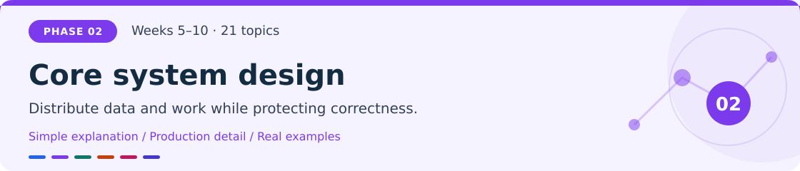
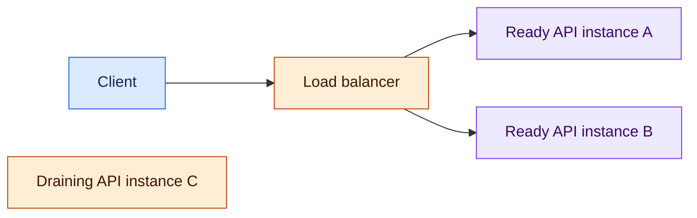
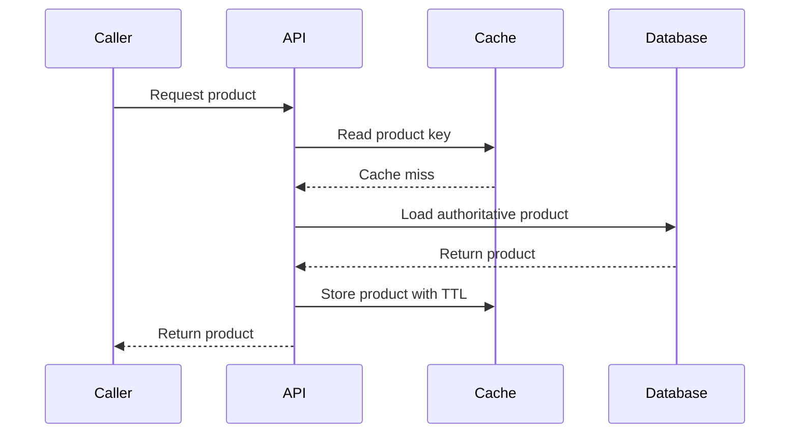
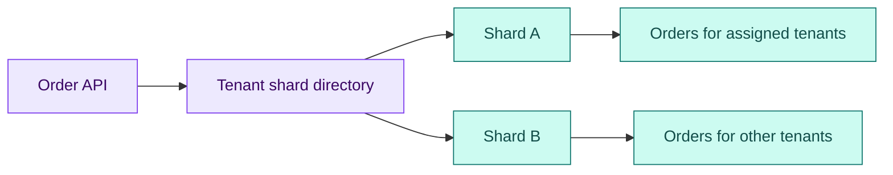
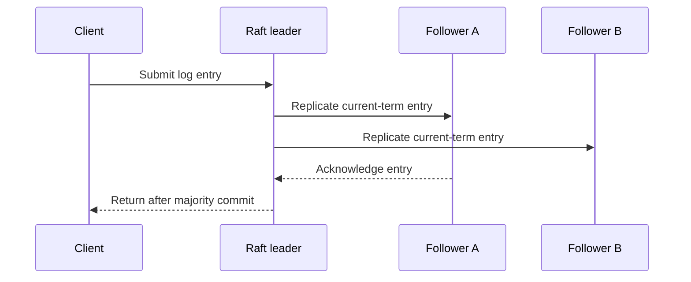
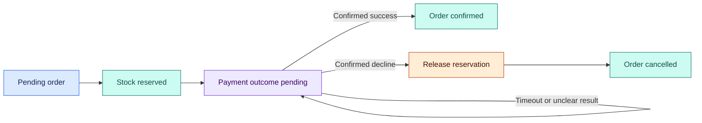
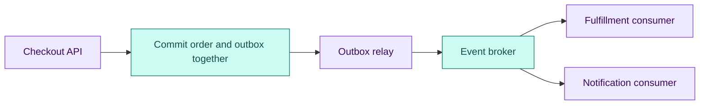
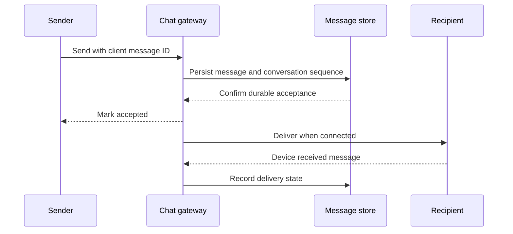

# Phase 2 · Core system design

**Weeks 5–10 · Topics 14–34**

[Roadmap](../roadmap.md) · [Glossary](../glossary.md) · [← Previous phase](01-foundations.md) · [Next phase →](03-reliability-security-and-lld.md)

Capacity is useful only when the system still produces correct results. Scale the component that is actually constrained, then design the communication, recovery, and ownership rules introduced by each new boundary.

**After this phase:** you can explain a scaled application's data paths, design safe retries and asynchronous workflows, and defend a URL shortener, social feed, or messaging architecture under failures.

> **Example context:** ShopStream is an illustrative marketplace. Named-app design exercises teach common architectural problems; they do not reconstruct those companies' private or current infrastructure. All numerical workloads are teaching assumptions.

## In this chapter

| Capacity and placement | Coordination and events | Estimation and designs |
|---|---|---|
| [14. Horizontal vs vertical scaling](#topic-14) | [21. Replication](#topic-21) | [28. Stream processing](#topic-28) |
| [15. Load balancers](#topic-15) | [22. Consensus (Raft / Paxos)](#topic-22) | [29. System estimation](#topic-29) |
| [16. Caching strategies](#topic-16) | [23. Distributed transactions](#topic-23) | [30. Component design](#topic-30) |
| [17. CDN architecture](#topic-17) | [24. Clock & ordering](#topic-24) | [31. Microservices patterns](#topic-31) |
| [18. Database sharding](#topic-18) | [25. Message queues](#topic-25) | [32. Design a URL shortener](#topic-32) |
| [19. Read replicas](#topic-19) | [26. Event-driven architecture](#topic-26) | [33. Design Instagram/Twitter](#topic-33) |
| [20. Consistent hashing](#topic-20) | [27. Exactly-once delivery](#topic-27) | [34. Design WhatsApp](#topic-34) |

---

## 14. Horizontal vs vertical scaling

> [!NOTE]
> **Simple explanation**
>
> Vertical scaling gives one machine more capacity, such as extra CPU or memory. Horizontal scaling adds more machines and shares the work. A larger kitchen resembles vertical scaling; opening more kitchens resembles horizontal scaling. Both help only when they expand the resource limiting output. More API machines cannot fix a database already at its limit.

### 🟣 Production explanation

Measure throughput, latency, utilization, and resource waits before selecting a scaling action. Vertical scaling avoids some distributed coordination, but reaches hardware limits and leaves a large failure unit. Horizontal scaling increases aggregate capacity and can reduce the impact of one instance failure, while introducing load distribution, shared-state management, and deployment coordination.

Stateless handlers are easier to replicate because durable sessions and business data live outside an individual process. Bound each instance's connection pool so additional replicas do not overwhelm a shared database. Scale CPU-heavy workers independently of request handlers. Autoscaling reacts after a signal rises and provisioning takes time, so spare capacity, minimum replicas, and admission controls still matter. Evaluate capacity when an instance or zone is unavailable, not only when every machine is healthy. [AWS reliability design principles](https://docs.aws.amazon.com/wellarchitected/latest/framework/rel-dp.html).

> [!TIP]
> **Production example**
>
> ShopStream first finds that thumbnail jobs consume the API machine's CPU. Moving that work to separately scaled workers improves checkout latency. Later, catalogue queries saturate database I/O, so an index and selective caching produce more benefit than another API replica. The team repeats measurement after each change because removing one bottleneck reveals the next rather than guaranteeing unlimited capacity.

> [!WARNING]
> **Failure to handle**
>
> Autoscaling doubles API replicas, and their combined connection pools exhaust the database. Set a global connection budget, bound per-instance pools, and monitor connection wait before using API replica count as the only response to overload.

### 🛠️ Try it

Load-test one and two API instances with the same catalogue-and-checkout mix. Record throughput, p95 latency, CPU, and database connection waits. Expected result: you identify the actual limiting resource and explain why observed capacity may grow by less than two times.

---

## 15. Load balancers

> [!NOTE]
> **Simple explanation**
>
> A load balancer is a traffic distributor in front of multiple application instances. It sends requests to backends that can serve them and stops using unhealthy ones. A useful distributor also handles what happens during deployment: an instance should finish accepted work before shutting down, while new requests go to the remaining instances.

### 🟣 Production explanation

Layer 4 balancing uses transport information; layer 7 balancing understands application requests and can route by host, path, or selected headers. Round-robin rotates targets, least-connections considers active connections, and hashing can preserve affinity. These strategies differ under uneven request duration and long-lived connections, so choose from measured traffic behavior.

Liveness asks whether a process should be restarted; readiness asks whether it can currently receive traffic. Keep checks useful without making every transient dependency blip trigger a fleet-wide restart. Connection draining removes a backend from new traffic and gives accepted requests time to finish. Align client, proxy, and backend deadlines, and define which requests may be retried. Sticky sessions can simplify state placement but concentrate load and complicate failover. Durable sessions should survive losing one process. [NGINX load balancing](https://nginx.org/en/docs/http/load_balancing.html).

*Arrows show new requests going only to ready instances. The draining instance finishes existing work but receives no new request in this example.*

> [!TIP]
> **Production example**
>
> ShopStream runs three API instances behind a proxy. During a release, one instance becomes unready, stops taking new traffic, completes in-flight checkouts, and exits. Chat clients reconnect when a gateway drains, then recover missed messages from durable storage. A readiness probe checks the application's ability to serve its intended route rather than reporting healthy merely because a process exists.

> [!WARNING]
> **Failure to handle**
>
> The proxy retries a timed-out order POST on another backend and creates a duplicate order. Require application idempotency before retrying mutations, and restrict automatic proxy retries to operations whose contracts make repetition safe.

### 🛠️ Try it

Place two local API processes behind a reverse proxy. Remove one from readiness, then terminate it while sending requests. Expected result: new traffic uses the remaining backend, accepted work drains within a bound, and any retried checkout preserves one business outcome.

---

## 16. Caching strategies

> [!NOTE]
> **Simple explanation**
>
> A cache keeps a reusable copy of data so callers do not repeat expensive work. In cache-aside, the application checks the cache, reads the database on a miss, and stores the result. The database remains authoritative. Caching makes selected reads cheaper, but a saved answer can become stale and many simultaneous misses can overload the original source.

### 🟣 Production explanation

Choose the cached object, key, freshness contract, maximum size, and miss policy together. Cache-aside loads on demand; write-through updates through a synchronous write path; write-behind defers persistence and requires stronger recovery guarantees. A TTL controls time-based retention, while eviction policies reclaim space under memory pressure. Neither prevents every invalidation race.

Use TTL jitter to avoid simultaneous expiration, coalesce concurrent misses for the same key, and bound database work when the cache is cold or unavailable. Stale-while-refresh can help where stale answers are explicitly acceptable. Include tenant and visibility context in cache keys where data differs by caller. Decide whether updates invalidate, version, or refresh entries, and analyze a read racing with a write. A high hit rate can coexist with dangerous stale reads or one overloaded hot key. [Redis eviction policies](https://redis.io/docs/latest/develop/reference/eviction/).

*The arrows show a cache-aside miss. A valid cache hit skips the database steps; stock reservation still uses the authoritative inventory path.*

> [!TIP]
> **Production example**
>
> ShopStream caches public product descriptions but checks current inventory inside the checkout transaction. A flash sale makes many product keys expire together. Jitter spreads refresh times, and a single-flight mechanism lets concurrent callers share one load per key. A database concurrency limit prevents cache loss from turning into database collapse; optional stale descriptions remain distinguishable from authoritative purchase decisions.

> [!WARNING]
> **Failure to handle**
>
> A private merchant response is cached under only its URL and later served to another tenant. Include the required isolation context in keys or avoid shared caching for that response, then verify cross-tenant reads.

### 🛠️ Try it

Implement cache-aside with bounded TTL, jitter, and coalesced misses. Flush the cache during a load test. Expected result: hit rate falls temporarily, database concurrency remains bounded, and checkout inventory decisions stay correct despite missing or stale cached descriptions.

---

## 17. CDN architecture

> [!NOTE]
> **Simple explanation**
>
> A CDN distributes delivery through edge locations between users and an origin server. An edge can serve a reusable object immediately or fetch it from the origin when needed. The architecture works well for public photos and static assets. Personalized data needs stricter rules because sharing the wrong cached response can expose someone else's information.

### 🟣 Production explanation

An edge cache combines request routing, a cache key, eligibility checks, freshness handling, and origin fetching. An optional shielding tier consolidates misses before they reach the origin. Configure which URL parts, headers, or other dimensions distinguish responses; adding too many dimensions lowers reuse, while omitting a necessary one can corrupt or leak results.

HTTP `Cache-Control` communicates caching policy, ETags support validation, and `Vary` identifies relevant request-header differences. Policy enforcement depends on the intermediary's actual configuration. Fingerprinted asset URLs let updated content use a new address while old immutable assets remain cacheable. Purges do not automatically remove copies already stored in browsers, so define a separate strategy for revocation-sensitive data. Monitor hit ratios, origin request rates, error rates, and bandwidth; edge presence alone does not prove useful caching. [HTTP caching specification](https://www.rfc-editor.org/rfc/rfc9111.html).

> [!TIP]
> **Production example**
>
> ShopStream publishes `product-photo.<content-hash>.webp` with a long-lived immutable caching policy. An edited photo gets a new URL, so clients do not need a global purge to discover the replacement. Private invoices follow an authenticated download path with an appropriate cache policy. The team tests edge behavior directly because a correct origin permission check cannot repair an unsafe cache key.

> [!WARNING]
> **Failure to handle**
>
> An authenticated invoice response is reused from a shared cache for a different buyer. Disable unsafe shared reuse or isolate it correctly, then test both authorized and unauthorized requests against the edge rather than only the origin.

### 🛠️ Try it

Publish two image versions under different content-based URLs and inspect response headers. Add a private download route and try it as two tenants. Expected result: public assets reuse safely, updated assets use the new URL, and private responses never cross tenant boundaries.

---

## 18. Database sharding

> [!NOTE]
> **Simple explanation**
>
> Sharding divides a dataset across independently operated database partitions. A routing rule decides which shard owns each record. Keeping a merchant's orders together can make local queries easy, but a very large merchant may overload one shard. Sharding expands possible capacity while making moves, cross-shard questions, and recovery more complicated.

### 🟣 Production explanation

Choose a shard key from workload distribution, transaction locality, growth, and query patterns. Hash-based assignment can spread keys; range-based assignment supports locality but risks concentrated writes. A routing directory can make placement explicit and allow exceptional tenants to move independently. Cross-shard joins, global uniqueness, and transactions require additional coordination or redesigned access patterns.

Sharding is different from table partitioning inside one PostgreSQL server: local partitions do not alone distribute work across independent machines. Plan migration before the first shard fills. A move needs a copy or replay phase, a verified consistency point, and a cutover policy that prevents two active writers or stale routing. Backups, schema changes, and restore drills must cover every shard. Global analytics often belongs in a separate pipeline instead of scanning all production shards for each dashboard request. [PostgreSQL table partitioning](https://www.postgresql.org/docs/current/ddl-partitioning.html).

*The directory chooses one owning shard for a tenant. The two storage paths are alternatives, not a broadcast write to both shards.*

> [!TIP]
> **Production example**
>
> ShopStream first exhausts a measured single-database capacity limit, then groups ordinary tenants across two shards. An unusually large merchant receives dedicated placement. During a tenant move, writes either pause briefly at cutover or follow a controlled single-writer protocol while changes replay. The routing entry changes only after the target reaches the agreed consistency point and ownership is unambiguous.

> [!WARNING]
> **Failure to handle**
>
> Old and new shards both accept writes during migration, creating conflicting order histories. Use an explicit ownership version or equivalent cutover authority, reject stale routes, and verify the target before enabling its writes.

### 🛠️ Try it

Route synthetic tenants across two database instances through a directory. Move one tenant with a documented cutover policy. Expected result: every order remains findable, exactly one shard accepts writes for that tenant, and a stale routing attempt is handled explicitly.

---

## 19. Read replicas

> [!NOTE]
> **Simple explanation**
>
> A read replica keeps a copy of a database's changes and can answer some read requests. The leader usually accepts writes, while replicas replay them. This spreads read load, but a replica can lag. A customer who just created an order may therefore need a read from the leader to see it immediately.

### 🟣 Production explanation

Asynchronous replication allows the leader to acknowledge without waiting for every follower, creating a freshness and potential failover-loss window. Synchronous modes wait for configured acknowledgement conditions and add latency or availability dependencies. “Synchronous” alone does not specify whether a follower merely received, durably stored, or applied a change; inspect the configured guarantee.

Route freshness-sensitive reads to the leader, or use a recorded consistency point and wait for a replica to catch up where supported. Monitor replay lag and follower health rather than assuming distance-based routing is safe. A failover policy must account for the candidate's state and prevent two writers. Replicas do not increase leader write throughput, and they are not independent historical backups: accidental deletion or corrupted business changes may propagate to every replica. [PostgreSQL standby and replication](https://www.postgresql.org/docs/current/warm-standby.html).

> [!TIP]
> **Production example**
>
> ShopStream routes catalogue browsing to read replicas because a short delay in product descriptions is acceptable. After checkout, the buyer's order page reads the leader until the required write is visible elsewhere. Without that rule, a lagging replica returns “order not found,” leading the buyer to repeat checkout. Operational dashboards expose lag so on-call engineers can distinguish a stale read from lost order data.

> [!WARNING]
> **Failure to handle**
>
> A replica is promoted without checking replay progress, and recent acknowledged orders disappear under an asynchronous mode. Define the acceptable loss window, select candidates using observed replication state, and reconcile affected operations after failover.

### 🛠️ Try it

Set up a follower or simulate delayed replication. Create an order and compare leader and replica reads before and after replay. Expected result: lag is observable, read-after-write handling returns the order immediately, and the failover policy states what writes it might lose.

---

## 20. Consistent hashing

> [!NOTE]
> **Simple explanation**
>
> Consistent hashing assigns keys to servers through a stable hash space, often drawn as a ring. Adding a server changes ownership for only part of the keys instead of remapping nearly everything. This reduces reshuffling during growth. It does not guarantee even traffic, because one popular key can attract most requests regardless of placement.

### 🟣 Production explanation

Hash node identifiers and data keys into the same space, then use a defined placement rule such as the next node clockwise. Virtual nodes give a physical server several positions, improving distribution and representing different capacities. Simple modulo assignment, `hash(key) % node_count`, often remaps many keys when the count changes.

Ownership changes still require migration or a cache refill; consistent hashing reduces movement rather than eliminating it. A replication policy must choose distinct physical nodes and, where required, distinct failure domains. Adjacent virtual positions can belong to the same machine, so selecting positions blindly can create fake redundancy. During membership changes, specify how requests find old and new owners and when writes become authoritative. Measure request volume and bytes per node as well as key count. [Amazon's original Dynamo paper](https://www.allthingsdistributed.com/files/amazon-dynamo-sosp2007.pdf).

> [!TIP]
> **Production example**
>
> ShopStream spreads cache entries across several servers. When adding another server, only a portion of keys gain new owners, limiting cache refill work compared with naive modulo placement. However, a viral product still concentrates reads for one key. The team uses replication or another explicit hot-key strategy and caps origin lookups while moved entries are cold.

> [!WARNING]
> **Failure to handle**
>
> Replica placement selects three virtual nodes hosted on one machine, so a single host failure removes every copy. Select distinct physical owners and failure domains, and test placement against the real deployment topology.

### 🛠️ Try it

Assign 100,000 keys to three nodes, add a fourth, and compare moved keys with modulo hashing. Repeat with virtual nodes and skewed key popularity. Expected result: less remapping, improved key-count distribution, and visible traffic imbalance for a deliberately hot key.

---

## 21. Replication

> [!NOTE]
> **Simple explanation**
>
> Replication keeps multiple copies of data so failures or read demand do not depend on one machine. Copies must receive updates, and readers need rules for choosing among them. Waiting for more copies can improve a defined durability guarantee, but it can add delay and make writes unavailable when those copies cannot be reached.

### 🟣 Production explanation

Leader–follower replication centralizes write ordering. Multi-leader and leaderless approaches introduce other conflict, version, and recovery choices. Replicas should occupy independent failure domains appropriate to the promised guarantee; three copies on one host do not survive losing that host.

With `N` replicas, write quorum `W`, and read quorum `R`, `R + W > N` provides read/write overlap under the relevant fixed-set assumptions. Overlap alone does not establish linearizability: concurrent writes, version selection, unfinished operations, membership changes, and repair behavior still matter. For three replicas, reading two and writing two is an overlap calculation, not a complete correctness proof. State what each acknowledgement means and which failure it survives. Replication protects current copies from selected failures; backups and restoration protect against different threats such as deletion propagated everywhere. [Cassandra consistency levels](https://cassandra.apache.org/doc/latest/cassandra/architecture/dynamo.html).

> [!TIP]
> **Production example**
>
> ShopStream needs acknowledged order records to survive one selected infrastructure failure. Engineers choose replica placement and acknowledgement requirements to match that goal, then test it. Likes can accept a different freshness policy. A remote acknowledgement increases checkout latency, so the business must decide whether regional-loss protection is worth that synchronous dependency rather than treating more replicas as universally free improvement.

> [!WARNING]
> **Failure to handle**
>
> A design claims strong consistency solely because read and write quorums overlap. Analyze concurrent updates and version rules, verify the product's actual semantics, and avoid exposing a guarantee that quorum arithmetic by itself cannot establish.

### 🛠️ Try it

Model three replicas with several quorum settings. Introduce a stale replica, concurrent updates, and one unreachable node. Expected result: you explain possible returned values, which operations remain available, and why an overlapping configuration still needs an ordering and recovery protocol.

---

## 22. Consensus (Raft / Paxos)

> [!NOTE]
> **Simple explanation**
>
> Consensus lets several participants agree on values despite some failures. A common use is agreeing on an ordered log of decisions. Raft does this with a leader and majority-based rules. If a group splits, both sides must not independently declare conflicting decisions committed. Agreement is a building block for coordination, not automatic correctness for every business operation.

### 🟣 Production explanation

Raft organizes consensus around terms, leader election, log replication, and commitment rules. Paxos is a family of protocols that also solves agreement. With three members, a majority is two; an available majority can progress under the protocol's timing and failure assumptions, while an isolated minority cannot independently commit conflicting state. A two-member configuration needs both members and therefore cannot retain majority progress after one fails.

Timeouts suggest a leader may be unreachable; they cannot prove it is permanently dead. Election and log rules preserve safety through pauses and partitions. Using consensus for a lease or leadership decision does not stop an old process from performing external writes after it resumes. Protect those writes with fencing tokens or equivalent authority enforcement at the receiving resource. Use a proven implementation for production and understand its documented fault model. [Raft paper](https://raft.github.io/raft.pdf).

*The leader plus follower A form a majority in this three-member illustration. Commitment also follows Raft's term and log rules; counting arbitrary acknowledgements is insufficient.*

> [!TIP]
> **Production example**
>
> ShopStream uses a proven coordination service to select the worker responsible for scheduled settlements. The elected worker carries a monotonically increasing authority token when writing settlement state. If it pauses, loses leadership, and resumes, the storage layer rejects its older token. Consensus chooses the current leader; fencing prevents the former leader from continuing external work.

> [!WARNING]
> **Failure to handle**
>
> A paused former leader resumes and updates storage after its replacement has started. Require receiving resources to reject stale authority tokens; a successful election alone cannot prevent obsolete processes from sending requests.

### 🛠️ Try it

Use a small Raft simulator with three nodes. Stop the leader, elect a replacement, then isolate one node. Expected result: the majority can commit appropriate entries, the minority cannot commit conflicting ones, and you explain why two members cannot tolerate one loss.

---

## 23. Distributed transactions

> [!NOTE]
> **Simple explanation**
>
> One database transaction cannot automatically cover inventory, payment, and shipping services. A distributed workflow must coordinate their separate changes. Two-phase commit seeks an all-or-nothing decision across participants. A saga uses local transactions and recovery actions, such as releasing reserved stock when payment is declined. Recovery actions must match what the business can actually undo.

### 🟣 Production explanation

Two-phase commit first asks participants to prepare, then records a commit or abort decision. Prepared participants can hold resources while the outcome is uncertain, and coordinator or communication failure can block progress. Evaluate those costs and actual support before assuming a transaction can span arbitrary services.

A saga stores workflow progress durably and retries idempotent steps. Compensation is another business action, not a reversal of history: an email cannot be unsent, and a shipment may require a return rather than rollback. Record every state transition, pending action, stable external key, and reconciliation result. A timeout from a payment provider means the outcome is unknown; query or reconcile the original attempt before choosing cancellation or another attempt. Bound retries and route unresolved work to an observable recovery path. [Azure saga pattern](https://learn.microsoft.com/en-us/azure/architecture/patterns/saga).

*Arrows show persisted workflow transitions. An uncertain payment stays pending for reconciliation; it does not automatically enter the cancellation path.*

> [!TIP]
> **Production example**
>
> ShopStream reserves a camera, then requests payment authorization with a stable provider key. The provider response is lost, so the order remains payment-pending while a worker checks the original attempt or processes its callback. On confirmed success, checkout advances. On confirmed decline, stock is released once. A restart reads saved progress and resumes the next action instead of recreating the entire order.

> [!WARNING]
> **Failure to handle**
>
> A payment timeout is treated as a decline, stock is released, and the payment later succeeds. Preserve an unknown-outcome state, reconcile using the original key, and compensate only after the business outcome is established.

### 🛠️ Try it

Implement the diagram as a durable state machine. Crash after each local commit and each external request, then restart. Expected result: orders resume from recorded states, payment uncertainty is reconciled, and repeated actions neither double-charge nor release inventory twice.

---

## 24. Clock & ordering

> [!NOTE]
> **Simple explanation**
>
> Computers' wall clocks can disagree, and a clock adjustment can move time backward. That makes timestamps unreliable as the only way to determine which distributed update happened first. Logical clocks track ordering relationships instead of exact real time. Start by deciding whether you need local duration, conversation order, causal order, or one global order.

### 🟣 Production explanation

Use a monotonic clock for elapsed durations within one process. Do not compare unrelated hosts' monotonic-clock readings; they are not a shared calendar. Wall clocks remain useful for human-readable times but require an explicit uncertainty and conflict policy when they influence decisions.

Lamport clocks advance locally and incorporate received timestamps. If event A causally precedes B, A's Lamport value is lower. The reverse implication does not hold: lower values alone do not prove a causal relationship. Vector clocks can distinguish causal order from concurrent events using per-participant metadata, with storage and membership costs. A total order can order concurrent events by a rule, but that rule does not reveal a true physical ordering. Prefer the smallest required scope: per-conversation sequence numbers are often enough for chat, whereas unrelated conversations need no shared sequence. [Lamport's time and clocks paper](https://lamport.azurewebsites.net/pubs/time-clocks.pdf).

> [!TIP]
> **Production example**
>
> ShopStream assigns messages a durable sequence number within each conversation so reconnecting clients can recover them in a stable order. The catalogue's separate conversations do not share one global sequencer. Inventory reservations rely on database coordination, not whichever API server claims an earlier wall-clock timestamp. Request latency uses monotonic elapsed time so clock synchronization cannot produce a negative duration.

> [!WARNING]
> **Failure to handle**
>
> Two servers overwrite stock using the later wall-clock timestamp, but one clock runs ahead. Move invariant enforcement to an authoritative transactional path; use version checks or an explicit conflict policy for data that genuinely permits concurrent writes.

### 🛠️ Try it

Simulate three processes exchanging events and assign Lamport timestamps. Identify events with different values but no causal link, then use vector timestamps to detect concurrency. Expected result: you distinguish ordering from causality and local monotonic duration from cross-host wall time.

---

## 25. Message queues

> [!NOTE]
> **Simple explanation**
>
> A queue lets a producer submit work for a consumer to process later. Checkout can accept an order while a worker sends its receipt. This separates response time from background work and absorbs short bursts. Queues still need capacity and recovery rules: an ever-growing backlog usually means processing is slower than arrival.

### 🟣 Production explanation

Queue and log products expose different routing, acknowledgement, retention, ordering, and replay semantics. RabbitMQ emphasizes routing and acknowledgements; SQS provides managed queue behavior; Kafka stores a partitioned log with consumer offsets. Learn the chosen product's contract rather than assuming their delivery behavior is interchangeable.

A publisher acknowledgement means the broker accepted publication under its configured guarantees. A consumer acknowledgement means processing reached the application's chosen completion point. Crashing between a side effect and acknowledgement can cause redelivery; acknowledging too early can lose the effect. Set visibility or processing timeouts, bounded retries, and a dead-letter review workflow. Monitor oldest-message age as well as depth, and separate urgent work from optional work. Order is usually scoped to a queue, partition, or key, not every event globally. [RabbitMQ acknowledgements and confirms](https://www.rabbitmq.com/docs/confirms).

> [!TIP]
> **Production example**
>
> ShopStream confirms an order synchronously and publishes a receipt job for a worker. If the email provider slows, checkout remains responsive while notification backlog rises. The worker uses a stable notification identity and records processing state, while the team checks whether the provider itself supports deduplication. Critical fulfillment tasks have separate capacity so marketing work cannot consume every worker during a campaign.

> [!WARNING]
> **Failure to handle**
>
> A worker sends email, crashes before acknowledging, and sends it again on redelivery. Deduplicate the effect at a supported boundary or make duplicates tolerable; acknowledging before sending simply replaces duplication risk with loss risk.

### 🛠️ Try it

Publish jobs and crash a consumer at several processing stages. Add retry limits and a dead-letter workflow. Expected result: unfinished work is redelivered, poison jobs stop blocking useful work, and backlog drains when measured processing rate exceeds incoming rate.

---

## 26. Event-driven architecture

> [!NOTE]
> **Simple explanation**
>
> An event records something that happened, such as `OrderConfirmed`. Other components react without the order service calling each one directly. A command asks for an action, such as `SendReceipt`. This separation allows independent consumers, but it introduces delayed views, repeated delivery, and the need to recover events after failures.

### 🟣 Production explanation

Publisher–subscriber architecture lets fulfillment, analytics, and notifications consume the same business fact independently. Define event identity, schema version, tenant context, entity version, and relevant business data. Evolve schemas compatibly, avoid unnecessary sensitive payloads, and provide replay policies that do not accidentally repeat irreversible actions.

CQRS separates write handling from read models; it does not inherently require separate databases or event sourcing. Event sourcing uses recorded state transitions as authoritative history and requires deliberate replay, migration, and storage design. For ordinary transactional state, a transactional outbox commits the business change and a pending event in one database transaction. A relay publishes that event later. If publication succeeds but progress recording fails, the relay may publish again, so consumer idempotency remains necessary. Measure the age of unpublished and unprocessed events. [Transactional outbox implementation](https://aws.amazon.com/blogs/compute/implementing-the-transactional-outbox-pattern-with-amazon-eventbridge-pipes/).

*Arrows move from one durable database commit to later event delivery. The relay can repeat a publication, so each consumer protects its own business effect.*

> [!TIP]
> **Production example**
>
> ShopStream commits an order and its `OrderConfirmed` outbox row together. The API can then return success without waiting for email delivery. A relay forwards the saved event to the broker. Fulfillment creates its own job once per event, while analytics updates its view independently. During a notification outage, the confirmed order remains durable and other consumers continue processing their own workloads.

> [!WARNING]
> **Failure to handle**
>
> Publishing before the database commit creates an event for an order that later rolls back. Publishing only afterward can lose the event on a crash. Use an outbox or equivalent reliable capture mechanism that bridges this boundary.

### 🛠️ Try it

Add an outbox to order confirmation and stop the process after commit but before publication. Restart, then replay a published event. Expected result: every committed order eventually produces its event, rolled-back orders do not, and duplicates cause no extra fulfillment job.

---

## 27. Exactly-once delivery

> [!NOTE]
> **Simple explanation**
>
> A request or message may arrive more than once when a caller retries after losing a response. The useful goal is often one business effect, such as one order, rather than literally one network delivery. An idempotency key identifies one logical action so repeated attempts can return its saved result instead of repeating the action.

### 🟣 Production explanation

Distinguish transport delivery, processing, and external effects. At-least-once delivery with atomic deduplication can produce one effect within a defined database boundary. Store the deduplication key and resulting state mutation in the same transaction. A uniqueness constraint handles concurrent attempts; a preliminary “already seen?” read without atomic enforcement can race.

Scope keys to the tenant and operation, bind them to a request fingerprint, and reject key reuse with different input. Define in-progress responses, retention, expiry, and retry duration. Broker-specific exactly-once processing covers documented source-and-sink boundaries; it does not automatically include email, payment providers, or unrelated databases. External actions need stable provider keys or another explicit reconciliation mechanism. A crash after commit but before responding should leave a retrievable outcome. More than one API attempt can still produce one effective charge. [SQS at-least-once delivery](https://docs.aws.amazon.com/AWSSimpleQueueService/latest/SQSDeveloperGuide/standard-queues-at-least-once-delivery.html), [Kafka processing semantics](https://kafka.apache.org/41/design/design/).

> [!TIP]
> **Production example**
>
> ShopStream's mobile checkout retries after a connection drops. Every retry uses the original tenant-scoped checkout key. The server either finds the saved order result or coordinates with the still-running attempt; it never creates a second order for that key. Payment retries reuse a provider key tied to the same operation. A different cart submitted with that key is rejected rather than silently returning an unrelated purchase.

> [!WARNING]
> **Failure to handle**
>
> Two concurrent requests both pass an in-memory deduplication check and charge independently. Enforce durable uniqueness and atomic state updates, then extend idempotency to the external provider rather than relying only on process-local memory.

### 🛠️ Try it

Send one checkout request one hundred times, including concurrent attempts and a crash after commit. Also change its payload while reusing its key. Expected result: one order, one reservation, one effective charge, a recoverable stored outcome, and explicit rejection of mismatched input.

---

## 28. Stream processing

> [!NOTE]
> **Simple explanation**
>
> Stream processing updates results continuously as events arrive, such as sales totals or fraud signals. Events may arrive late, out of order, or more than once. Event time is when something happened; processing time is when a worker saw it. Choose which time the business question requires before grouping events into windows.

### 🟣 Production explanation

Processors often maintain keyed state and aggregate over windows. A five-minute tumbling window groups events into consecutive, nonoverlapping intervals. Watermarks represent estimated event-time progress, helping a processor decide when to emit results despite out-of-order arrival. They are not proof that no older event will ever arrive, so specify late-event handling, correction rules, and retained state.

Deduplication may need event identity and a bounded retention horizon. Recovery relies on source replay, state checkpoints, and compatible sink behavior; a checkpoint label alone does not guarantee an arbitrary external effect occurs once. Backpressure slows upstream processing when downstream capacity is insufficient. Monitor lag, processing rate, state size, checkpoint health, and dropped or corrected late events. Analytical delays should have a defined relationship to user-facing operations rather than accidentally blocking checkout. [Flink event time and watermarks](https://nightlies.apache.org/flink/flink-docs-stable/docs/concepts/time/).

> [!TIP]
> **Production example**
>
> ShopStream aggregates five-minute order value and flags rapid purchase bursts. A mobile client submits an event late, while a broker redelivers another event after a worker restart. The processor uses the business timestamp, deduplicates within its defined scope, and applies its late-correction policy. Checkout remains available if the dashboard is behind, while alerting explains the stream's freshness and recovery progress.

> [!WARNING]
> **Failure to handle**
>
> A late order is silently discarded, making sales totals disagree with authoritative records. Define an accepted lateness and correction policy, expose excluded-event counts, and reconcile analytical outputs against durable order data.

### 🛠️ Try it

Aggregate timestamped orders into five-minute windows, then inject late and repeated events and restart processing. Expected result: totals match the documented watermark and lateness policy, replay does not inflate them within the deduplication scope, and retained state remains bounded.

---

## 29. System estimation

> [!NOTE]
> **Simple explanation**
>
> Estimation turns vague requirements into quantities: requests per second, bytes transferred, records retained, and work in flight. Start with users and their actions, then show every assumption and unit. An estimate helps compare designs and plan experiments. It is a model to validate, not proof that a chosen server can handle the load.

### 🟣 Production explanation

Calculate average demand from active users and requests per user, then model peak factors, read/write mix, payload distributions, and expensive operations separately. Separate media traffic from small API responses. Storage estimates include primary records, indexes, replicas, event retention, backups, and expected growth; multiplying only the business-row size understates total usage.

Little's law relates average in-flight work to average arrival rate multiplied by average time in system under stable conditions. Use mean values with compatible boundaries and units; substituting p99 latency does not produce the same identity. Estimate failure-mode headroom and the interval before autoscaling adds capacity. Replace assumed service throughput with measurements from a representative workload. Sensitivity analysis asks which uncertain input changes the design most, keeping precision aligned with the evidence.

> [!TIP]
> **Production example**
>
> Suppose ShopStream has 100,000 daily active users making twenty API calls each: two million calls per day, about twenty-three per second on average. A teaching peak factor of ten gives roughly 230 calls per second. At 20 KB per response, that is about 4.6 MB per second, excluding media and overhead. These assumed numbers guide a load test rather than claiming any production benchmark.

> [!WARNING]
> **Failure to handle**
>
> Capacity is sized for average traffic and fails during a concentrated campaign. Model peak demand, slower dependencies, and lost instances, then measure how queueing and tail latency change before committing to capacity assumptions.

### 🛠️ Try it

Create a worksheet with units for user traffic, peak rate, bandwidth, and one year's retained orders. Include index and replica overhead separately. Expected result: every number traces to an assumption or measurement, and you identify which uncertainties most affect infrastructure cost.

---

## 30. Component design

> [!NOTE]
> **Simple explanation**
>
> Component design assigns jobs and data ownership to parts of a system. Useful boxes answer specific questions: who accepts checkout, who owns inventory, where orders persist, and what sends notifications? Arrows matter as much as boxes because they reveal synchronous waiting, durable writes, and asynchronous work. Draw the user's path before adding infrastructure.

### 🟣 Production explanation

Specify each component's interface, owned state, dependencies, resource limits, and failure behavior. An API gateway can perform ingress authentication, routing, quotas, and protocol adaptation. A service mesh can provide parts of service-to-service identity, telemetry, and policy. Neither substitutes for business authorization or well-defined ownership.

Distinguish identity authentication from permission to access a specific tenant's object. Mark synchronous calls, persisted transitions, and asynchronous publication separately. Annotate request deadlines, retries, unknown outcomes, and recovery entry points. A design should show where business success becomes durable and what happens if the response is then lost. Start with a modular application where that fits; extracting a service introduces a network and operational boundary. Justify that boundary through ownership, scaling, release, or fault-isolation needs rather than the number of boxes on the diagram.

> [!TIP]
> **Production example**
>
> ShopStream initially has catalogue, checkout, and merchant administration modules in one application, plus a database, object store, and worker. The checkout module owns order state, while the worker handles notifications from durable jobs. The gateway validates identity, but checkout still checks tenant access. This small architecture makes transaction boundaries clear and can later extract a component when measured requirements justify it.

> [!WARNING]
> **Failure to handle**
>
> Every component trusts the gateway and accepts any tenant ID in a request. Enforce object-level authorization inside the owning component, validate propagated identity, and test cross-tenant access through both external and internal call paths.

### 🛠️ Try it

Draw a checkout sequence and mark identity checks, permissions, deadlines, durable commits, and retry points. For each component, state its owner and user-visible failure response. Expected result: another reader can follow successful checkout and recovery without guessing where state lives.

---

## 31. Microservices patterns

> [!NOTE]
> **Simple explanation**
>
> A microservice owns a business capability and communicates through an explicit contract. Separate services can scale and deploy independently, but every remote call adds waiting and failure possibilities. A modular monolith keeps clear internal boundaries within one deployment. Begin with the arrangement that fits the team and workload, then split where a concrete benefit outweighs coordination costs.

### 🟣 Production explanation

Decompose around stable business ownership rather than creating one service per table. A service should control its data and expose supported operations instead of allowing other services to mutate its tables directly. Remote contracts require compatible schema changes, deadlines, authorization, observability, and recovery for partial failure.

Circuit breakers limit repeated calls to an unhealthy dependency. Bulkheads isolate resources so one workload cannot consume every connection or worker. Sagas coordinate recoverable multi-service business workflows, and the strangler pattern moves functionality gradually from an existing system. These patterns address specific failures; adding them does not automatically make unnecessary service boundaries useful. Avoid long synchronous chains that multiply latency and couple availability. Compare release independence and operational ownership with the added cost of queues, contracts, debugging, and on-call responsibilities. [Azure microservices architecture](https://learn.microsoft.com/en-us/azure/architecture/guide/architecture-styles/microservices).

> [!TIP]
> **Production example**
>
> ShopStream extracts thumbnail processing because it has CPU-intensive workloads, different scaling needs, and failure behavior that should not affect checkout. It retains order lines with orders because splitting them would complicate a local invariant without a measured benefit. A versioned image-job contract lets the worker deploy independently, while catalogue owns metadata and receives a completion result through an explicit path.

> [!WARNING]
> **Failure to handle**
>
> A synchronous call chain makes checkout depend on an optional recommendation service. Remove that dependency from the critical path or degrade gracefully, apply separate resource limits, and verify that recommendation failure does not exhaust checkout workers.

### 🛠️ Try it

Extract a thumbnail worker behind a versioned job contract with explicit metadata ownership. Stop the worker during order traffic. Expected result: checkout remains usable, image jobs stay recoverable, and you can identify the deployment benefit and new operational responsibilities.

---

## 32. Design a URL shortener

> [!NOTE]
> **Simple explanation**
>
> A URL shortener stores a mapping from a compact code to a destination URL. Creating a link writes that mapping; visiting it reads the mapping and redirects. The design must also decide who owns a link, when it expires, whether it can change, and how dangerous or abusive destinations are handled.

### 🟣 Production explanation

Define create, redirect, update, expire, and disable operations before sizing the service. Choose identifiers with adequate collision resistance or allocate unique values and encode them in base62. Encoding is not encryption; enforce uniqueness in storage and handle collisions explicitly. Custom aliases also require atomic uniqueness and clear ownership.

Redirects are usually read-heavy and benefit from caching, while creation needs correctness. Permanent and temporary redirects have different caching consequences, especially when a destination can change or be revoked. Cache TTL must honor expiration and the chosen disable-latency contract; browser-cached permanent redirects complicate prompt revocation. Keep click analytics asynchronous so slow reporting does not block navigation. Validate allowed schemes, plan abuse reporting and quotas, and do not treat an opaque short code as permission to view a private resource.

> [!TIP]
> **Production example**
>
> ShopStream merchants publish campaign links. One campaign goes viral, turning a single mapping into a hot key. Cached redirects keep database reads manageable, while click events feed analytics separately. When a merchant disables a link, the service invalidates its cache and applies the documented caching policy. The product explains any bounded delay rather than promising immediate revocation despite previously cached redirects.

> [!WARNING]
> **Failure to handle**
>
> Two merchants claim the same custom alias and the later write overwrites the first. Use a unique constraint and conflict response, verify ownership for updates, and never resolve collisions with an uncontrolled last-write-wins overwrite.

### 🛠️ Try it

Implement `POST /links` and `GET /{code}` with expiration, alias conflicts, and caching. Create aliases concurrently, load one hot link, then disable it. Expected result: no alias overwrite, valid redirects before expiry, and revocation behavior matching the documented cache delay.

---

## 33. Design Instagram/Twitter

> [!NOTE]
> **Simple explanation**
>
> A social feed combines posts from people or accounts a user follows. You can prepare each user's timeline when a post is created, or assemble it when the user reads. Preparing early makes reads cheap but creates more writes. Assembling later saves some write work but increases read work. Large audiences change the balance.

### 🟣 Production explanation

This is a social-feed design exercise, not a description of either company's current stack. Separate post metadata, media objects, follow relationships, timeline references, and ranking inputs. Fan-out on write inserts references into follower timelines; fan-out on read gathers relevant posts when requested. A hybrid can precompute ordinary authors and merge high-fanout authors during reads.

Use IDs rather than copying full media into every timeline. Keyset pagination needs stable ordering and unique tie-breakers; ranking changes may require a cursor contract that accounts for changing results. Deletion, moderation, blocks, unfollowing, and visibility changes must affect delivery even when references were precomputed or cached. Eventual freshness may be acceptable, while privacy checks remain enforced at a defined authoritative boundary. Estimate follower distribution and read frequency instead of relying only on average user counts.

> [!TIP]
> **Production example**
>
> ShopStream adds a feed of followed merchants. A seller with five hundred followers is inexpensive to fan out, while a celebrity seller with millions creates a very different write burst. The design precomputes ordinary timeline references and merges selected high-fanout posts at read time. Before returning a post, the feed applies its current visibility rules and omits deleted or unauthorized content.

> [!WARNING]
> **Failure to handle**
>
> A deleted or newly private post remains visible through cached timeline references. Validate visibility before delivery, propagate revocations, and define cache invalidation behavior rather than assuming removing the original post automatically clears every derived view.

### 🛠️ Try it

Build a chronological feed with both fan-out strategies and a deliberately high-fanout author. Add cursor pagination, deletion, and unfollowing. Expected result: you compare write/read work, avoid duplicate pages under new posts, and prevent delivery of revoked or unauthorized content.

---

## 34. Design WhatsApp

> [!NOTE]
> **Simple explanation**
>
> A messaging system accepts a message, stores it, and tries to deliver it to the recipient's devices. Accepted, delivered, and read are different states. A live connection handles immediate exchange, while stored history handles offline users and reconnects. Design those paths together so a disappearing connection does not imply that an accepted message disappeared.

### 🟣 Production explanation

This is a messaging architecture exercise, not a reconstruction of WhatsApp's implementation. Separate connection gateways, durable message storage, delivery workers, presence, push notifications, and attachment storage. A client-generated message ID supports deduplication; a durable conversation sequence or equivalent cursor supports ordering and recovery.

A server acknowledgement should state the chosen persistence guarantee. Recipient-device acknowledgement and read receipt are separate transitions, and multi-device behavior needs an explicit contract. Presence is ephemeral and can tolerate delay; accepted messages need a stronger durability policy. On reconnect, synchronize history and live delivery without a gap or duplicate visible messages. If end-to-end encryption is required, design key distribution, device changes, group membership, backup behavior, and metadata exposure deliberately. TLS encrypts a transport connection; by itself it does not prevent a server from seeing message content.

*Arrows distinguish durable acceptance from device delivery. An offline recipient later syncs from stored history; acceptance does not mean the message was read.*

> [!TIP]
> **Production example**
>
> ShopStream's buyer resends a chat message after losing a connection. The gateway finds the same client message ID and returns the existing acceptance result rather than storing a second visible message. The seller's offline device later requests messages after its saved conversation cursor. When the seller reads the message, a distinct receipt updates the sender's interface without changing the original message's identity.

> [!WARNING]
> **Failure to handle**
>
> A gateway acknowledges a message before storing it and then crashes, leaving the sender with false success. Acknowledge only after the specified durable boundary, and recover delivery from storage rather than gateway memory.

### 🛠️ Try it

Build two-user chat with stable message IDs, conversation cursors, reconnect, and offline sync. Crash a gateway after persistence and before its response. Expected result: accepted messages remain recoverable, retries produce no duplicate display, and acceptance, delivery, and read states remain distinct.

---

## Check your understanding

- Which bottleneck would more API replicas fail to solve, and how would you prove it?
- What happens if the cache disappears during a flash sale?
- Why do quorum overlap and consensus solve related but different problems?
- Where can an order workflow be uncertain, and how does it recover without double-charging?
- Which guarantees belong to a broker, a local database transaction, and an external provider?
- How do feed visibility changes and offline chat recovery affect cached or precomputed data?

[← Foundations](01-foundations.md) · [Roadmap](../roadmap.md) · [Glossary](../glossary.md) · [Continue to reliability, security, and component detail →](03-reliability-security-and-lld.md)
