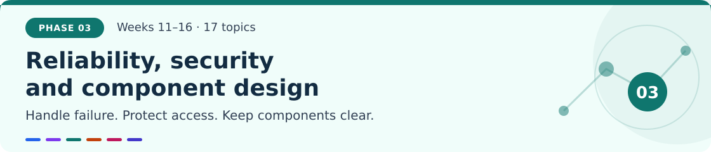
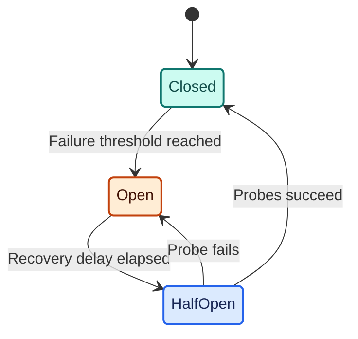
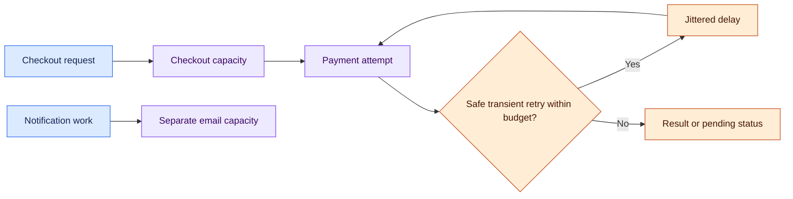
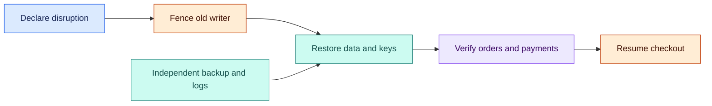
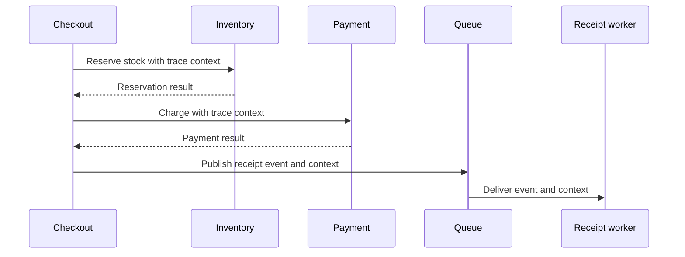
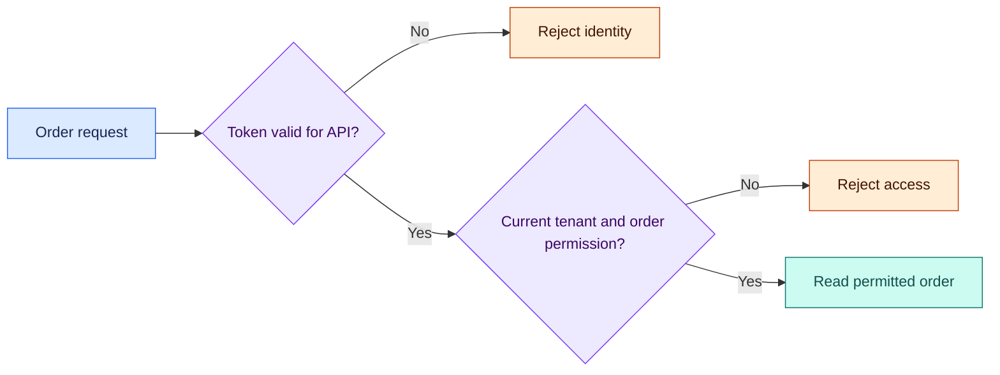

# Phase 3 · Reliability, security, and component design

> **Weeks 11–16 · Topics 35–51**
>
> Learn how a system stays useful when dependencies fail, how engineers investigate problems, and how software enforces access and business rules.

[← Previous: Core system design](02-core-system-design.md) · [Roadmap](../roadmap.md) · [Glossary](../glossary.md) · [Next: Cloud and infrastructure →](04-cloud-and-infrastructure.md)

**Learning outcome:** explain a failure from the customer's perspective, choose bounded recovery behavior, enforce tenant permissions, and design components with explicit contracts.

ShopStream is our illustrative marketplace. Its examples show production design decisions; the numbers are teaching assumptions rather than claims about a real company.

| Reliability | Observability and security | Component design |
|---|---|---|
| [35. Circuit breaker pattern](#topic-35) | [40. Distributed tracing](#topic-40) | [48. SOLID principles](#topic-48) |
| [36. Bulkhead & retry logic](#topic-36) | [41. Metrics & alerting](#topic-41) | [49. Design patterns](#topic-49) |
| [37. SLA / SLO / SLI](#topic-37) | [42. Structured logging](#topic-42) | [50. LLD: Parking lot / Elevator](#topic-50) |
| [38. Chaos engineering](#topic-38) | [43. Rate limiting](#topic-43) | [51. LLD: Rate limiter / Cache](#topic-51) |
| [39. Disaster recovery](#topic-39) | [44. Auth patterns](#topic-44) | |
| | [45. Zero-trust architecture](#topic-45) | |
| | [46. API security](#topic-46) | |
| | [47. Data encryption](#topic-47) | |

---

## 35. Circuit breaker pattern

> [!NOTE]
> **Simple explanation**
>
> A circuit breaker is a caller's temporary stop sign for an unhealthy dependency. After enough recent failures, it stops sending requests and returns a defined response immediately. Later, it allows a few trial requests. Successful trials restore normal traffic; failed trials keep the stop sign in place.

### 🟣 Production explanation

A breaker has three states: **closed** accepts calls, **open** rejects them, and **half-open** admits a limited number of recovery probes. Count failures and slow calls over a defined window, require a minimum sample size, and decide which errors reflect dependency health. A rejected customer payment is usually a business result, not proof that the payment provider is unavailable.

The breaker belongs at a dependency boundary and needs meaningful fallback behavior. It does not cancel calls already executing or limit concurrency; combine it with deadlines and a bulkhead. A single instance's breaker also does not describe the state of every other instance. Monitor transitions and rejected requests to explain customer impact. Resilience4j implements these states; Hystrix is a historical reference whose repository states that it is in maintenance mode.

> [!TIP]
> **Production example**
>
> ShopStream's recommendation service repeatedly times out during a sale. Product pages continue displaying prices and stock while their recommendation panel is omitted. Checkout uses a different response when payment status is uncertain: “Payment confirmation pending,” followed by reconciliation. Returning a fabricated payment success would improve an HTTP success graph while creating incorrect orders. Each dependency therefore receives its own fallback policy.

*Arrows show state changes; an open breaker rejects new calls while existing calls may still complete.*

> [!WARNING]
> **Failure to handle**
>
> A single failed call opens every breaker, causing unnecessary rejection. Require a minimum sample count and tune thresholds from measured traffic. Limit recovery probes so all callers do not overload the recovering dependency simultaneously.

### 🛠️ Try it

Wrap a controllable recommendation endpoint. Configure a minimum of 20 samples and a 50% failure threshold. Cause failures, restore the endpoint, and inspect transitions. Expect open-state calls to skip the dependency and successful recovery probes to restore normal routing.

**Read more:** [Resilience4j circuit breaker](https://resilience4j.readme.io/docs/circuitbreaker), [Hystrix status](https://github.com/Netflix/Hystrix).

---

## 36. Bulkhead & retry logic

> [!NOTE]
> **Simple explanation**
>
> A bulkhead gives separate workloads their own limited capacity, like compartments in a ship. Slow email delivery cannot occupy every checkout worker. A retry gives a failed operation another chance. Waiting between retries and limiting their number helps a struggling service recover rather than receive more work.

### 🟣 Production explanation

Reserve concurrency with separate worker pools or semaphores, then bound waiting queues. An oversized pool can overload a dependency; an undersized one rejects useful traffic. A timeout limits how long the caller waits, but downstream execution may continue after that timeout.

Retry transient failures only when repeating the operation is safe. Use a stable **idempotency key**, an operation identifier recorded durably to prevent repeated business effects. Set one overall deadline, per-attempt timeouts, a maximum attempt count, and an aggregate retry budget. Exponential backoff increases the delay between attempts; **jitter** randomizes it to spread returning traffic. Choose one layer to own retries. Three attempts at each of five layers can generate 243 downstream attempts. Permanent validation errors should return immediately instead of consuming the retry budget.

> [!TIP]
> **Production example**
>
> ShopStream allocates ten notification workers and twenty checkout workers. An email provider slowdown fills only the notification pool, leaving checkout capacity available. A payment request loses its response after the provider charged the card. Checkout retries with the original provider key and retrieves the same logical result. If the outcome remains unknown, the order stays pending while reconciliation checks provider records.

*The retry loop spends a finite budget; notification workers use separate capacity.*

> [!WARNING]
> **Failure to handle**
>
> Retries create a second charge after an ambiguous timeout. Persist the operation key and use the provider's deduplication contract. Do not interpret a local timeout as evidence that downstream processing never happened.

### 🛠️ Try it

Inject a two-second email delay and run checkout traffic concurrently. Expect bounded notification queues and independent checkout capacity. Then simulate a charge with a lost response; retry it and verify exactly one effective charge and a finite total waiting time.

**Read more:** [AWS guidance on timeouts, retries, and jitter](https://d1.awsstatic.com/builderslibrary/pdfs/timeouts-retries-and-backoff-with-jitter.pdf).

---

## 37. SLA / SLO / SLI

> [!NOTE]
> **Simple explanation**
>
> An **SLI**, or service-level indicator, measures what users experience. An **SLO**, or service-level objective, gives that measurement a target and time window. An **SLA**, or service-level agreement, records promised service and the consequences of missing it. “The server is running” is less useful than “customers can complete checkout.”

### 🟣 Production explanation

Define the eligible population, measurement location, numerator, denominator, and exclusions before setting a target. A checkout availability SLI might count completed valid checkout attempts divided by all eligible attempts. Decide explicitly how expected card declines, cancellations, duplicate submissions, and internal test traffic are classified. Otherwise teams can report conflicting numbers for the same service.

Set latency separately: a technically successful response delivered after a minute may still be unusable. An **error budget** is the permitted amount of bad behavior. A request-based 99.9% objective allows 0.1% of eligible requests to fail; it does not automatically translate into a downtime allowance. Write a policy explaining what rapid budget consumption changes, including release decisions and incident response. A stronger target costs engineering time, redundancy, and operational effort.

> [!TIP]
> **Production example**
>
> ShopStream measures one million eligible checkout attempts over a 30-day window. At a 99.9% objective, the budget permits 1,000 bad attempts. A faulty release causes 800 failures in a short period, so the team rolls it back and pauses risky releases under its written policy. A healthy load-balancer check cannot hide the failed payment and inventory workflows behind it.

> [!WARNING]
> **Failure to handle**
>
> Different dashboards silently exclude different failures, making the reported budget meaningless. Store the eligibility rules with the SLO, compare independent calculations, and change definitions through review rather than adjusting them during an incident.

### 🛠️ Try it

Write separate checkout availability and latency objectives. Generate good, failed, slow, and expected-decline requests. Calculate eligible totals and budget consumption independently, then compare with the dashboard. Expect identical classification and an alert when short-window consumption accelerates.

**Read more:** [Google SRE service-level objectives](https://sre.google/sre-book/service-level-objectives/).

---

## 38. Chaos engineering

> [!NOTE]
> **Simple explanation**
>
> Chaos engineering is a controlled experiment that checks a specific reliability claim. You predict what should happen, introduce one realistic fault, and measure the result. For example: “If one receipt worker crashes, paid orders still exist and receipts eventually arrive.” Randomly breaking components without a prediction teaches much less.

### 🟣 Production explanation

Start with a measurable baseline and a falsifiable hypothesis. Select one fault, define its scope and duration, and state the conditions that immediately end the experiment. Examples include added latency, a process crash, or a dropped connection. Begin in a disposable lab using fake providers; make restoration and result collection part of the experiment.

For any later production exercise, use the organization's operational approval, ownership, communication, and provider-notification requirements. Confirm observability, rollback, and a small blast radius before execution. **Chaos Monkey** focuses on instance termination, but resilience experiments need not use that tool or that fault. Evaluate customer and business outcomes rather than merely whether a replacement process started. A passing experiment supports a claim under its tested conditions; it does not prove protection against every outage.

> [!TIP]
> **Production example**
>
> ShopStream kills a notification worker after its fake email provider accepted a receipt but before the worker acknowledged the queue message. The queue delivers the message again. The experiment reveals whether the provider accepts an idempotency key or the workflow can tolerate a repeated receipt. Payment processing remains separate, so the notification replay must never initiate another charge or create another order.

> [!WARNING]
> **Failure to handle**
>
> An experiment unexpectedly hits a shared provider or keeps running after its stop condition. Use a disposable environment, explicit resource allowlists, a time limit, and an independent abort mechanism. Record any required provider notifications.

### 🛠️ Try it

Capture checkout success, queue depth, and receipt delay in a local lab. Crash one worker at the chosen processing point, restore it, and replay pending work. Expect preserved orders, bounded recovery, and delivery behavior that matches the stated provider contract.

**Read more:** [Principles of Chaos Engineering](https://principlesofchaos.org/), [Chaos Monkey project](https://github.com/Netflix/chaosmonkey).

---

## 39. Disaster recovery

> [!NOTE]
> **Simple explanation**
>
> Disaster recovery answers two practical questions: how quickly can the service return, and how much recent data might be lost? **RTO**, or recovery time objective, sets the recovery-time target. **RPO**, or recovery point objective, sets the target limit on lost data, commonly expressed as minutes of missing writes.

### 🟣 Production explanation

Choose a recovery strategy from measured business needs. Restoring backups is less expensive than keeping a warm standby but generally takes longer. A second region reduces some regional risks; replication can still copy accidental deletion or corruption, so independent backups and point-in-time recovery matter.

A credible runbook covers data, application configuration, credentials, encryption keys, networking, dependencies, and operators' access. Measure achieved RTO from declared disruption to verified useful service, not merely database startup. Measure achieved RPO by identifying the newest recovered committed records. Before promoting a standby, **fence** the former primary: prevent it from continuing writes and creating competing histories. Reconcile external effects such as payments against recovered data. Recovery objectives are targets supported by drills, not guarantees created by enabling a backup checkbox.

> [!TIP]
> **Production example**
>
> ShopStream sets a teaching target of one hour RTO and five minutes RPO for orders. During a regional-outage drill, operators stop writes to the former primary, restore the standby, and switch traffic. They compare payment-provider records with recovered orders before reopening unrestricted checkout. Product browsing can return earlier while checkout remains limited, making the definition of “recovered service” an explicit business decision.

*Arrows show recovery steps; RTO includes verification before checkout resumes.*

> [!WARNING]
> **Failure to handle**
>
> Backups restore successfully but their encryption key or application configuration is unavailable. Include those dependencies in isolated recovery drills and verify a real checkout. Track the newest recovered order to detect an RPO miss.

### 🛠️ Try it

Restore a database backup and its write-ahead logs into a fresh lab. Measure time until a successful checkout and locate the newest recovered order. Expect both measurements to satisfy your chosen targets, with balances and inventory invariants preserved.

**Read more:** [AWS disaster-recovery planning](https://docs.aws.amazon.com/wellarchitected/latest/reliability-pillar/plan-for-disaster-recovery-dr.html).

---

## 40. Distributed tracing

> [!NOTE]
> **Simple explanation**
>
> Distributed tracing follows one operation as it crosses services. Each timed piece of work is a **span**; related spans form a **trace**. Instead of asking several teams to search unrelated logs, you can see whether checkout spent its time in inventory, payment, a network call, or a queue.

### 🟣 Production explanation

Propagate trace context through HTTP requests and message envelopes so receiving services can connect their work to the initiating operation. Instrument meaningful boundaries, including database calls, external requests, event publication, and worker execution. Distinguish queue waiting from active processing; a fast worker can still deliver late when the queue is overloaded.

**OpenTelemetry** supplies vendor-neutral instrumentation and collection. **Jaeger** and **Zipkin** are examples of trace storage and viewing systems. Sampling reduces collection cost but may omit rare failures, so choose sampling behavior based on diagnostic needs and available capacity. Use bounded attribute values, redact sensitive content, and control access to stored traces. Trace identifiers support investigation; they are not authentication credentials. A trace shows observed timing and relationships, while missing spans or clock differences can limit what you infer.

> [!TIP]
> **Production example**
>
> ShopStream checkout takes 1.8 seconds even though database queries are fast. One trace shows the fraud check taking 1.4 seconds. Another shows the receipt worker starting 30 seconds after event publication. The first points toward dependency latency; the second toward queue backlog. The team links trace IDs to structured logs to inspect the exact error without logging card details or private document contents.

*Arrows show requests and message delivery; context lets instrumentation connect their spans.*

> [!WARNING]
> **Failure to handle**
>
> An asynchronous worker starts a disconnected trace, hiding the wait between checkout and receipt delivery. Propagate context in the event envelope, instrument both publication and consumption, and expose queue age independently as a metric.

### 🛠️ Try it

Instrument checkout, inventory, a payment stub, and a receipt worker. Inject a 500 ms inventory delay and a worker exception. Expect the trace viewer to identify affected spans and asynchronous relationships without containing payment secrets or document bodies.

**Read more:** [OpenTelemetry traces](https://opentelemetry.io/docs/concepts/signals/traces/).

---

## 41. Metrics & alerting

> [!NOTE]
> **Simple explanation**
>
> Metrics summarize how a system behaves over time. A **counter** counts events, a **gauge** shows a current value, and a **histogram** groups measured values such as response durations. Alerts turn selected measurements into actions. The useful question is whether a person needs to act now to protect customers.

### 🟣 Production explanation

Measure traffic, errors, latency, and saturation, then connect them with user-facing objectives. **Prometheus** commonly collects metrics and **Grafana** presents dashboards. Choose metric labels with a bounded set of values. Adding every order ID or arbitrary tenant ID creates many independent series, increasing memory and storage costs; detailed identifiers belong in protected logs or traces.

Use histograms to examine latency distributions rather than relying only on averages. A brief CPU spike can be diagnostic without requiring a page. Sustained checkout failures or rapidly accelerating error-budget consumption are stronger signals of customer harm. Give alerts an owner, a clear description, and a runbook with concrete diagnostic steps. Route lower urgency issues to planned work. Test alert duration, grouping, and recovery behavior so an incident does not create endless duplicate notifications.

> [!TIP]
> **Production example**
>
> ShopStream's database reaches 80% CPU while checkout success and latency remain healthy. Engineers review capacity during normal work. When checkout failures begin consuming the budget rapidly, an alert reaches the on-call engineer. Receipts use an oldest-message-age alert because a large queue may be acceptable during a brief burst, while steadily increasing delivery delay violates the customer promise.

> [!WARNING]
> **Failure to handle**
>
> The dashboard looks healthy because missing telemetry is interpreted as zero errors. Display absent data explicitly, monitor collection health, and distinguish a quiet service from a failed metrics pipeline before calculating indicators or clearing alerts.

### 🛠️ Try it

Export request counts, duration histograms, worker usage, queue depth, and oldest-message age. Trigger a sustained checkout failure and a short harmless spike. Expect a useful incident alert for the sustained failure and no repeated pages for the brief spike.

**Read more:** [Prometheus alerting practices](https://prometheus.io/docs/practices/alerting/).

---

## 42. Structured logging

> [!NOTE]
> **Simple explanation**
>
> Structured logging records events as consistent fields instead of sentences that each developer formats differently. A searchable record might contain an event name, timestamp, order reference, service, and trace ID. Shared fields make it possible to follow one order through several services and compare similar failures quickly.

### 🟣 Production explanation

Define a small event schema with timestamp, severity, service, deployment version, event name, correlation ID, and safe business references. A **correlation ID** connects a workflow; a trace ID links a log entry to trace spans. Keep event names stable so queries do not depend on parsing changing prose.

The **ELK stack** combines Elasticsearch indexing, Logstash processing, and Kibana viewing; other tools can provide the same pipeline. Decide retention, access permissions, field indexing, and redaction before broad collection. Avoid credentials, card details, and complete private documents. Logging must also have a failure policy: use bounded buffers, monitor dropped events, and prevent an unavailable sink from exhausting request workers. Security or financial audit records may need a stronger durability contract than ordinary diagnostic logs.

> [!TIP]
> **Production example**
>
> A ShopStream customer has a paid order but no receipt. Searching the safe order reference finds payment confirmation, a committed outbox event, and repeated notification-provider errors. The evidence directs engineers to delivery rather than creating another charge. When the logging sink is unavailable, checkout continues using a bounded buffer and records telemetry loss separately once collection returns.

> [!WARNING]
> **Failure to handle**
>
> A debug log copies an authorization token into the central index. Redact before transmission, restrict index access, and test with fake sensitive values. Retention limits reduce exposure but do not undo an already leaked credential.

### 🛠️ Try it

Emit JSON logs through checkout and the receipt worker. Search one correlation ID across both services. Insert a fake token and interrupt the sink. Expect redaction before indexing, bounded memory, visible dropped-log counts, and continued checkout according to your logging policy.

**Read more:** [Elastic tracing fields](https://www.elastic.co/docs/reference/ecs/ecs-tracing).

---

## 43. Rate limiting

> [!NOTE]
> **Simple explanation**
>
> Rate limiting controls how quickly someone can submit work. A token bucket refills a limited allowance over time, permitting a short burst when tokens have accumulated. A leaky bucket smooths work at a steady rate. These policies protect capacity and fairness; they do not establish who the caller is.

### 🟣 Production explanation

For a token bucket, define refill rate `r`, capacity `b`, and each request's cost. Consume and refill atomically so simultaneous requests cannot spend the same tokens. A leaky bucket may queue and drain requests at a fixed rate, or meter excess arrivals and reject them; specify the implementation's exact behavior and queue bound.

Local limits protect one instance. A shared limit coordinates a wider quota but adds storage latency and a dependency. Decide how failures in that storage affect service: rejecting everything and allowing everything have different business consequences. Identify callers using authenticated user or tenant identity when available; IP addresses can group unrelated users behind shared networking. Return a clear rejection and retry guidance. Rate limits control arrivals, while concurrency limits separately bound simultaneous execution and expensive resource use.

> [!TIP]
> **Production example**
>
> ShopStream permits a seller ten catalogue updates per second with a twenty-request burst. Document Q&A has a separate, tighter allowance because each request consumes more compute. A seller cannot bypass the policy by submitting another tenant's identifier. With two API instances, independently configured ten-per-second buckets would allow a combined rate higher than the advertised tenant quota, so shared coordination is required.

> [!WARNING]
> **Failure to handle**
>
> A limiter trusts an arbitrary tenant header and lets callers change identities to gain fresh buckets. Derive the quota key from verified identity, enforce resource authorization separately, and choose an explicit bounded fallback for shared-store failures.

### 🛠️ Try it

Implement a token bucket and one clearly defined leaky-bucket variant with an injectable clock. Test bursts, steady overload, weighted requests, and two simultaneous API instances. Expect atomic token spending, bounded queueing, and documented global behavior during storage failure.

**Read more:** [Envoy token-bucket limiting](https://www.envoyproxy.io/docs/envoy/latest/configuration/http/http_filters/local_rate_limit_filter), [NGINX leaky-bucket explanation](https://blog.nginx.org/blog/rate-limiting-nginx).

---

## 44. Auth patterns

> [!NOTE]
> **Simple explanation**
>
> Authentication asks, “Who is calling?” Authorization asks, “May this caller perform this action on this resource?” Login establishes identity; every order or document request still needs permission checks. A signed token is evidence the server must validate, not a universal pass to every resource in the application.

### 🟣 Production explanation

**OAuth 2.0** delegates limited access to resources; it does not itself define user login. **OpenID Connect**, or OIDC, adds an identity layer for authentication. **SSO** means signing in once for multiple applications; **SAML** is another federation protocol often used in enterprise SSO.

A **JWT** is a token format. Validate its signature, issuer, audience, expiry, and permitted algorithms according to its intended use. ID tokens describe login to their client; access tokens authorize calls to their intended resource server. Use established authorization-code flows with **PKCE**, which binds code redemption to the initiating client. Plan sessions, refresh tokens, and logout explicitly. A signed token may remain valid until expiry unless revocation or server-side session checks apply. Recheck tenant membership and object access at the protected operation, including asynchronous workflows.

> [!TIP]
> **Production example**
>
> ShopStream shoppers use an OIDC provider while an enterprise seller uses SAML SSO. The API accepts only access tokens intended for it, then checks order ownership and current tenant permissions. Logging out ends the stated session behavior; it does not magically erase every previously issued token. The team documents token lifetime and any revocation delay so operators understand the actual access-removal guarantee.

*Arrows show two separate decisions: token validation establishes identity; current permissions govern the order.*

> [!WARNING]
> **Failure to handle**
>
> An API accepts any correctly signed token, including one issued for another audience, then skips ownership checks. Validate purpose and audience, enforce resource authorization, and test authentication success separately from permission denial.

### 🛠️ Try it

Connect a local identity provider and create two tenants. Send expired, wrong-audience, incorrectly signed, and cross-tenant requests. Expect token-validation failures to reject identity and valid cross-tenant callers to receive no protected order data. Verify documented logout behavior.

**Read more:** [OAuth framework](https://www.rfc-editor.org/rfc/rfc6749), [OAuth security practices](https://datatracker.ietf.org/doc/html/rfc9700), [OIDC Core](https://openid.net/specs/openid-connect-core-1_0.html), [SAML overview](https://docs.oasis-open.org/security/saml/Post2.0/sstc-saml-tech-overview-2.0-cd-02.html), [JWT security practices](https://www.rfc-editor.org/rfc/rfc8725), [OWASP JWT revocation guidance](https://cheatsheetseries.owasp.org/cheatsheets/JSON_Web_Token_Cheat_Sheet.html#jwt-revocation).

---

## 45. Zero-trust architecture

> [!NOTE]
> **Simple explanation**
>
> Zero trust means a request does not become trustworthy merely because it came from the company's network. Each user or service needs a verified identity and permission for the requested operation. A document worker should be allowed to process its assigned documents without automatically gaining access to refunds or every tenant.

### 🟣 Production explanation

Make authorization decisions using identity, requested resource, action, and relevant current context. Apply **least privilege**: grant only the capabilities a workload needs. Distinct service identities prevent one leaked credential from becoming a universal internal credential. Short-lived credentials and **mutual TLS**, where both connection endpoints authenticate, help establish workload identity.

Network restrictions and encrypted connections remain useful, but neither replaces application-level permission checks. A verified ingestion service may still be forbidden from reading an unrelated tenant's document. Enforce that decision at the service that owns the protected operation. Record authorization decisions safely and define how policy updates or revocations propagate. Cached permissions trade availability and performance against staleness; specify their maximum age and failure behavior rather than assuming a private network makes stale access acceptable.

> [!TIP]
> **Production example**
>
> ShopStream's ingestion worker can fetch assigned private documents and write their search index entries. It cannot issue refunds or scan every seller's files. If its identity is compromised, the allowed actions remain narrow. When a seller revokes a document, the retrieval service evaluates current access at query time; an older index entry must not preserve read access merely because ingestion was once authorized.

> [!WARNING]
> **Failure to handle**
>
> An internal endpoint skips authorization because traffic arrives over mutual TLS. Require resource and action checks after verifying workload identity. Bound permission-cache age and make the documented revocation delay visible to operators and tests.

### 🛠️ Try it

Give checkout, ingestion, and notifications different identities. Attempt required and forbidden operations with each, then revoke ingestion access. Expect only the explicit allowed actions to succeed and revoked permissions to stop working within the documented propagation delay.

**Read more:** [NIST zero-trust architecture](https://csrc.nist.gov/pubs/sp/800/207/final).

---

## 46. API security

> [!NOTE]
> **Simple explanation**
>
> API security protects each operation, not just the login screen. The server must check who is calling, what they may do, which tenant owns the resource, and whether submitted data is valid. Knowing an order's identifier should never give someone the right to read or change that order.

### 🟣 Production explanation

**Role-based access control**, or RBAC, groups permissions into roles such as catalogue editor or support agent. Combine role permissions with resource ownership and current tenant membership. A role that can edit products should only edit products within its allowed scope. **Broken object-level authorization** occurs when a server accepts an object identifier without validating access to that object.

Check every endpoint and background operation, including exports, batch requests, and nested resources. Validate inputs, bound query size and execution cost, and use parameterized database statements. Store secrets outside source code and logs, scope access narrowly, and plan rotation. Prefer workload identity where supported. Credentials authorize a particular service interaction; a notification-provider secret should not also unlock the order database. Build an explicit access matrix so denied cases receive the same attention as successful ones.

> [!TIP]
> **Production example**
>
> A ShopStream seller changes `/orders/123` to `/orders/124`. The API uses the caller's verified tenant context and checks the requested order, rather than trusting a submitted tenant field. Support staff can read masked order details but cannot issue refunds. A batch export applies the same ownership filters as a single-order endpoint, preventing the less visible workflow from becoming an access bypass.

> [!WARNING]
> **Failure to handle**
>
> The single-order endpoint checks ownership but the export endpoint trusts a list of IDs. Apply authorization at each resource boundary, including background jobs. Test mixed-tenant batches and ensure denied resources never enter the generated export.

### 🛠️ Try it

Create a role, action, and ownership matrix for two tenants. Exercise individual and batch endpoints across all allowed and denied combinations. Rotate a fake provider credential. Expect cross-tenant denials, unchanged intended access, and no credential values in logs or history.

**Read more:** [OWASP object-level authorization](https://api-security.owasp.org/editions/2023/en/0xa1-broken-object-level-authorization/), [AWS secrets practices](https://docs.aws.amazon.com/secretsmanager/latest/userguide/best-practices.html).

---

## 47. Data encryption

> [!NOTE]
> **Simple explanation**
>
> Encryption turns readable data into bytes that require a key to recover. Encryption **in transit** protects a network connection. Encryption **at rest** protects stored data and backups. These protections reduce exposure from intercepted or stolen bytes, while the application must still decide who is allowed to request the readable content.

### 🟣 Production explanation

Use validated TLS connections between relevant endpoints; disabling certificate verification removes a key part of that protection. For stored data, a **key management service**, or KMS, manages keys and controlled cryptographic operations. With **envelope encryption**, a data key encrypts content and a wrapping key encrypts the data key. Store the wrapped key with the encrypted content.

Separate storage permissions from decryption permissions, record key usage, and define rotation and recovery behavior. Rotating a wrapping key does not necessarily re-encrypt every document; the chosen scheme determines which keys old content still needs. Protect key access in the recovery environment as carefully as in production. Encryption cannot prevent an authorized compromised application from reading permitted plaintext. Key availability is also an availability dependency: intact encrypted backups are useless if their required key is permanently unavailable.

> [!TIP]
> **Production example**
>
> ShopStream stores private seller documents encrypted at rest. A backup operator can copy encrypted objects but cannot decrypt them. The document service verifies current seller permissions before returning content or a short-lived authorized link. During a recovery drill, operators restore both data and the intended key access. The team measures whether old documents remain readable after key rotation instead of assuming rotation preserved them.

> [!WARNING]
> **Failure to handle**
>
> A key is disabled or deleted before older backups stop depending on it. Maintain key-dependency and retention records, test restoration after rotation, and protect key deletion through the organization's normal controls for irreversible infrastructure changes.

### 🛠️ Try it

Encrypt a sample document using envelope encryption. Verify one identity can decrypt and another cannot. Rotate the wrapping key and restore older content in a fresh lab. Expect preserved authorized access, validated TLS, and auditable denial for unauthorized key use.

**Read more:** [AWS KMS concepts](https://docs.aws.amazon.com/kms/latest/developerguide/concepts.html).

---

## 48. SOLID principles

> [!NOTE]
> **Simple explanation**
>
> SOLID describes five ways to keep object-oriented code easier to change. Give each part a clear job, separate unrelated capabilities, and let business rules depend on small contracts. A useful abstraction makes a real change safer. Adding an interface to every class can make a small system harder to understand.

### 🟣 Production explanation

**Single responsibility** gives a module one coherent reason to change. **Open/closed** introduces a suitable extension point for genuine variation. **Liskov substitution** requires implementations to preserve the behavior promised by a contract. **Interface segregation** keeps clients dependent only on capabilities they use. **Dependency inversion** makes business logic depend on abstractions rather than provider details.

Evaluate these principles through expected changes and behavioral tests. Matching method signatures is insufficient: currency handling, retry safety, idempotency, and error meanings belong to a payment contract. Avoid hiding business differences behind an abstraction that silently promises capabilities a provider lacks. Keep a refund interface separate when not all payment methods support refunds. Test doubles should preserve important production behavior rather than immediately returning success and concealing uncertain outcomes.

> [!TIP]
> **Production example**
>
> ShopStream checkout depends on a `PaymentGateway` contract, while receipt formatting lives in a different module. Adding a second provider changes gateway construction without rewriting order rules. Both gateways must preserve operation keys, currency, and pending-payment behavior. A provider that ignores idempotency violates the contract even if its `charge` method looks identical. A new receipt design should not require changes to payment execution.

> [!WARNING]
> **Failure to handle**
>
> A replacement gateway returns success for an unknown payment outcome, breaking the expectations of checkout. State behavioral requirements explicitly and run the same contract checks against all implementations, including fakes used by other teams.

### 🛠️ Try it

Refactor a tangled checkout module, then add a second gateway and a new receipt format. Expect unchanged core order rules and common behavioral checks for both gateways. Explain the specific change each abstraction supports and remove abstractions without a useful purpose.

**Read more:** [Microsoft's SOLID discussion](https://learn.microsoft.com/en-us/archive/msdn-magazine/2014/may/csharp-best-practices-dangers-of-violating-solid-principles-in-csharp).

---

## 49. Design patterns

> [!NOTE]
> **Simple explanation**
>
> Design patterns give names to common ways of arranging responsibilities. A factory chooses what to create; a strategy selects an algorithm; an observer receives change notifications; a decorator adds behavior around an existing object. Use a pattern when it explains a real variation, rather than choosing patterns before understanding the problem.

### 🟣 Production explanation

A **Factory** keeps construction details outside its callers. A **Strategy** swaps behavior through a shared contract, such as shipping-price calculation. An **Observer** connects an event source with interested listeners. A **Decorator** adds behavior while preserving the wrapped interface, such as measuring payment latency.

The important boundary is each pattern's actual guarantee. An in-process observer does not persist events across a crash; business-critical delivery needs a durable mechanism. Decorator ordering also changes behavior. Measuring outside a retry wrapper includes all attempts and waiting; measuring inside it records individual attempts. Caching before authorization can return data without the required access decision. Avoid automatic retry decorators for operations without safe repetition. Patterns reduce duplicated decisions only when their contracts and lifetime match the workload.

> [!TIP]
> **Production example**
>
> ShopStream uses a factory to construct the shipping client selected by validated configuration, and strategies to calculate fees for different seller plans. An observer updates an in-memory operations display. Customer receipts use a persisted event instead because their delivery must survive restart. A metrics decorator measures gateway calls while a separate workflow owns safe retries and pending-payment reconciliation.

> [!WARNING]
> **Failure to handle**
>
> An observer sends critical receipts only in memory, and a crash loses notifications after orders commit. Persist the business event with the order transaction or an equivalent durable contract, then let a recoverable worker handle external delivery.

### 🛠️ Try it

Implement the four patterns in a small order module. Swap a pricing strategy, remove an observer, and reverse two decorators. Expect documented behavior changes from wrapper order. Restart after an order commit and prove critical notifications survive independently of in-memory observers.

**Read more:** [Microsoft factory patterns](https://learn.microsoft.com/en-us/shows/visual-studio-toolbox/design-patterns-factories), [Microsoft Strategy explanation](https://learn.microsoft.com/en-us/archive/msdn-magazine/2001/july/design-patterns-solidify-your-csharp-application-architecture-with-design-patterns), [Microsoft Observer contract](https://learn.microsoft.com/en-us/dotnet/standard/events/observer-design-pattern), [Oracle Decorator explanation](https://www.oracle.com/technical-resources/articles/enterprise-architecture/decorators.html).

---

## 50. LLD: Parking lot / Elevator

> [!NOTE]
> **Simple explanation**
>
> Low-level design, or LLD, turns a problem into objects, contracts, and valid state changes. A parking lot needs a precise rule for claiming the last free spot. An elevator simulation needs rules for doors, movement, and stop selection. The design succeeds when it preserves those rules during concurrency and failures.

### 🟣 Production explanation

For parking, model vehicles, spot types, reservations, tickets, pricing, payment, and exit. State the **invariants**, conditions that must always hold: one spot has at most one active owner, payment is not duplicated, and a duplicate exit does not free an already reassigned spot. Allocate and release atomically through a transaction or suitable synchronization.

For an elevator simulation, separate the car state machine from the scheduler that chooses stops. Model position, direction, doors, capacity, pending requests, and emergency state. A state machine makes forbidden transitions testable. Decide fairness under a finite workload and avoid claims of eventual service under unlimited overload. Locks protect shared state, but inconsistent lock order can deadlock and coarse locking can restrict throughput. This exercise models software behavior; a real physical controller requires additional safety engineering.

> [!TIP]
> **Production example**
>
> ShopStream integrates parking for a merchant pickup center. Two kiosks simultaneously request the final free spot. Atomic allocation gives one kiosk the reservation and returns “full” to the other. An expired reservation is released only if its ownership version still matches. The elevator exercise helps the team discuss scheduling fairness: repeatedly selecting nearby stops can keep a distant passenger waiting despite apparently efficient movement.

> [!WARNING]
> **Failure to handle**
>
> A delayed exit event releases a spot now occupied by another vehicle. Match the release against the original ticket and current ownership version. Reject stale transitions and make repeated valid exits harmless instead of freeing arbitrary state.

### 🛠️ Try it

Race two kiosks for one spot and expect one winner. Test expired reservations, duplicate exits, and payment failure. For the elevator simulation, replay finite request sequences; expect no movement with open doors, valid floors, and eventual service for every accepted request.

**Read more:** [Java lock contract](https://docs.oracle.com/en/java/javase/21/docs/api/java.base/java/util/concurrent/locks/Lock.html).

---

## 51. LLD: Rate limiter / Cache

> [!NOTE]
> **Simple explanation**
>
> A component needs a precise promise before it needs clever data structures. A rate limiter promises how much work a caller may submit. A cache promises how values are stored, expired, and removed when full. Thread safety, tenant separation, and behavior after restart are part of those promises.

### 🟣 Production explanation

A limiter can expose `allow(key, cost, now)` and return acceptance plus retry delay. Refill and consume tokens atomically. Use elapsed time from a monotonic clock, which does not jump when wall time changes. State whether its guarantee applies to one process or all service instances.

A cache can expose get, put, delete, capacity, and **TTL**, the lifetime of a stored entry. A hash map plus doubly linked list supports efficient **LRU**, or least-recently-used, eviction. **LFU** favors frequently used values; TTL controls expiry separately from capacity eviction. Neither TTL nor eviction alone guarantees freshness: the source may already be stale at refill. Include tenant scope in keys. Coordinate simultaneous misses for popular data so one cold item does not create thousands of duplicate database reads.

> [!TIP]
> **Production example**
>
> ShopStream caches product details and limits seller updates. When a popular product expires, callers share one in-flight reload rather than all querying the database. Every cache key includes tenant identity and product ID. The local limiter remains useful for per-instance protection, but a seller's global allowance needs explicit coordination as API replicas scale. Restarts must not silently create an unexpected unlimited quota.

> [!WARNING]
> **Failure to handle**
>
> Concurrent misses overwhelm the database while stale cached values are incorrectly treated as current stock. Bound reload concurrency and define permissible staleness. Keep authoritative inventory decisions in their transactional workflow rather than relying on product-display cache contents.

### 🛠️ Try it

Build a bounded LRU cache and thread-safe token bucket with injectable time. Exercise expiry, eviction, weighted requests, concurrent misses, and tenant-key collisions. Expect bounded memory, one coordinated load per chosen key, and atomic allowance consumption under concurrent callers.

**Read more:** [Redis eviction policies](https://redis.io/docs/latest/develop/reference/eviction/).

---

## Check your understanding

- Why can a timeout still produce a successful downstream payment?
- What distinguishes an HTTP-success graph from a checkout SLO?
- How would you prove that an encrypted backup supports your recovery targets?
- Why does a valid token still require a tenant and resource permission check?
- Which component guarantees change when a single process becomes several replicas?

[← Previous: Core system design](02-core-system-design.md) · [Roadmap](../roadmap.md) · [Glossary](../glossary.md) · [Next: Cloud and infrastructure →](04-cloud-and-infrastructure.md)
