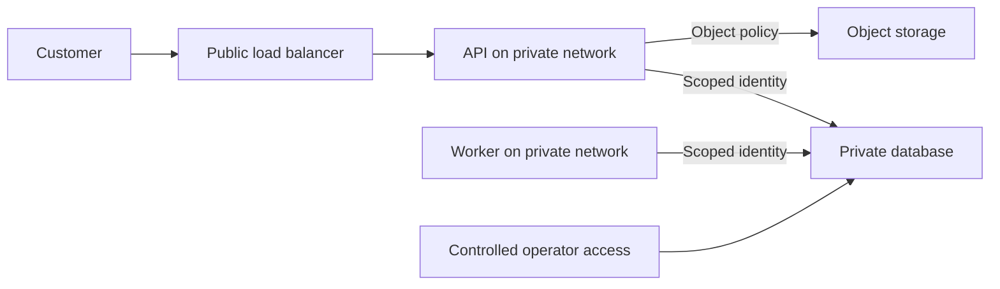
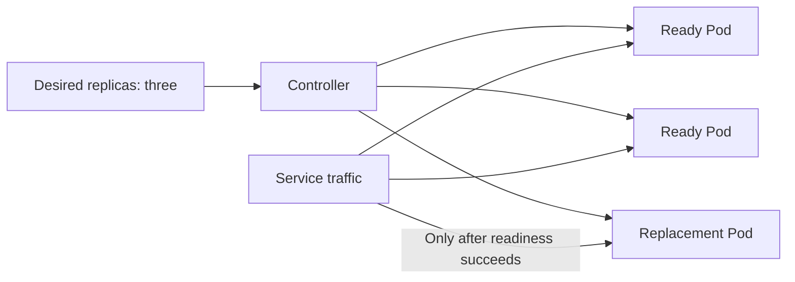
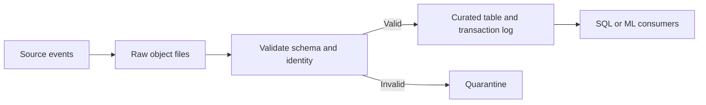
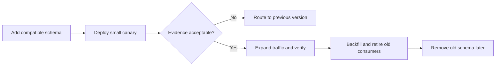

# Phase 4 · Cloud and infrastructure

> **Weeks 17–20 · Topics 52–63**
>
> Learn how to place services, control infrastructure changes, organize analytical data, and release software while preserving customer behavior.

[← Previous: Reliability and security](03-reliability-security-and-lld.md) · [Roadmap](../roadmap.md) · [Glossary](../glossary.md) · [Next: AI fundamentals and RAG →](05-ai-fundamentals-and-rag.md)

**Learning outcome:** draw a deployment with clear access and failure boundaries, explain its storage choices, and describe a release that can be verified and rolled back.

Learn one provider deeply, then compare equivalent concepts in the others. Kubernetes and a service mesh are choices to evaluate, not prerequisites for a reliable application. ShopStream examples and numerical targets are illustrative.

| Running services | Managing data | Releasing changes |
|---|---|---|
| [52. AWS / GCP / Azure fundamentals](#topic-52) | [57. Data warehouses](#topic-57) | [61. CI/CD pipelines](#topic-61) |
| [53. Container orchestration](#topic-53) | [58. Data lakes](#topic-58) | [62. Blue-green / canary deploys](#topic-62) |
| [54. Serverless architecture](#topic-54) | [59. Object storage design](#topic-59) | [63. Feature flags](#topic-63) |
| [55. Infrastructure as Code](#topic-55) | [60. Time-series databases](#topic-60) | |
| [56. Service mesh](#topic-56) | | |

---

## 52. AWS / GCP / Azure fundamentals

**Simple explanation**

A cloud provider supplies building blocks such as computers, networks, databases, and file storage on demand. You choose how they connect, which identities can use them, and how much capacity to buy. Managed services reduce some operational work, while your application still owns its behavior, permissions, data, and recovery plan.

**Production explanation**

Learn compute, networking, identity, storage, regions, availability zones, monitoring, and billing together. AWS examples include EC2 virtual machines, S3 object storage, and VPC networking. Google offers Compute Engine, Cloud Storage, and VPC; Azure offers Virtual Machines, Blob Storage, and Virtual Network. These are comparable families, not identical products or failure boundaries.

Trace public ingress, private service connections, and outbound dependency traffic. A private network restricts reachability; service identity and database permissions restrict what reachable callers can do. Multiple availability zones reduce a zone failure's impact when applications and data actually span them. Regional recovery still requires a separate plan. Define shared responsibility explicitly: the provider operates selected infrastructure layers, while you configure access, capacity, backups, and application security. Estimate requests, storage, data transfer, and telemetry retention rather than treating the virtual-machine price as the complete cost.

**Production example**

ShopStream puts its public API behind a load balancer and allows database connections only from approved application and operator paths. Product images use object storage, while private seller documents require separate policies. API replicas span zones and use scoped identities. A cost model includes outbound image traffic, backups, and logs; these grow differently from CPU usage and can become significant even when application servers are lightly loaded.

*Arrows show permitted paths; private placement and identity checks provide different controls.*

**Failure to handle**

A database is accidentally reachable from the internet or grants every internal workload broad access. Review network routes and identities separately, verify denied connections, and test the permissions of each service rather than only its connectivity.

**Try it**

Draw the deployment for all three providers, then write a reviewable plan for one. Attempt allowed and denied database and document access. Expect only explicit paths and identities to work. Estimate monthly cost from documented traffic, storage, transfer, and retention assumptions.

**Read more:** [Google's cloud service comparison](https://docs.cloud.google.com/docs/get-started/aws-azure-gcp-service-comparison).

---

## 53. Container orchestration

**Simple explanation**

A container packages an application with its dependencies into a repeatable environment. An orchestrator keeps the desired number of application instances running, replaces failed ones, and routes traffic. It can restart a crashed process, but it cannot automatically repair incorrect business logic or recover data that was never stored durably.

**Production explanation**

**Docker** builds and runs container images; containers share the host kernel rather than functioning as complete virtual machines. **Kubernetes** schedules Pods, reconciles declared state, and exposes workloads through Services. **Helm** packages configurable Kubernetes resources into charts.

Define resource requests and limits, external persistent storage, configuration, credentials, and shutdown behavior. A **readiness probe** controls whether an instance should receive traffic. A **liveness probe** helps identify an instance that needs restarting; making it fail whenever a dependency is down can create a restart storm. Startup probes accommodate slow initialization. Spread replicas according to the failure boundaries you need and ensure spare cluster capacity exists. During termination, stop new work and safely finish or release existing work within the allowed period. A managed container platform may meet a small team's needs with less operational complexity than a full Kubernetes cluster.

**Production example**

ShopStream runs three API replicas and separate receipt workers. Kubernetes replaces a failed Pod while the queue preserves unfinished notification work. Replicas are distributed across appropriate nodes and zones; putting all three on one node would preserve replica count but not node-failure availability. Database data remains outside container writable layers, and readiness checks prevent traffic from reaching instances before application initialization is complete.

*Arrows show reconciliation and routing eligibility; replacement alone does not make a Pod ready.*

**Failure to handle**

A liveness probe depends on the database, so every API Pod restarts during a database outage. Separate process-health checks from dependency readiness and test the behavior under outage. Preserve important data outside replaceable container storage.

**Try it**

Build one reproducible image and deploy it to a local cluster with a Helm chart. Delete a Pod and interrupt a dependency. Expect replacement, correct readiness, bounded resources, and safe handling of in-flight work without essential data on the writable container layer.

**Read more:** [Docker containers](https://docs.docker.com/get-started/docker-concepts/the-basics/what-is-a-container/), [Kubernetes overview](https://kubernetes.io/docs/concepts/overview/), [Helm documentation](https://helm.sh/docs/).

---

## 54. Serverless architecture

**Simple explanation**

Serverless execution lets you submit code while a provider handles much of the server provisioning and scaling. A function can respond to an upload or queue message without your team operating a permanent worker fleet. You still choose permissions, limits, failure behavior, dependencies, and the budget for each useful result.

**Production explanation**

**AWS Lambda** runs functions triggered by requests or events. Google's functions topic is documented through **Cloud Run functions**. Check the actual service and trigger for execution limits, concurrent execution, cold starts, networking, and event-delivery guarantees. Local storage is temporary; execution must not depend on files left by a previous invocation.

Scaling function execution does not scale its database, provider quotas, or other dependencies automatically. Bound concurrency and connection usage to protect them. Make repeated delivery safe with a durable operation key and a clearly defined result. Use bounded retries plus a visible terminal-failure path where the trigger supports it. Functions fit bounded event processing well; long-running jobs or workloads needing consistently low latency may justify another compute model. Compare compute, requests, storage, transfer, and downstream cost rather than assuming serverless is always cheaper.

**Production example**

ShopStream generates thumbnails when a product image arrives. The handler identifies work by object key and version, writes a versioned output, and records completion. If the event is delivered again, it returns the existing logical result. A concurrency limit prevents a large seller import from exhausting image-processing capacity or database connections. Malformed images are retained as inspectable failures rather than retried indefinitely.

**Failure to handle**

Every new function instance opens several database connections and a burst exhausts the database. Use bounded concurrency and suitable connection handling, monitor downstream saturation, and ensure repeated events do not create duplicate output or side effects.

**Try it**

Replay upload events through a local function-shaped handler, including duplicates, malformed files, and interrupted execution. Expect one logical result per object version, inspectable failed events, and bounded concurrency. Restart with empty local storage and verify processing still completes.

**Read more:** [AWS Lambda overview](https://docs.aws.amazon.com/lambda/latest/dg/welcome.html), [Cloud Run functions overview](https://docs.cloud.google.com/run/docs/functions/overview).

---

## 55. Infrastructure as Code

**Simple explanation**

Infrastructure as Code describes servers, networks, storage, and permissions in files that a team can review. A tool compares the declared configuration with managed resources and proposes changes. This makes environments easier to reproduce, but a configuration change can still replace or delete a valuable resource if reviewed carelessly.

**Production explanation**

**Terraform** uses configuration, providers, plans, and state. **Pulumi** expresses infrastructure through general-purpose languages. **AWS CDK** creates constructs in code and synthesizes CloudFormation templates. Choose one workflow first and understand its resource identity, dependency, import, replacement, and drift behavior.

State associates declarations with real resources. Protect it with appropriate access control, storage security, backup, and concurrency coordination. Plans and state may contain secrets; marking a field “sensitive” does not make every underlying file safe. Review the actual planned changes before applying them, especially replacement of databases, keys, or storage. Detect **drift**, differences caused by out-of-band changes, without blindly overwriting emergency fixes. Reproducible provisioning does not automatically migrate application data, restore backups, or prove a new environment can serve customers.

**Production example**

ShopStream creates development and staging through a shared module with different capacity settings. A plan reveals that a renamed database resource would replace the existing instance rather than merely rename its display label. The team corrects the resource identity before applying. Protected remote state and controlled deployment identities prevent overlapping infrastructure changes, while a fresh environment test verifies that networking and permissions support real checkout.

**Failure to handle**

Two operators apply incompatible plans or a renamed resource causes database replacement. Use the tool's appropriate state coordination and a serialized deployment workflow. Review replacement actions explicitly and preserve a recovery plan for valuable resources.

**Try it**

Describe networking, an application service, and an object bucket using one tool. Inspect a harmless change, a replacement change, and simulated drift. Expect a clear plan before mutation and no changes on a clean second plan. Verify state access is restricted.

**Read more:** [Terraform introduction](https://developer.hashicorp.com/terraform/intro), [Pulumi concepts](https://www.pulumi.com/docs/iac/concepts/), [AWS CDK overview](https://docs.aws.amazon.com/cdk/v2/guide/home.html).

---

## 56. Service mesh

**Simple explanation**

A service mesh provides shared controls for traffic between services, such as identity, encryption, routing, and measurements. Instead of implementing every connection policy inside every application, services use a common traffic layer. The application still owns its business rules, tenant permissions, and whether repeating an operation is safe.

**Production explanation**

A mesh has a **data plane** that handles traffic and a **control plane** that distributes configuration and identity information. **Envoy** is a proxy often used in the data plane; **Istio** supplies mesh capabilities. A classic **sidecar** deployment places a proxy alongside a workload, though not every mesh deployment uses sidecars.

A mesh can provide mutual TLS, traffic splitting, connection management, and configured timeouts. It introduces resource overhead, another configuration system, and new failure modes, so evaluate the operational benefit before adopting it. Distinguish transport identity from application authorization: knowing that checkout called inventory does not establish its right to mutate every seller's stock. Coordinate retry settings with the application's overall deadline and retry policy. Proxies cannot infer whether replaying a charge or order creation preserves business correctness.

**Production example**

ShopStream adopts a mesh after several services need consistent workload identities and traffic policy. Inventory accepts the checkout workload's connection, then checks the tenant and requested operation. The mesh sends a small catalogue traffic share to a new version. Operators disable broad automatic retries for payment mutations and inspect per-service policies, rather than assuming one global retry rule fits every dependency.

**Failure to handle**

Application and proxy retries multiply each other during an outage. Assign retry ownership deliberately, account for every attempt in the request budget, and verify policy behavior with injected latency. Preserve application-level resource authorization after transport authentication.

**Try it**

Connect two test services in a supported local mesh. Allow one identity and deny another, then split traffic 90/10 between versions. Expect documented access behavior, an approximately matching split over enough requests, and timeouts within the caller's overall budget.

**Read more:** [Istio service-mesh concepts](https://istio.io/latest/about/service-mesh/).

---

## 57. Data warehouses

**Simple explanation**

A data warehouse answers questions about many records, such as monthly sales by seller. The checkout database answers short operational questions, such as whether one order exists. Separating analytical work helps large reports avoid competing with purchases, while the team defines how fresh and complete each report must be.

**Production explanation**

**BigQuery**, **Redshift**, and **Snowflake** are managed analytical platforms. Column-oriented storage and parallel processing suit scans and aggregations. BigQuery and Snowflake describe separated compute and storage; Redshift documents columnar storage. Evaluate the actual service configuration rather than assuming all architectures and billing models are identical.

Model **facts**, such as order line items, and **dimensions**, such as seller, product, and date. Ingest source changes and transform them using **ETL** or **ELT**, which place transformation before or after loading. Define the meaning of net sales, cancellations, currencies, and refunds. Use partitioning or clustering suited to queries, and track data freshness and reconciled totals. Duplicate events, late refunds, and changing seller attributes require explicit handling. An analytical database can efficiently produce a wrong answer when its business definitions or ingestion logic are wrong.

**Production example**

ShopStream finance asks for monthly net sales by seller. Order and refund changes feed the warehouse instead of large reports scanning the checkout database during a sale. The report uses an agreed accounting definition and records its latest processed event boundary. A refund arriving late revises the relevant period under that policy, so yesterday's published number is not assumed immutable merely because the query already ran.

**Failure to handle**

A replayed ingestion batch doubles revenue, or a late refund never updates the report. Deduplicate by stable business identifiers, define update and lateness behavior, and reconcile aggregates against source records rather than trusting successful query execution.

**Try it**

Load generated orders, line items, sellers, and refunds into an analytical database. Replay duplicates and add late refunds. Expect totals to match an independent reference calculation. Compare a full scan and date-filtered query using scanned bytes or plans, not assumed speedups.

**Read more:** [BigQuery overview](https://docs.cloud.google.com/bigquery/docs/introduction), [Redshift columnar storage](https://docs.aws.amazon.com/redshift/latest/dg/c_columnar_storage_disk_mem_mgmnt.html), [Snowflake architecture](https://docs.snowflake.com/en/user-guide/intro-key-concepts).

---

## 58. Data lakes

**Simple explanation**

A data lake keeps datasets in object storage so different tools can process them later. Raw events preserve what arrived; validated and curated datasets make it easier to answer trusted questions. A bucket full of files is only the starting point: ownership, permissions, schemas, and replay rules make the data useful.

**Production explanation**

**S3 with Athena** separates object storage from SQL query execution. Register datasets and organize raw, validated, and curated layers with clear schema, ownership, retention, and lineage. **Parquet**, a columnar file format, and suitable partitions reduce unnecessary scanning. Many tiny files increase metadata and scheduling work; compaction groups them into fewer larger files.

**Delta Lake** adds a transaction log and table semantics, including ACID transactions and schema enforcement, over data files. It is more than an unstructured bucket and is not a replacement for the underlying storage. Transactional commits alone do not deduplicate a repeated ingestion batch. Use stable transaction or batch identifiers where supported, or keyed upserts with a defined uniqueness rule. Validate private-data access across raw and derived datasets; an analytics copy must not silently widen the original audience.

**Production example**

ShopStream stores click events, order changes, and seller uploads in a raw layer for controlled replay after transformation bugs. Curated tables drive recommendation experiments and financial analysis. Ingestion records stable batch identities so retrying a completed batch does not add the same rows again. Private seller documents use separate permissions, and derived datasets remain constrained by their intended audience rather than becoming universally readable lake contents.

*Arrows show dataset processing; replay safety and permissions apply throughout the flow.*

**Failure to handle**

A retry appends the same batch twice despite a transactional table format. Track a stable batch identity or upsert by defined keys, test replay behavior, and quarantine invalid data without making it visible to normal consumers.

**Try it**

Create dated Parquet datasets and a Delta table. Replay one batch, introduce a schema mismatch, and compact small files. Expect unchanged totals after safe replay, visible quarantine, consistent snapshots, and fewer files without losing records or permissions.

**Read more:** [Amazon Athena overview](https://docs.aws.amazon.com/athena/latest/ug/what-is.html), [Delta Lake documentation](https://docs.delta.io/index.html).

---

## 59. Object storage design

**Simple explanation**

Object storage saves bytes under a key inside a bucket or container. It works well for images, backups, and documents. A key that looks like a folder path does not make the service a normal filesystem. The application must coordinate object uploads with its own metadata and permission rules.

**Production explanation**

Design upload size limits, multipart transfer, checksums, object versions, access policies, lifecycle, and deletion. Treat upload completion and application metadata changes as separate operations unless a specific system supplies a stronger contract. Identify incomplete work through durable workflow records and reconciliation.

**HDFS** is a distributed filesystem: a NameNode manages metadata and DataNodes hold blocks. It teaches distributed storage concepts but is not interchangeable with S3-style object storage or Azure Blob Storage. Check a provider's guarantees for each operation. S3 documents strong consistency for specified object operations; that does not create a transaction covering multiple objects and a separate database. Object prefixes also do not promise filesystem append or atomic directory rename. Private document access should be authorized before issuing any short-lived download capability, with its lifetime included in the revocation design.

**Production example**

ShopStream uploads a private PDF, then marks its database record ready for ingestion. If upload succeeds but metadata commit fails, a reconciliation job identifies the orphaned version. If metadata exists without the expected object, the record stays unavailable and processing retries or reports failure. Public product images and private seller documents use different access and caching policies, even when both live in object storage.

**Failure to handle**

An upload succeeds while its metadata transaction fails, leaving an untracked object. Record object identity and version, reconcile unfinished workflows, and clean up safely after a retention window. Never repair private content by making its bucket public.

**Try it**

Implement version-aware uploads and authorized downloads against a local object store. Interrupt processing between upload and metadata commit. Expect missing or orphaned work to be detected and repaired or removed, checksums to match, and unauthorized document reads to remain blocked.

**Read more:** [HDFS architecture](https://hadoop.apache.org/docs/current/hadoop-project-dist/hadoop-hdfs/HdfsDesign.html), [Amazon S3 overview](https://docs.aws.amazon.com/AmazonS3/latest/userguide/Welcome.html).

---

## 60. Time-series databases

**Simple explanation**

Time-series data records measurements over time, such as a sensor's temperature every minute. Specialized storage helps answer questions about time ranges, recent readings, and trends. Decide whether a timestamp means “when this happened” or “when it arrived,” because delayed observations can otherwise produce misleading charts and alerts.

**Production explanation**

**InfluxDB** focuses on time-series workloads. **TimescaleDB** extends PostgreSQL with hypertables divided into time-oriented chunks. Choose storage and indexing around common time-range queries, dimensions, write volume, and retention needs.

Define event time, ingestion time, timezone normalization, duplicate identity, and lateness behavior. Missing samples are not automatically zero; counter resets need different interpretation from decreasing business values. **Downsampling** replaces detailed readings with aggregates to reduce cost, but discards information. Preserve the statistics needed by consumers: combining hourly averages into a daily average requires their sample counts when bucket sizes differ. Coordinate aggregate refresh and raw-data retention so late records do not silently disappear before they are incorporated. Limit high-cardinality dimensions, such as unique request IDs, because their many values can increase index and memory costs. Use traces or logs for detailed request investigation.

**Production example**

ShopStream monitors warehouse temperatures and inventory-feed age. A disconnected sensor later sends older readings. Historical charts place them at event time, while immediate alerting follows a documented late-data rule. Raw readings remain for a chosen period and daily summaries last longer. An offline sensor creates a missing-data signal instead of displaying an invented zero temperature that would hide a monitoring gap.

**Failure to handle**

Raw samples expire before their required aggregate refresh, permanently losing late data. Define refresh windows and retention together, monitor late arrival, and test summary correctness. Store counts with averages so later aggregation preserves the intended weighting.

**Try it**

Load readings with duplicates, gaps, delayed timestamps, and a counter reset. Create hourly summaries and retention rules. Expect agreement with an independent calculation, explicit missing-data handling, correct late-data updates, and surviving required summaries after raw detail expires.

**Read more:** [InfluxDB introduction](https://docs.influxdata.com/influxdb3/core/get-started/), [Timescale hypertables](https://docs.timescale.com/use-timescale/latest/hypertables/).

---

## 61. CI/CD pipelines

**Simple explanation**

A pipeline turns a code change into repeatable checks and a release artifact. **CI**, or continuous integration, checks changes frequently. Continuous delivery keeps validated releases ready to deploy; continuous deployment releases them automatically after required gates. A green pipeline is useful evidence only for the behaviors its checks actually examine.

**Production explanation**

**GitHub Actions** defines workflows with events, jobs, runners, and steps. **Jenkins** supports version-controlled pipelines, commonly through a Jenkinsfile. Build a flow that validates source, checks important behavior, builds one immutable artifact, and promotes that same artifact through environments.

Use unit tests for local rules and integration or contract tests for meaningful boundaries such as inventory reservation. Preserve failure logs and reports so a broken gate is diagnosable. Cache dependencies without allowing unrelated or untrusted changes to substitute release contents. Scope deployment credentials narrowly and prefer short-lived credentials where supported. Identify an artifact by its digest, a content-derived identifier, rather than rebuilding it independently for each environment. The deployment stage still needs readiness, monitoring, data compatibility, and rollback decisions; successful compilation and unit tests do not demonstrate a safe production rollout.

**Production example**

ShopStream changes the inventory response format. Unit tests pass, but a checkout integration test fails because reservation confirmation is no longer understood. The pipeline stops before artifact promotion. After correction, it builds one image and records its digest. Staging and production use that digest, so a later rebuild cannot silently introduce different dependencies or source into the release that was already reviewed.

**Failure to handle**

A deployment rebuilds the image and introduces untested dependency changes. Promote the validated artifact by digest and record the deployed identity. Restrict deployment jobs so untrusted changes cannot retrieve credentials merely by altering workflow instructions.

**Try it**

Create a pipeline with static checks, business-rule tests, a disposable checkout integration test, and artifact creation. Break an inventory contract and expect promotion to stop. Restore it and verify staging receives the recorded digest, with useful logs for failed gates.

**Read more:** [GitHub Actions concepts](https://docs.github.com/en/actions/get-started/understand-github-actions), [Jenkins Pipeline](https://www.jenkins.io/doc/book/pipeline/).

---

## 62. Blue-green / canary deploys

**Simple explanation**

Blue-green deployment prepares a replacement environment, checks it, and switches traffic from the existing one. Canary deployment gives the replacement a small traffic share before expanding. Both let teams compare behavior and reduce exposure. Moving traffic back only helps if the older application still works with the current data and dependencies.

**Production explanation**

Define readiness, connection draining, cohort selection, observation time, and rollback criteria. Compare errors, latency, and business outcomes using enough traffic to support a decision. A clean five-minute canary receiving two orders offers little evidence. Keep sufficient capacity for the chosen rollout and rollback behavior.

For database changes, use **expand-contract**: first add a compatible schema, deploy code that tolerates coexistence, backfill and verify data, and remove the old schema only when old consumers are gone. An old and new application may run together throughout a rollout, so their write and read contracts must remain compatible. Traffic rollback cannot undo committed external effects or restore a column that was dropped. “Zero downtime” depends on application and dependency behavior, not merely a load-balancer switch. Test the actual migration and return path before relying on them.

**Production example**

ShopStream introduces a reservation algorithm to 5% of eligible checkout traffic. It compares checkout latency, errors, and overselling indicators against the current version. A new optional database field is added before rollout; both versions can read and write safely during coexistence. The team delays destructive cleanup until old workers and application versions have disappeared and rollback no longer needs the former schema.

*Arrows show release and migration order; routing back is available while compatibility is preserved.*

**Failure to handle**

A new release drops a field that the old version needs, making traffic rollback fail. Apply additive changes first, rehearse mixed-version operation, and postpone destructive schema cleanup until remaining consumers and recovery requirements are understood.

**Try it**

Run two versions behind a local router. Introduce a defect and expect rollback based on defined signals. Rehearse an additive schema change while both versions run; verify in-flight requests drain and the previous version remains usable before destructive cleanup.

**Read more:** [Argo Rollouts deployment concepts](https://argo-rollouts.readthedocs.io/en/stable/concepts/), [Prisma expand-contract migration guide](https://www.prisma.io/docs/guides/database/data-migration).

---

## 63. Feature flags

**Simple explanation**

A feature flag lets deployed software choose between behaviors through controlled configuration. You can enable a feature for a few users, increase exposure, or turn it off without another code deployment. A flag changes availability of a feature; the server must still check whether the caller may access its data.

**Production explanation**

A service such as **LaunchDarkly** manages targeting rules, variations, and rollout state; a small system may start with simpler controlled configuration. Distinguish release flags, experiment flags, and operational kill switches because they have different lifetimes and expectations.

Percentage rollout requires stable assignment, often using a deterministic hash of a user or tenant identifier. Repeated requests should not randomly switch variants unless that is the intended experiment. Define behavior when configuration is stale or the flag provider is unavailable, including which fallback is safest for the business operation. Evaluate security-relevant eligibility on the server, then enforce authentication and tenant authorization independently. Flags add possible execution paths, so test important combinations and give every flag an owner and removal condition. Document which side effects a kill switch stops and what already started work may still finish.

**Production example**

ShopStream enables document Q&A for selected eligible sellers and later for 10% of those tenants. A kill switch prevents new answer-generation jobs when errors or cost rise, while ordinary support remains available. Existing jobs follow the stated cancellation policy. Whether enabled or disabled, retrieval checks current permissions for each seller's documents. A browser-only flag never grants permission to invoke the protected backend operation.

**Failure to handle**

A flag is used as the only access check, allowing callers to invoke a hidden backend endpoint directly. Keep server-side authentication and resource authorization mandatory. Test provider failure and stable assignment, and remove completed flags before combinations multiply.

**Try it**

Implement deterministic tenant assignment, an explicit provider-failure fallback, and an audit record for flag changes. Expect repeated requests to keep their variant and unauthorized tenants to remain blocked even when enabled. Complete a rollout and remove its obsolete code and configuration.

**Read more:** [LaunchDarkly flag variations](https://launchdarkly.com/docs/home/flags/variations).

---

## Check your understanding

- Which responsibility remains yours when a service is managed?
- Why do three replicas not automatically survive a node or zone failure?
- How can a transactional data table still contain duplicate ingestion results?
- What can a traffic rollback reverse, and which side effects need separate recovery?
- Why must feature eligibility and document authorization remain separate decisions?

[← Previous: Reliability and security](03-reliability-security-and-lld.md) · [Roadmap](../roadmap.md) · [Glossary](../glossary.md) · [Next: AI fundamentals and RAG →](05-ai-fundamentals-and-rag.md)
