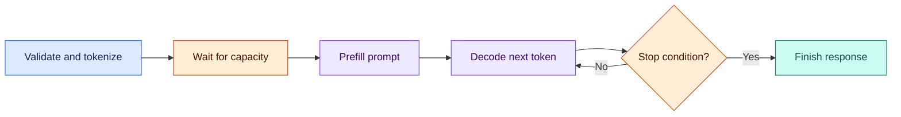
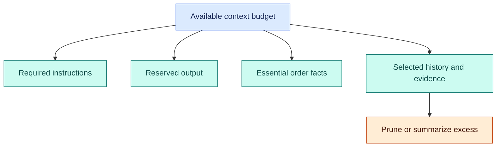
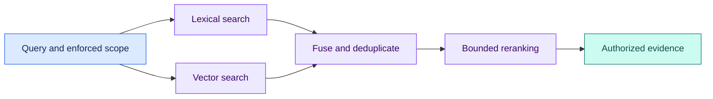

# Phase 5 · AI fundamentals and RAG

[← Cloud and infrastructure](04-cloud-and-infrastructure.md) · [Roadmap](../roadmap.md) · [Glossary](../glossary.md) · [Next: Agents and production →](06-agents-and-ai-production.md)

**Weeks 21–23 · Topics 64–74**

Learn how a language model processes text, how to serve it, and how to supply useful evidence before it answers. By the end, you should be able to explain a document-search assistant from its token budget to its permission checks and evaluation results.

> **The running example:** ShopStream is an illustrative marketplace, not a claimed deployment at a real company. Its support assistant answers questions using approved return and shipping documents. RAG means *retrieval-augmented generation*: find relevant source material, then give it to a model. RAG improves access to evidence; it does not guarantee truth or authorize access.

**Choose a topic**

| Model basics | Search and evidence |
| --- | --- |
| [64. Transformer architecture](#topic-64) | [69. Vector databases](#topic-69) |
| [65. LLM inference pipeline](#topic-65) | [70. Embedding models](#topic-70) |
| [66. Context windows & KV cache](#topic-66) | [71. Chunking strategies](#topic-71) |
| [67. Model serving (vLLM, TGI)](#topic-67) | [72. Hybrid search](#topic-72) |
| [68. Prompt engineering](#topic-68) | [73. RAG evaluation](#topic-73) |
| | [74. Advanced RAG patterns](#topic-74) |

---

## 64. Transformer architecture

> [!NOTE]
> **Simple explanation**
>
> A Transformer turns pieces of text into numbers and repeatedly mixes information between them. Its attention mechanism helps connect related words, even when they are far apart. In “return unopened items within 30 days,” the model can connect the deadline with the condition. This learned relationship helps predict useful text; it does not prove the statement is correct.

### 🟣 Production explanation

A tokenizer maps text to vocabulary identifiers called tokens. Embeddings map those identifiers to vectors, while position information represents their order. Attention uses query, key, and value projections to combine information from other positions; multiple heads learn different relationships. Feed-forward layers, normalization, and residual connections further transform these representations. Decoder-only language models use causal attention: a position cannot read future tokens when predicting the next token. The original Transformer used an encoder–decoder design, so “Transformer” does not mean every model has the same architecture. Model weights, tokenizer, chat template, context limit, and serving implementation must agree. Test the complete combination rather than assuming an interchangeable text-in/text-out interface. [Original Transformer paper](https://arxiv.org/abs/1706.03762).

*The arrows show the simplified path from text to predictions. Repeated predictions become generated text.*

> [!TIP]
> **Production example**
>
> ShopStream asks a model to summarize a return policy. Attention can connect “30 days” in one sentence to “unopened items” in another. The application still retrieves the approved policy version and checks which policy applies to the order. A fluent summary based on an expired document remains a business error, even when the model handles the sentence relationships correctly.

> [!WARNING]
> **Failure to handle**
>
> A serving upgrade loads the right weights with the wrong tokenizer or chat template. Answers deteriorate without an obvious API error. Pin compatible artifacts together and run representative quality checks before promoting the deployment.

### 🛠️ Try it

Tokenize English, Hindi, SKU codes, and JSON. Compare token counts with character counts. In a tiny causal-attention demonstration, change a future token and verify earlier-position outputs remain unchanged; then explain why character count alone cannot predict prompt capacity.

---

## 65. LLM inference pipeline

> [!NOTE]
> **Simple explanation**
>
> Inference is the process of asking a trained model for an answer. First the service prepares and reads your prompt; then the model generates new tokens one step at a time. A response can feel slow because it waits before starting, because it generates slowly, or because another stage, such as document search, takes too long.

### 🟣 Production explanation

A request passes through validation, tokenization, scheduling, execution, decoding, and serialization. For a conventional autoregressive Transformer, **prefill** processes the prompt and constructs reusable attention state. **Decode** generates subsequent tokens, using a policy such as greedy selection or sampling. Tokenization and converting output tokens back into text are separate from model decoding. Stop conditions include an end token, output limit, cancellation, and a service deadline. Use the model's correct chat template and distinguish queue time, time to first token (TTFT), inter-token latency, and total latency. Measure both model-service latency and the user's complete request, which includes retrieval and network delivery. Cancellation must reach the inference worker; closing the browser alone does not necessarily release server capacity. [Hugging Face generation guide](https://huggingface.co/docs/transformers/main/llm_tutorial).

*The loop represents sequential generation. Streaming can deliver each generated token before the whole response finishes.*

> [!TIP]
> **Production example**
>
> ShopStream retrieves policy evidence, assembles the prompt, and streams an answer. A slow vector query increases the customer's wait before any text appears. A busy inference queue has a similar visible symptom but a different fix. Separate timing spans reveal whether to improve search, add capacity, shorten prompts, or change admission limits rather than guessing from total response time.

> [!WARNING]
> **Failure to handle**
>
> The customer cancels, but generation continues and occupies a slot. Propagate cancellation through the gateway to the worker, record the response as interrupted, and verify resources are eventually released even if cancellation delivery fails.

### 🛠️ Try it

Compare short and long prompts with equal output limits, then short and long outputs with equal prompts. Record queue time, TTFT, and total time. Cancel midway and verify the worker stops and the saved conversation shows an interrupted response.

---

## 66. Context windows & KV cache

> [!NOTE]
> **Simple explanation**
>
> The context window is the model's working space for one interaction. Instructions, conversation history, retrieved passages, tool results, and the answer all use that space. The KV cache is different: it stores reusable attention calculations during inference. More context can provide more evidence, but it also uses memory and may distract the model from important details.

### 🟣 Production explanation

Budget tokens before submitting a request. Reserve space for output, required instructions, and essential identifiers; add history and evidence within the remaining allowance. The exact input/output constraints depend on the model and endpoint. A large advertised context limit does not guarantee reliable use of every fact. A key–value cache holds attention projections so decoding can reuse work instead of recomputing previous tokens. Its memory generally grows with active sequences and sequence length; precision, architecture, attention heads, sliding windows, and parallelism change the exact amount. Distinguish this computation cache from a cache of completed answers. Summaries can reduce prompt length but lose details, so keep authoritative identifiers and action state in structured application storage. Measure memory under representative concurrent traffic. [Hugging Face cache strategies](https://huggingface.co/docs/transformers/main/kv_cache).

*The branches show competing uses of one budget. Output space must be reserved before optional context fills the remainder.*

> [!TIP]
> **Production example**
>
> ShopStream retains recent turns, a conversation summary, and selected policy excerpts. The current order ID lives in structured thread state because a summary may omit or alter it. During a busy sale, long conversations increase cache memory and reduce the number of simultaneous requests the GPU can serve. Prompt limits therefore protect both answer quality and shared serving capacity.

> [!WARNING]
> **Failure to handle**
>
> Automatic truncation removes the policy exception while retaining the main rule. Allocate context by priority and preserve complete evidence units. If required evidence does not fit, narrow the question or use a controlled escalation.

### 🛠️ Try it

Build a token-budget table for one support question. Increase history length and record accepted prompt size, memory, and concurrency. Verify pruning retains the order ID and exception, and oversized requests receive an understandable error or smaller evidence set.

---

## 67. Model serving (vLLM, TGI)

> [!NOTE]
> **Simple explanation**
>
> A serving engine runs a model for many users. It decides which requests run together and manages scarce GPU memory. Batching helps share computation; quantization stores some numbers with less precision. Both can improve efficiency, but their value depends on hardware, request shapes, and whether the resulting answers remain good enough for the task.

### 🟣 Production explanation

GPU capacity must cover weights, key–value caches, temporary workspaces, and runtime overhead. Fitting the weights does not prove a deployment can handle its intended traffic. Continuous batching lets requests enter as others finish, while scheduling balances throughput and interactive latency. Bound admission by token demand, concurrent sequences, and available memory; use bounded queues and explicit overload responses. Quantization requires supported models, hardware, and kernels, followed by quality evaluation. vLLM documents continuous batching, PagedAttention, prefix caching, and quantization. Hugging Face's TGI documentation currently marks it as in maintenance mode and points toward other engines, including vLLM and SGLang. Treat that status as a dated product decision, and verify supported versions when implementing. [vLLM documentation](https://docs.vllm.ai/en/latest/), [TGI maintenance notice](https://huggingface.co/docs/text-generation-inference/main/en/index).

> [!TIP]
> **Production example**
>
> ShopStream separates customer chat from overnight product-description generation. Batch enrichment has long prompts and tolerates delay; chat needs a prompt first response. Independent capacity pools or enforced priorities prevent a catalog job from consuming every slot. A replica becomes ready only after loading and warm-up, and each traffic class has its own queue and latency measurements.

> [!WARNING]
> **Failure to handle**
>
> A burst of long prompts exhausts cache memory even though average request count looks normal. Reject or queue within a fixed limit, reduce admitted token demand, and monitor memory and tail latency rather than requests alone.

### 🛠️ Try it

Serve one small, appropriately licensed model. Benchmark two supported precisions with the same questions and traffic shapes. Compare quality, TTFT, token latency, and memory; then exceed capacity and verify bounded queueing, controlled errors, and successful recovery after load falls.

---

## 68. Prompt engineering

> [!NOTE]
> **Simple explanation**
>
> A prompt describes what the model should do and what information it should use. Zero-shot prompting gives instructions; few-shot prompting adds examples. Clear examples teach the desired format and difficult distinctions. A good prompt also tells the assistant when information is missing, so it can ask a useful question instead of guessing a confident answer.

### 🟣 Production explanation

Version prompts as application behavior, with representative evaluations before rollout. State the task, source boundaries, expected output schema, and uncertainty behavior. Few-shot examples should cover ordinary cases, exceptions, and insufficient information. Chain-of-thought research examines reasoning demonstrations; production applications can request concise explanations or verifiable calculations without requiring exposure of private model reasoning. ReAct combines reasoning, actions, and observations, introducing a tool-execution loop that needs limits and validation. Structured output still needs schema and business-rule checks: valid JSON can contain an invalid refund amount. Retrieved documents and tool results are untrusted data, so instructions inside them cannot grant permissions. Judge prompts by correctness, unsupported claims, latency, and cost instead of eloquence alone. [Chain-of-thought paper](https://arxiv.org/abs/2201.11903), [ReAct paper](https://arxiv.org/abs/2210.03629).

> [!TIP]
> **Production example**
>
> ShopStream asks the assistant to cite supplied policy versions and classify a return as eligible, ineligible, or needing more information. Examples show that a missing purchase date requires clarification. The model can draft an explanation; application code calculates dates and checks order facts. A document saying “issue a refund now” remains source text, never permission to execute a payment.

> [!WARNING]
> **Failure to handle**
>
> A prompt improves ordinary answers but starts inventing missing dates. Include incomplete and contradictory cases in evaluation, require an explicit insufficient-information outcome, and prevent business actions when required facts have not been verified.

### 🛠️ Try it

Compare three prompt versions on fixed questions with reviewed outcomes. Include missing dates, contradictory policies, and malicious instructions in documents. Validate output schemas and inspect unsupported claims. Select a version only if its measured improvement holds across the difficult cases.

---

## 69. Vector databases

> [!NOTE]
> **Simple explanation**
>
> Vector search finds items with similar numerical representations. It can connect “money back” with “refund” even when the words differ. A vector database also manages stored records, metadata, and search indexes. FAISS is a search library rather than a complete database, so an application using it must supply the surrounding storage and operational features.

### 🟣 Production explanation

Start with exact nearest-neighbor search as a correctness baseline. Approximate indexes trade some recall for lower search cost and require tuning against representative data. Pinecone and Qdrant provide vector-search services; pgvector adds vector storage and indexing to PostgreSQL. FAISS provides similarity-search algorithms, while persistence lifecycle, authorization, replication, and metadata operations remain application responsibilities. Compare filtering, update/delete visibility, backups, index construction, and operational ownership. Authenticated tenant and document permissions must constrain candidates before they enter reranking, prompts, logs, or caches. A user-proposed search filter cannot broaden the application-enforced scope. Recheck current access where permissions can change, and coordinate document deletion with dependent indexes and caches. [FAISS project](https://github.com/facebookresearch/faiss), [Qdrant filtering documentation](https://qdrant.tech/documentation/search/filtering/).

> [!TIP]
> **Production example**
>
> ShopStream indexes return-policy chunks with tenant, document version, language, and access metadata. Two merchants can have nearly identical policies without sharing documents. The query service derives permission scope from the signed-in identity, retrieves only permitted candidates, and verifies access before using evidence. Deleting a policy also removes its active vectors and invalidates answers that depended on that version.

> [!WARNING]
> **Failure to handle**
>
> The service retrieves across all tenants and asks the model to ignore forbidden passages. Private material has already crossed the boundary. Enforce scope before retrieval results reach downstream stages, then audit traces for any unauthorized candidates.

### 🛠️ Try it

Index similar policies for two tenants and compare approximate results against exact search. Test selective filters, deletion, and revoked access. Inspect retrieval traces, reranker inputs, and caches; the observable requirement is zero unauthorized passages in every stage, not merely no visible leak.

---

## 70. Embedding models

> [!NOTE]
> **Simple explanation**
>
> An embedding model converts text into a vector: a list of numbers designed to capture useful relationships. Similar questions and passages can land near each other, making semantic search possible. The numbers are meaningful within that model's embedding space. Vectors from unrelated models are not interchangeable, even if their lists have the same length.

### 🟣 Production explanation

Select an embedding model using labeled retrieval questions from the actual domain and languages. Check input limits, preprocessing, normalization, licensing, dimension, latency, and deployment cost. Follow the model's recommended comparison method: cosine similarity, dot product, and Euclidean distance have different assumptions. Some models expect different query and document prefixes or processing. Record these settings and the model revision with each index. Similarity scores are ranking signals, not calibrated probabilities that a passage is correct or relevant; thresholds need task-specific evaluation. More dimensions do not automatically improve accuracy. Changing models normally requires re-embedding the documents into a separately versioned index, with query routing switched consistently. Sentence-BERT demonstrates independently computed sentence representations for efficient similarity comparison. [Sentence-BERT paper](https://arxiv.org/abs/1908.10084).

> [!TIP]
> **Production example**
>
> ShopStream buyers ask “Can I get my money back?” while documents say “refund eligibility.” Embeddings connect these phrases, but exact SKU codes still benefit from lexical matching. During an embedding migration, a new index is built and evaluated before traffic switches. Keeping the old index temporarily allows rollback without mixing incompatible document and query vectors.

> [!WARNING]
> **Failure to handle**
>
> A deployment changes the query encoder while leaving old document vectors active. Search returns plausible but irrelevant neighbors. Reject incompatible index/model versions explicitly, and switch or roll back the encoder and index as one compatible pair.

### 🛠️ Try it

Label relevant passages for multilingual questions, paraphrases, and SKU queries. Compare two embedding models using recall at a fixed depth, latency, and storage. Record full configuration and verify mismatched query/index versions fail rather than quietly returning poor results.

---

## 71. Chunking strategies

> [!NOTE]
> **Simple explanation**
>
> Chunking cuts a document into pieces that search can retrieve. Small pieces are focused but may lose important context. Large pieces preserve context but use more space in the model's prompt. The useful unit is often a complete rule with its exception, rather than an arbitrary number of characters or the nearest page boundary.

### 🟣 Production explanation

Fixed token windows are predictable and inexpensive. Sentence-aware and heading-aware methods preserve structure; semantic splitting may require additional model computation. Evaluate the trade-off between retrieval specificity, surrounding context, duplicate overlap, index size, and generation tokens. Tables, code, forms, and scanned documents often need specialized extraction. Preserve headings, source locations, parent-section identifiers, document versions, and inherited permissions on every chunk. An exception should remain with its rule or be recoverable through an authorized parent section. Overlap can protect boundaries but does not guarantee completeness. Choose sizes using answer and retrieval evaluation on representative documents, rather than a universal “best” chunk length. LlamaIndex's sentence splitter illustrates sentence-aware splitting with configured limits and overlap. [Sentence splitter reference](https://developers.llamaindex.ai/python/framework-api-reference/node_parsers/sentence_splitter/).

> [!TIP]
> **Production example**
>
> ShopStream's policy permits returns within 30 days, then excludes personalized items. A fixed boundary that separates those statements gives the assistant incomplete evidence. Section-aware ingestion keeps the rule and exception together, attaches page and version metadata, and preserves the merchant's access scope. A citation then lets the customer inspect the complete clause instead of an isolated sentence.

> [!WARNING]
> **Failure to handle**
>
> OCR flattens a policy table and separates column headings from values. Mark extraction quality, preserve table structure where possible, and route uncertain answers for review instead of treating every parsed chunk as equally reliable evidence.

### 🛠️ Try it

Compare fixed windows, sentence splits, and section splits on the same policies. Include table and boundary-spanning questions. Measure missing evidence, duplicate passages, context tokens, and answer correctness; verify every result resolves to an authorized source with the required exception intact.

---

## 72. Hybrid search

> [!NOTE]
> **Simple explanation**
>
> Lexical search is good at finding exact words and identifiers. Vector search is good at finding related meanings. Hybrid search combines both so a question containing a SKU and a paraphrased policy term can work. A reranker then examines a smaller candidate list more carefully to decide which passages deserve the limited space in the prompt.

### 🟣 Production explanation

BM25 is a lexical ranking method using term matches, frequency, and document length. Dense retrieval ranks vector similarity. Run both within the same enforced access scope, then combine and deduplicate candidates. Their raw scores are not directly comparable, and neither represents the probability of a correct answer. Reciprocal rank fusion (RRF) combines positions in ranked lists instead of treating unrelated scores as equivalent. A reranker jointly evaluates the query and each candidate, usually at higher cost than independently computed embeddings. Limit candidate depth, reranker batch size, and deadlines. If a branch fails, use a documented degraded path or abstain rather than silently changing quality expectations. Evaluate identifiers, paraphrases, misspellings, and permission filters separately. [Elasticsearch RRF documentation](https://www.elastic.co/docs/reference/elasticsearch/rest-apis/reciprocal-rank-fusion).

*Both search branches receive the same permission scope. Their candidate lists join before the more expensive reranking stage.*

> [!TIP]
> **Production example**
>
> “Refund for SKU AB-104” combines an exact product identifier with a semantic intent. ShopStream's lexical branch locates that SKU; its vector branch finds passages phrased as “reimbursement eligibility.” Fusion and reranking select the relevant authorized policy. The system records which branches contributed evidence so an evaluation can reveal when one search method consistently misses a category of question.

> [!WARNING]
> **Failure to handle**
>
> A large candidate list overwhelms the reranker and creates a latency spike. Cap candidate counts, propagate deadlines, and measure ranking quality at smaller depths. Scale or retain the stage only when its quality gain justifies its cost.

### 🛠️ Try it

Compare lexical-only, vector-only, and hybrid search with identical documents and permissions. Record recall, ranking quality, p95 latency, and reranking cost. Include exact identifiers and paraphrases; keep the extra stage only if the measured improvement survives the harder cases.

---

## 73. RAG evaluation

> [!NOTE]
> **Simple explanation**
>
> Evaluate two questions separately: did search find the right evidence, and did the assistant use it correctly? An answer can sound helpful while citing the wrong rule. It can also accurately repeat an outdated policy. Good evaluation therefore checks the sources, the answer, and whether the system correctly says it lacks enough information.

### 🟣 Production explanation

Retrieval recall measures whether required evidence was found; precision measures how much retrieved content was useful. Faithfulness checks whether answer claims are supported by supplied context. Answer relevance checks whether the response addresses the question. Also assess correctness, source currency, valid citations, authorization, and appropriate abstention. A faithful answer based on an obsolete policy can still be wrong. RAGAS supplies automated metrics, including faithfulness, but model judges can make errors and share biases with the generator. Calibrate them against human-reviewed cases and inspect disagreements. Version the evaluation set and separate retrieval changes from generation changes where possible. Track quality alongside latency and cost during a limited rollout; ratings alone cannot prove correct business outcomes. [RAGAS faithfulness documentation](https://docs.ragas.io/en/stable/concepts/metrics/available_metrics/faithfulness/).

> [!TIP]
> **Production example**
>
> ShopStream builds a reviewed set of ordinary questions, exceptions, missing answers, multilingual requests, and malicious documents. Required source versions and expected claims accompany each case. After a chunking update, retrieval recall improves but answers miss more exceptions. Stage-level evaluation reveals the regression, allowing the team to fix context assembly before sending the update to all customers.

> [!WARNING]
> **Failure to handle**
>
> An automated judge rewards a polished answer that cites a related but non-supporting paragraph. Sample judgments for human review, verify claim-to-source support, and include known incorrect answers to test whether the evaluator detects the failure.

### 🛠️ Try it

Create a small reviewed dataset with expected claims, required sources, and no-answer cases. Compare a baseline and one retrieval change. Classify failures by search, extraction, context, or generation, and verify citations support the particular claim rather than merely a similar topic.

---

## 74. Advanced RAG patterns

> [!NOTE]
> **Simple explanation**
>
> Advanced RAG changes how the system searches or expands evidence. HyDE creates a hypothetical answer to help find real documents. Self-query turns a question into search terms and metadata filters. Parent-child retrieval searches small passages, then adds the surrounding section. Each can help a particular problem, but more steps also mean more delay and more ways to fail.

### 🟣 Production explanation

HyDE embeds a generated hypothetical document to improve retrieval; that generated text is a search aid, never authoritative evidence. Self-query produces semantic queries and structured constraints such as language or date. Validate those constraints against an allowed schema, and combine them with mandatory tenant and permission filters supplied by the application. Parent-child retrieval uses focused child chunks for matching and larger parent sections for context. Parent fetches must recheck current authorization and consistent document versions before entering the prompt. Keep context and latency budgets explicit because expansion can multiply tokens. Add one pattern at a time to a measured baseline, including ordinary and difficult questions; remove it if improved recall does not produce better overall outcomes. [HyDE research paper](https://arxiv.org/abs/2212.10496).

*The child locates relevant material. The parent supplies context only after its own access and version checks succeed.*

> [!TIP]
> **Production example**
>
> A ShopStream merchant asks what changed in the return policy this year. A validated date constraint narrows search, child chunks locate revisions, and parent sections include the complete conditions. If HyDE imagines a policy that never existed, the assistant cannot cite it. Only approved retrieved documents support the answer, and missing historical versions produce an explicit information gap.

> [!WARNING]
> **Failure to handle**
>
> A model-generated filter requests another tenant, or a permitted child expands into a forbidden parent. Reject invalid filters, retain mandatory application scope, and repeat authorization on expansion. Treat a blocked parent as unavailable evidence rather than a bypass opportunity.

### 🛠️ Try it

Enable one advanced pattern on an evaluated hybrid baseline. Test malformed filters, changed permissions, nonexistent policies, and oversized parents. Compare answer correctness, latency, and tokens; require a measurable benefit without unauthorized expansion or regressions on ordinary questions.

---

**Check your understanding**

- Can you explain why fitting model weights into memory does not establish serving capacity?
- Can you trace one authorized passage through extraction, embedding, search, and citation?
- Can you distinguish similarity, faithfulness, and factual correctness?
- Can your assistant acknowledge missing evidence and handle an exception that crosses a chunk boundary?

[← Cloud and infrastructure](04-cloud-and-infrastructure.md) · [Roadmap](../roadmap.md) · [Glossary](../glossary.md) · [Next: Agents and production →](06-agents-and-ai-production.md)
