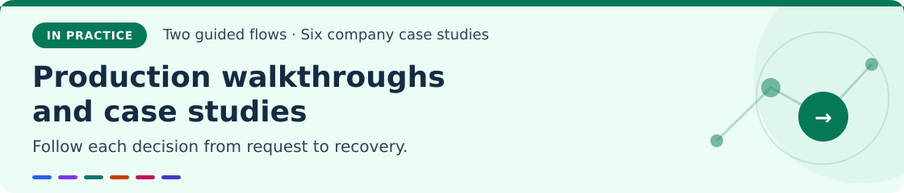
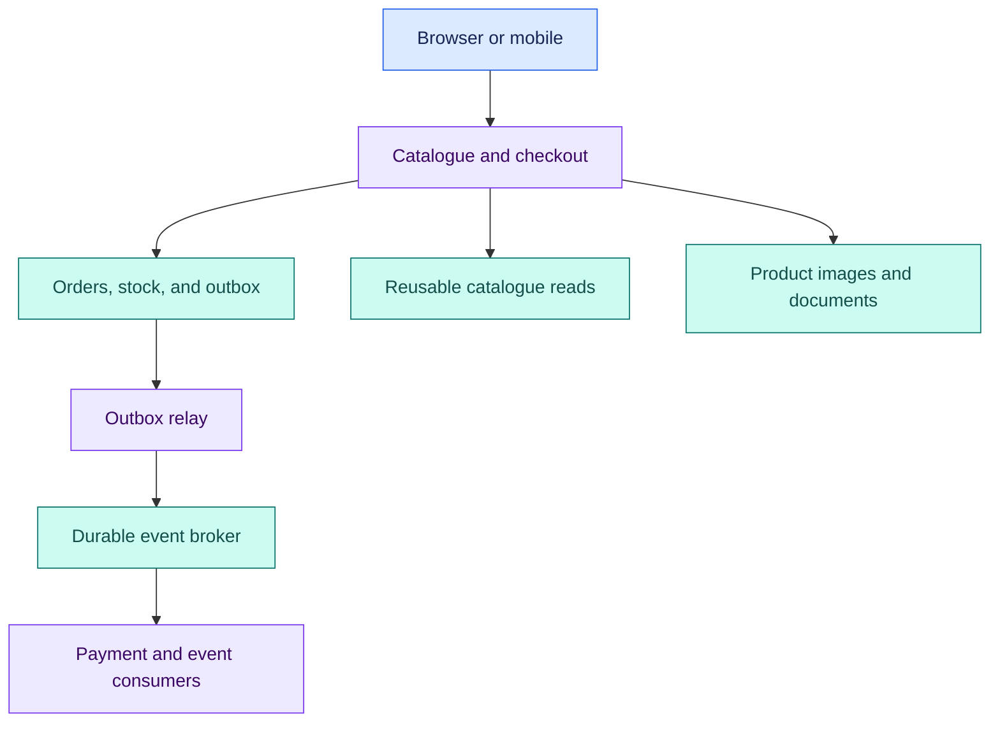
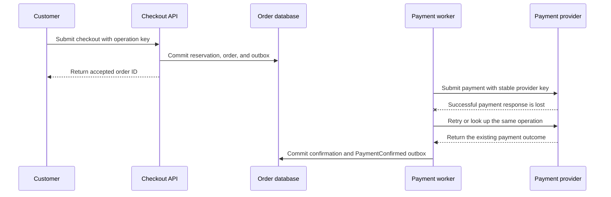
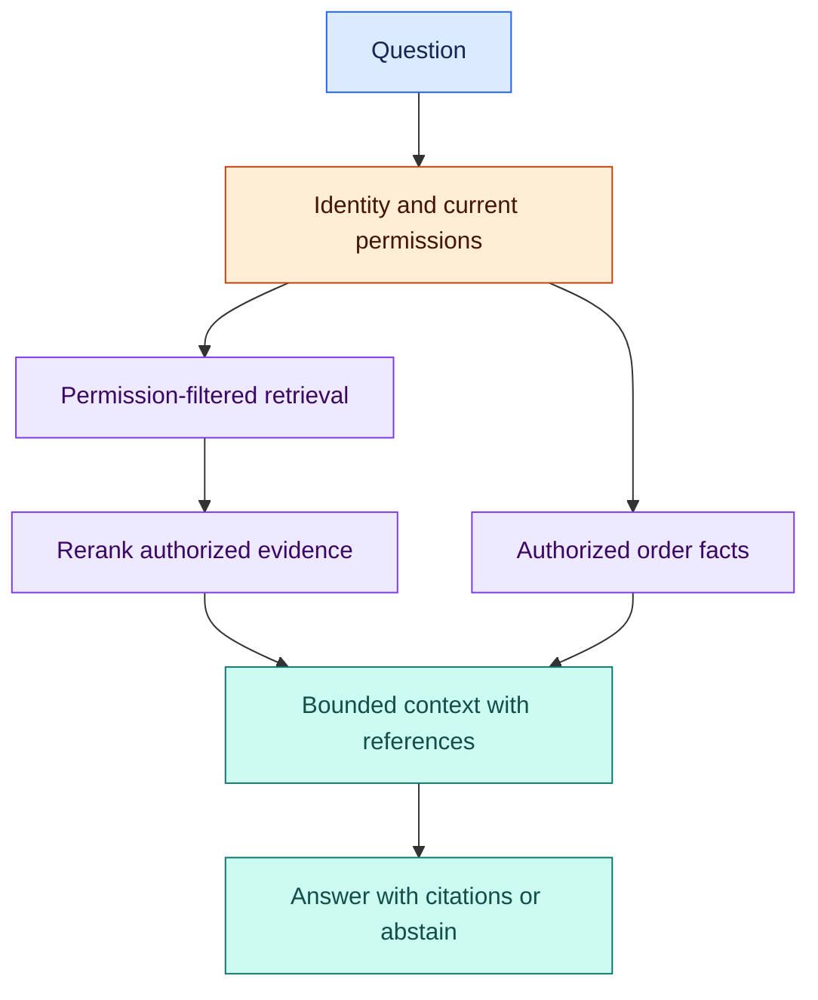

# Production walkthroughs and case studies

[Home](../README.md) · [Roadmap](../roadmap.md) · [Glossary](../glossary.md) · [← AI production systems](06-agents-and-ai-production.md)

**Follow the complete flow, then inspect what happens at its failure boundaries.**

Read these after the phase chapters, or return to them whenever a concept feels disconnected. ShopStream is an illustrative marketplace. The six company accounts are documented examples with primary references.

- [Checkout: one order through retries and failures](#checkout)
- [Document Q&A: authorized evidence through the full pipeline](#document-qa)
- [Six documented production case studies](#company-cases)
- [Further reading](#further-reading)

---

<a id="checkout"></a>
## Checkout: one order through retries and failures

> [!NOTE]
> **Simple explanation**
>
> A checkout is a promise about stock and money. Clicking twice or losing a connection should not buy the same item twice. Save one logical order, reserve its stock safely, and use the same payment identity while discovering the payment outcome. Send receipts in the background.

### 🟣 Production explanation

Networking, storage, workflows, messaging, and recovery cooperate across several boundaries. A local transaction preserves local order/inventory state; the payment provider has a separate contract; durable workflow state reconciles uncertain outcomes. The numerical workload below is a teaching assumption. The business invariants must hold through the specified failures.

### Define the product contract

Customers can browse products, reserve available stock, pay, and inspect their order. A successful durable acceptance creates an order that remains discoverable after a restart. A payment timeout can leave an order pending while reconciliation determines the real outcome. A card decline is an expected business result, whereas a lost order is a correctness failure. Receipts may arrive later without blocking checkout.

Write invariants before implementation: inventory cannot become negative; the same logical checkout cannot produce two orders or charges; every order belongs to the verified tenant and customer; paid orders eventually reach a confirmed or explicitly reconciled state. Add a documented expiry rule for abandoned reservations, coordinated with payment state so late payment confirmation does not silently resurrect an already released reservation.

### Estimate demand and choose the first architecture

Assume 100,000 daily active users and 20 API requests each. Average demand is `100,000 × 20 / 86,400 ≈ 23.1 requests/second`. A peak factor of 10 gives approximately 231 requests/second. At a mean response size of 20 KB, API response bandwidth is approximately 4.62 MB/second, excluding images, transport overhead, retries, and internal traffic. At a mean request time of 0.2 seconds under stable load, Little's law gives approximately `231 × 0.2 = 46.2` concurrent requests. This is an average occupancy estimate, not a concurrency limit or a prediction of tail latency.

Suppose 10,000 daily orders each consume a 2 KB primary record. That is about 20 MB/day or 7.3 GB/year before line items, indexes, replication, event retention, and backups. Product media may dwarf that number. A worksheet should separate metadata, media, analytical data, and operational telemetry, because they need different retention and storage policies.

Start with a modular application and background workers:



The initial transaction records the pending order and a PaymentRequested outbox event. Its consumer starts payment processing. Later, payment confirmation and a PaymentConfirmed outbox event commit together; only confirmed-payment events authorize paid receipts and fulfillment. Publication and delivery can repeat at either stage.

Add application instances behind ingress when a representative load test shows benefit. Allocate database connections across all instances and workers. For example, 20 replicas with a 30-connection pool imply up to 600 application connections before administrative or rollout overlap. A pool proxy reduces connection churn; it does not multiply database throughput. Monitor pool wait and transaction duration. [PgBouncer pooling modes](https://www.pgbouncer.org/features.html).

### Make the database mutation safe

`POST /orders` contains a client idempotency key. Bind it to the authenticated tenant and operation, compute a stable digest of the relevant request, and protect the key with a uniqueness constraint. Reuse with a changed payload is rejected. Concurrent requests using the same key must coordinate through durable database state, not a process-local map. The key's retention window must match the supported retry period.

Within one short transaction, create or claim the logical operation, reserve stock atomically, create the pending order, and insert an outbox event. A reservation can use an update shaped like this:

```sql
UPDATE inventory
SET available = available - :quantity
WHERE tenant_id = :verified_tenant
  AND sku_id = :sku
  AND available >= :quantity
RETURNING available;
```

This is conceptual SQL; parameter syntax depends on the client library. Validate a positive quantity first. If no row is returned, the stock condition or authorized resource lookup failed, and no reservation is created. Handle multiple order lines with a consistent locking order and transactional rollback. Store the agreed price on each order line, since catalogue prices can change. Commit before acknowledging durable acceptance, and expose a status endpoint so an uncertain client can discover the outcome.

Keep external HTTP calls outside the inventory transaction. Waiting on a payment provider while holding locks makes latency and contention depend on an unrelated service.

### Coordinate payment and publication

A durable workflow submits payment with a stable provider idempotency key derived from the logical operation. If the provider commits but its response is lost, retry with the same key or query/reconcile the operation according to the provider's contract. Several HTTP attempts can still produce one effective charge. A local “payment sent” boolean written after the HTTP call cannot protect against a crash between charge and database update. [Stripe's idempotent-request contract](https://docs.stripe.com/api/idempotent_requests).

The lost-response case crosses the database and payment boundaries:



The lost response leaves the worker uncertain. A repeated call is an additional network attempt; provider idempotency or result lookup preserves one effective charge. Committing the confirmed state and its outgoing event together prevents a crash from leaving a paid order without downstream fulfillment work.

Write state transitions explicitly: pending, reserved, payment-pending, confirmed, compensation-pending, and cancelled. Define how callbacks are authenticated and deduplicated, how delayed confirmation interacts with expiry, and who resolves ambiguous cases. A refund is a new compensating operation that can itself fail or require reconciliation.

The outbox relay publishes committed events, possibly more than once. For each consumer, atomically commit its database effect and processed-event record when they share a datastore. This closes a local replay window. For email, payment, or another external service, use that service's deduplication or lookup contract; if none exists, document and handle possible duplicate effects rather than claiming universal exactly-once behavior. [Debezium outbox pattern](https://debezium.io/documentation/reference/stable/transformations/outbox-event-router.html).

### Preserve correctness while making reads fast

Cache descriptions and media, but reserve stock against authoritative state. Route a newly accepted order lookup to a source satisfying read-after-write expectations. A stale replica returning “not found” must not encourage the client to create a new logical checkout.

Tenant isolation follows every derived representation: SQL lookup, cache key, event envelope, search index, export, and signed download. A user-supplied tenant identifier is not proof of membership. Database row-level policies can reinforce the boundary, provided the application's roles and privileged bypass behavior are controlled. [PostgreSQL row security](https://www.postgresql.org/docs/current/ddl-rowsecurity.html).

### Observe and break the system deliberately

Trace ingress, transaction, workflow steps, provider calls, outbox delay, and receipt delivery. Track completed requests, failure ratio, latency histograms, pool wait, worker concurrency, queue age, and unresolved payment outcomes. A request-based target such as 99.9% across one million eligible requests permits 1,000 bad requests; define eligibility and business-decline handling before computing the number. Logs can record operation IDs and state transitions while excluding card details, credentials, and unrestricted customer content.

Run failure tests with concrete expected behavior:

| Failure | Required behavior to demonstrate |
|---|---|
| Client loses response after order commit | Repeating the same key returns the existing operation and does not reserve stock again. |
| Two buyers race for the final unit | Only one reservation succeeds; no negative stock or half-created order remains. |
| Worker dies after provider success | Recovery uses the stable provider key or result reconciliation and preserves one effective charge. |
| Relay dies after publishing | A repeated event causes one local consumer state change. External effects follow their stated provider contract. |
| Cache is flushed during a sale | Bounded misses protect the database; catalogue reads may slow without corrupting inventory. |
| Payment provider becomes slow | Deadlines and isolated concurrency leave browsing responsive; uncertain payments remain recoverable. |
| Read replica lags | The customer's own accepted order remains discoverable through the documented read path. |
| Database is restored from backup | Inventory, orders, outbox/workflow state, keys, and external payment records are reconciled before unrestricted checkout resumes. |

Keep the measured timeline and result of each test. The application being reachable after a fault is weaker evidence than the business invariants still holding.

---

<a id="document-qa"></a>
## Document Q&A: evidence with permission checks

> [!NOTE]
> **Simple explanation**
>
> Think of this as an assistant consulting the right handbook. It first checks which documents you may read, finds the relevant passages, and answers with references. Current order facts come from an authorized application tool. Missing evidence should produce an honest no-answer result.

### 🟣 Production explanation

The support assistant needs two separate truths: current account facts from authorized application APIs, and applicable policy text from documents. A language model proposes an answer using these inputs; it does not establish order ownership, change stock, or authorize a refund.

### Build reliable ingestion

Authenticate the uploader, derive tenant context, validate file type and size, and store the original with a checksum. A durable job parses text, performs OCR where needed, preserves headings/tables, and emits chunks carrying document ID, tenant ID, version, source location, permissions, and extraction quality. Embedding requests are retried with idempotent job state. A partially processed document is not silently presented as a fully indexed version.

Publish a new index version after verification. Updating policies should supersede old versions according to explicit effective dates rather than indiscriminately replacing history: an order placed last month might be governed by an earlier policy. Changing embedding models normally requires a separate compatible vector space and a verified index migration.

### Retrieve authorized evidence



Only permitted documents and order facts enter the context. Citations let the reader inspect evidence; they do not replace correctness or freshness checks.

Apply access filtering during retrieval and revalidate source access as needed before using results. Retrieving everyone's content and asking the model to hide private documents exposes unnecessary data and fails to establish a reliable authorization boundary. Permission changes and deletion must propagate into indexes and caches; a current authorization check also protects against stale derived access metadata. [Microsoft query-time security filtering](https://learn.microsoft.com/en-us/azure/search/search-security-trimming-for-azure-search).

Combine lexical search for exact product codes and terms with vector search for paraphrases. Reranking improves relevance but adds latency and cost. Choose chunk size by evaluating realistic questions, including references across paragraphs and table rows. Assemble only useful evidence within a context budget, and keep a reference map so cited passages can be inspected.

### Generate and act under separate controls

Require citations for factual policy claims and a clear no-answer path when evidence is missing, contradictory, or unreadable. Source text is untrusted content: a malicious PDF can contain instructions to export customer records. The application must enforce tools, permissions, allowed destinations, execution budgets, and consequential-action approvals outside the prompt.

For “Can I return the second item?”, resolve the order and item through conversation state plus a live authorized order tool, retrieve the applicable policy, and draft the answer. Offering a refund and executing it are separate actions. A refund requires current business validation, the appropriate identity, a durable operation key, and the product's approval policy.

Stream the response with an explicit lifecycle: accepted, retrieving, generating, interrupted, complete, or failed. One durable user turn can survive reconnect, while worker crashes may still cause repeated model generation and additional cost. Measure time-to-first-token separately from total answer time.

### Evaluate the complete product

Begin with a small fixed evaluation set, such as 50 questions, then grow it from real failure patterns. Include straightforward questions, paraphrases, exact identifiers, missing information, outdated policies, scanned tables, conflicting sources, malicious instructions, and cross-tenant access attempts. For each case, record expected evidence, answer requirements, acceptable abstention, and permission scope.

Measure retrieval recall, whether generated claims are supported, whether the answer helps the user, inappropriate refusals, access leakage, freshness, latency, and cost per successful case. Automatic evaluators are useful signals; human review and deterministic permission checks validate what a model judge can miss. Hold out questions when selecting chunking, prompts, and retrieval settings so improvements generalize.

Release a new prompt, index, model, or routing rule as a versioned change. Compare against the previous evaluation results and observe a limited rollout. A faster or cheaper answer is an improvement only when the product's quality and permission requirements still hold.

---

<a id="company-cases"></a>
## Six documented production case studies

These six examples describe systems at the publication time of their primary sources. They provide evidence for design lessons; the ShopStream labs remain simplified illustrative designs.

### GitHub: failover and recovery must be tested together

GitHub's October 2018 incident began with a 43-second connectivity interruption and led to 24 hours and 11 minutes of degraded service. Database orchestration promoted West Coast primaries; some East Coast writes had not replicated, requiring reconciliation. The application tier was not prepared for cross-country database latency. Recovery included restoring large backups and draining queues. This connects asynchronous replication, geographic latency, failover decisions, and realistic restoration time. Use it to review topics 19, 21–22, and 39: available replicas alone do not prove the application can safely recover. [GitHub's post-incident analysis](https://github.blog/news-insights/company-news/oct21-post-incident-analysis/).

### Amazon: availability creates conflict-resolution obligations

The 2007 Dynamo paper describes an internal key-value store using consistent hashing, virtual nodes, configurable quorums, vector-clock versions, hinted handoff, and repair. Shopping-cart logic reconciles concurrent versions; preserving additions can reintroduce an item removed elsewhere. The lesson is that accepting updates through failures shifts work into application-level conflict resolution. Review topics 8, 20–21, and 24. The historical internal Dynamo account provides evidence for those mechanisms; it is not a complete specification of today's managed DynamoDB. [Amazon's original Dynamo account](https://www.allthingsdistributed.com/2007/10/amazons_dynamo.html).

### Google: global consistency combines several mechanisms

Google's 2012 Spanner paper describes synchronous replication through Paxos groups, two-phase commit across groups, and TrueTime's explicit clock-uncertainty interval. Commit waiting helps enforce external consistency. The F1 production example connects those mechanisms to an advertising backend needing consistent reads, transactions, and automatic failover while replacing a difficult MySQL sharding arrangement. Review topics 21–24: clock synchronization, consensus, and transactions serve different roles and have real coordination costs. [Google's Spanner paper](https://research.google.com/archive/spanner-osdi2012.pdf).

### Slack: durable commands and live delivery take separate paths

Slack's April 2023 engineering article separates persistent client WebSockets from channel-owning services. Gateway servers manage subscriptions across regions; channel servers own channel subsets selected through consistent hashing. Durable message submission goes through a web application API, and events then fan out through gateways. Presence updates are scoped to relevant users. Review topics 4, 20, and 34: socket connectivity, durable acceptance, subscriptions, and approximate presence are distinct concerns. [Slack's real-time messaging architecture](https://slack.engineering/real-time-messaging/).

### Netflix: inject a scoped failure and observe the user outcome

Netflix's 2014 FIT account explains that latency injection can cause cascading thread accumulation when timeouts and bulkheads are inadequate. FIT propagated scoped failure context to injection points, allowing teams to begin with a test account or device and expand exposure gradually. Automated device tests checked browsing and playback behavior. Review topics 35–38: formulate a resilience hypothesis, limit exposure, measure real user behavior, and stop when evidence disproves the hypothesis. Historical tooling names describe that publication's implementation. [Netflix's Failure Injection Testing account](https://netflixtechblog.com/fit-failure-injection-testing-35d8e2a9bb2).

### Uber: retrieval and ranking are separate production ML stages

Uber's two-tower recommendation account describes offline item embeddings, online user/query embeddings, approximate-nearest-neighbor candidate retrieval, and later ranking. Its integration with Michelangelo covers training, evaluation, deployment, serving, and Palette feature-store use. The article evaluates relevance and recall in session context alongside business measures. Review topics 69–70, 86, and 89: recommendations require a full data/model lifecycle and relevant evaluation, while a generative LLM is optional. [Uber's two-tower recommendation architecture](https://www.uber.com/us/en/blog/innovative-recommendation-applications-using-two-tower-embeddings/).

---

<a id="further-reading"></a>
## Further reading

Read the primary links beside each concept when you need a precise behavior or guarantee. For longer study, the source site's [Designing Data-Intensive Applications resource](https://dataintensive.net/), [Google SRE book](https://sre.google/sre-book/table-of-contents/), [AWS Well-Architected Framework](https://aws.amazon.com/architecture/well-architected/), and [Microsoft architecture patterns](https://learn.microsoft.com/en-us/azure/architecture/patterns/) complement the labs.

The site's link labeled Gaurav Sen points to a different handle; the intended creator's channel is [Gaurav Sen, @gkcs](https://www.youtube.com/@gkcs). Several framework documentation URLs redirect to newer homes. Hystrix, TGI, and AutoGen are covered to explain the source curriculum; their current maintenance status is identified in the relevant topics. Verify current official documentation and pin versions when implementing a lab.

For every design decision, record the requirement, tested workload, chosen guarantee, evidence, failure behavior, and reason to revisit it. That record is more useful in production than a diagram full of unexplained technology names.

[Home](../README.md) · [Roadmap](../roadmap.md) · [Glossary](../glossary.md) · [← AI production systems](06-agents-and-ai-production.md)
