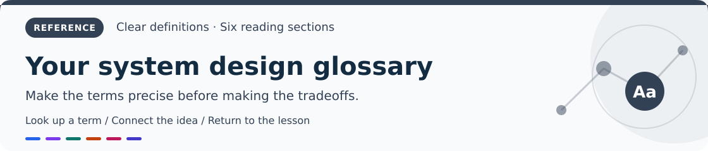

# A glossary for the reading guide

[Home](README.md) · [Roadmap](roadmap.md) · [Chapter 1 →](chapters/01-foundations.md)

Use this when a familiar word has a precise engineering meaning.

| **Start here** | Then explore | Finish with |
|---|---|---|
| **🟦 [Requests, load, and time](#requests-load-and-time)** | 🟩 [Data and correctness](#data-and-correctness) | 🟧 [Reliability, identity, and access](#reliability-identity-and-access) |
| **🟪 [Networking and APIs](#networking-and-apis)** | 🟩 [Repeated work and asynchronous processing](#repeated-work-and-asynchronous-processing) | 🟥 [AI, retrieval, and agents](#ai-retrieval-and-agents) |

> [!NOTE]
> A **network partition** breaks communication; a **data partition** divides stored records. They are different problems.

## Requests, load, and time

| Term | Meaning |
|---|---|
| **Latency** | How long one operation takes. Define its boundaries: browser-to-answer, API handling, and database query time differ. |
| **Throughput / QPS / RPS** | Operations or requests completed per second. Offered traffic can exceed completed traffic when queues grow or requests fail. |
| **p50 / p95 / p99** | Latency percentiles. A p95 of 300 ms means 95% of measured requests finished within 300 ms. It does not describe the slowest request. |
| **Tail latency** | The slow end of the distribution. Rare slow dependencies matter when many requests call several components. |
| **Deadline** | The latest useful completion time for an operation. Pass the remaining budget downstream. |
| **Timeout** | How long a caller waits. A timeout does not prove the remote operation failed or stopped. |
| **Concurrency** | Work in progress at the same time, including operations waiting on I/O. |
| **Parallelism** | Work executing simultaneously on multiple processing units. |
| **Backpressure** | Slowing or rejecting upstream work instead of accepting an unlimited backlog. |
| **Hot key / hot tenant** | A record or customer receiving disproportionate traffic. Balanced record counts can still produce unbalanced load. |

## Networking and APIs

| Term | Meaning |
|---|---|
| **DNS** | The name service used to discover addresses and other records. Cached answers can direct clients to an older destination. |
| **TLS** | Authenticated encryption for a connection. Validate certificates; encryption alone does not authorize access to an order. |
| **CDN** | Delivery infrastructure that serves eligible content near users, often from a cache. Personalized content needs cache isolation. |
| **TTL** | Time to live. It controls cached-item retention or DNS-answer reuse, not independent proof of source freshness. |
| **Anycast** | The same address is advertised from several locations. Routing chooses a path; geographic proximity is not guaranteed. |
| **L4 / L7** | Transport-layer versus application-layer routing. A layer-7 proxy can route using HTTP paths or headers. |
| **API contract** | Promised inputs, outputs, errors, permissions, and behavior. A changed field can break this contract. |
| **WebSocket** | A persistent channel where both sides send messages. Storage and replay determine durability. |
| **SSE** | Server-sent events: a server-to-client HTTP stream. Resuming missed events needs retention and replay logic. |

## Data and correctness

| Term | Meaning |
|---|---|
| **Invariant** | A rule that must remain true: nonnegative stock, one order owner, or one effective charge per logical payment. |
| **Transaction** | Database operations with defined commit and isolation guarantees. Its scope does not automatically include external HTTP calls. |
| **ACID** | Atomicity, consistency of declared rules, isolation, and durability. Actual guarantees depend on configuration and isolation level. |
| **Isolation** | How concurrent transactions observe and influence each other. |
| **Durability** | Retaining acknowledged changes through specified failures. Name the failure model and persistence configuration. |
| **Linearizability** | Each operation appears to happen at one instant between request and response, respecting real-time order. |
| **Eventual consistency** | Copies or derived views converge under stated delivery and conflict-resolution assumptions. Temporary disagreement must be acceptable. |
| **Read-after-write** | A caller observes its accepted change on a later read. A lagging replica may need special routing or waiting. |
| **Replica** | A maintained copy of data. Deletions can replicate too, so replicas do not replace independent backups. |
| **Data partition / shard** | A subset of records. Independent shards can distribute work; partitions inside one server do not automatically add machines. |
| **Network partition** | Components cannot communicate reliably even though they may still run and receive requests. |
| **Consensus** | Participants agree on values or a log within a failure model. It does not automatically coordinate all application transactions. |
| **Quorum** | A required number or set of participants. Read/write overlap alone does not prove linearizability. |
| **Fencing token** | An increasing authority version checked by the modified resource, rejecting writes from an old leader. |
| **Schema** | Data or message structure and constraints. Changes must account for old readers, writers, and retained events. |

## Repeated work and asynchronous processing

| Term | Meaning |
|---|---|
| **Idempotency** | Repeating one logical operation preserves one intended effect. Durable keys and external cooperation define its boundary. |
| **Deduplication** | Recognizing a processed identifier. Recording it separately from the effect can leave a crash gap. |
| **At-least-once delivery** | Messages may be delivered again. Consumers tolerate repetitions. |
| **Exactly-once processing** | One effective transition inside a named transactional boundary and failure model. External effects require a cooperating contract. |
| **Transactional outbox** | Business state and a pending event commit together. A relay publishes later and may repeat publication. |
| **Saga** | Local transactions coordinated by a durable workflow and compensating business actions. Compensation can fail too. |
| **Dead-letter queue** | Messages that normal processing could not handle. Give them an owner and safe replay procedure. |
| **Event time** | When an event occurred, which can differ from when a consumer processes it. |
| **Watermark** | A processor's estimate of event-time progress, used with a stated late-event policy. |
| **Retry budget** | A limit on extra attempts, preventing failures from multiplying dependency traffic indefinitely. |
| **Bulkhead** | Separate resource limits that contain one slow workload. |
| **Circuit breaker** | A stateful policy that temporarily avoids a failing dependency, then probes recovery. |

## Reliability, identity, and access

| Term | Meaning |
|---|---|
| **SLI** | Service-level indicator: a measured user behavior, such as successful eligible checkouts divided by eligible attempts. |
| **SLO** | Service-level objective: a target for an SLI over a stated window. Define exclusions and business declines. |
| **SLA** | Service-level agreement: commitments and consequences agreed with a customer. |
| **Error budget** | Unreliability allowed by an SLO. Request-based budgets count bad requests; time-based budgets measure bad intervals. |
| **RTO** | Recovery time objective: the targeted time to restore service. Verify it through recovery exercises. |
| **RPO** | Recovery point objective: the targeted data-loss window. Inspect actual restored records and replication lag. |
| **Observability** | Using traces, metrics, and logs to understand system behavior and user outcomes. |
| **Authentication** | Establishing the caller's identity. |
| **Authorization** | Deciding whether that identity may perform this action on this resource now. |
| **Tenant** | An organization sharing infrastructure with others while requiring separate data and permissions. |
| **OAuth / OIDC** | OAuth delegates access; OpenID Connect adds a standardized identity layer for login. |
| **JWT** | A token format. Validate issuer, audience, expiry, signature, and allowed algorithms; enforce authorization separately. |
| **Zero trust** | Evaluate identity, resource, and policy rather than automatically trusting network location. |
| **KMS** | Key management service. Key permissions and recovery affect confidentiality and availability. |

## AI, retrieval, and agents

| Term | Meaning |
|---|---|
| **Token** | A model tokenizer's unit, often a word fragment. Counts affect context, memory, latency, and cost. |
| **Embedding** | A vector representing input in a learned space. Similarity is not the probability a factual claim is correct. |
| **Vector search** | Finding nearby representations. Approximate search trades some retrieval accuracy for speed. |
| **RAG** | Retrieval-augmented generation: retrieve evidence and supply it to a model. Check permission, freshness, and correctness. |
| **Reranking** | A detailed relevance check on a bounded candidate set, adding latency and cost. |
| **Recall** | The proportion of relevant items found. Define labels and retrieval depth before comparing scores. |
| **Faithfulness** | Whether claims are supported by supplied evidence. Obsolete evidence can support a wrong answer. |
| **Context window** | Token space for instructions, conversation, evidence, tools, and output under model/serving limits. |
| **KV cache** | Reused attention keys and values that save computation while consuming memory. |
| **Prefill / decode** | Prefill processes input; autoregressive decode generates subsequent tokens. Their workloads differ. |
| **TTFT** | Time to first token, including preparation and queueing within the measured path. |
| **Prompt injection** | Untrusted text tries to redirect instructions or actions. Enforce permissions outside the model. |
| **Agent** | An application loop where a model chooses tools or steps. Bound execution and enforce action authorization. |
| **MCP** | Model Context Protocol: versioned communication for AI tools/context. Use compatible versions and tool access rules. |
| **Fine-tuning** | Training that changes behavior. It does not replace retrieval of current private account facts. |
| **LoRA / QLoRA** | Parameter-efficient adaptation; QLoRA uses a quantized base during adapter training. Evaluate actual quality and serving needs. |
| **Model drift** | Changes that make past evaluation less representative. Monitor outcomes as well as input distributions. |

[Home](README.md) · [Roadmap](roadmap.md) · [Chapter 1 →](chapters/01-foundations.md)
