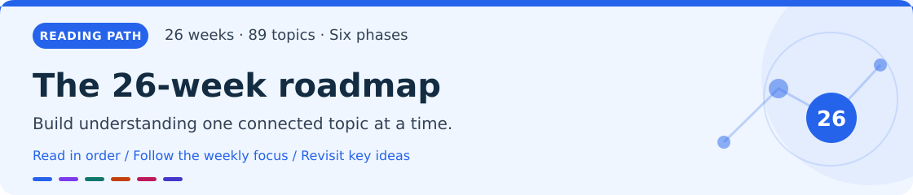
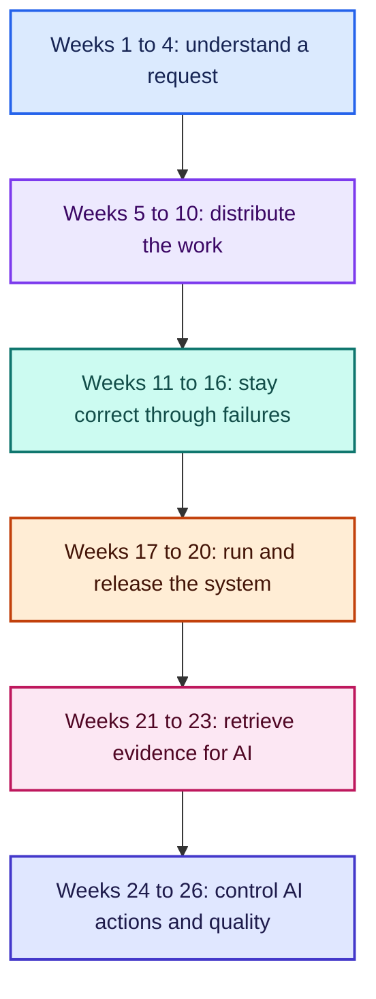

# The 26-week reading roadmap

[Home](README.md) · [Glossary](glossary.md) · [Start chapter 1 →](chapters/01-foundations.md)

> [!TIP]
> **Read an idea. Follow its data flow. Explain the production trade-off. Demonstrate one failure.**

This schedule covers all 89 lessons once. It assigns topics to individual weeks; the original curriculum assigned weeks only to phases. Use the numbered chapter contents to find each lesson.

Each stage builds on the previous one. Study later topics early when your project needs them, while keeping the correctness and access rules of your system explicit.

## What you will learn

System design means deciding how components cooperate to meet a product's requirements under load, change, and failure. Start with user behavior and business invariants, estimate demand, choose boundaries and storage, then prove the system behaves correctly. Technology names alone do not justify a design.

| Phase | Weeks | Topics | Learning outcome |
|---|---:|---:|---|
| [Foundations](chapters/01-foundations.md) | 1–4 | 1–13 | Explain a request from network to durable storage. |
| [Core system design](chapters/02-core-system-design.md) | 5–10 | 14–34 | Scale reads and asynchronous work while preserving business correctness. |
| [Reliability, security, and component design](chapters/03-reliability-security-and-lld.md) | 11–16 | 35–51 | Diagnose failures, recover data, protect tenants, and implement maintainable components. |
| [Cloud and infrastructure](chapters/04-cloud-and-infrastructure.md) | 17–20 | 52–63 | Package, provision, release, and operate an application and its data pipelines. |
| [AI fundamentals and RAG](chapters/05-ai-fundamentals-and-rag.md) | 21–23 | 64–74 | Build permission-aware retrieval and measure answer quality, latency, and cost. |
| [Agents and AI production systems](chapters/06-agents-and-ai-production.md) | 24–26 | 75–89 | Control tool execution and design evaluated AI products. |

This is a guided foundation and portfolio plan. The site's 7–8 hours per week is suitable for a focused first pass with small prototypes. Doing every lab deeply may require extra time or repeating weeks. In the final week, implement one AI capstone and write design reviews for the other four rather than trying to ship five complete products.

## Before week 1

Assume you can write a small application in one language, use Git, run commands locally, and write basic SQL. If those are new, first build a CRUD API and learn functions, asynchronous execution, SQL joins, and command-line debugging. The site's linked [12-week mental-model plan](https://system-design-12-week.vercel.app/) can supply theoretical background as needed; it need not be an extra mandatory 12-week stage.

Choose one backend stack you already know. A practical lab setup is a single application, PostgreSQL, a Redis cache when needed, one queue/log implementation when needed, and an object-store interface or local substitute. Run locally first. Study alternative tools to understand trade-offs, but do not implement every named database, cloud, mesh, and AI framework. Managed services can replace local components later without changing the fundamental learning goals.

From the beginning, keep a working minimum of authentication, object authorization, validation, request logging, backups of important data, and secret hygiene. Weeks 11–20 deepen those practices. The website's optional phase labels are learning choices, not permission to omit production essentials.

## One project connects the course

Build **ShopStream**, an illustrative multi-tenant marketplace. Buyers browse products and place orders; merchants manage stock; workers deliver notifications; a support assistant answers questions from authorized policies and order data. Add small feed, chat, and short-link exercises alongside it. The project is a teaching architecture, not a claim about the stack of Amazon, Instagram, WhatsApp, or another company.

Start with modules inside one deployable application. Add a cache after measuring repeat reads, a worker after identifying background work, and service boundaries when independent scaling or ownership justifies them. Keep a diagram showing clients, ingress, application modules, database, cache, object store, queue, workers, and later retrieval/model services.

Maintain four invariants throughout: stock never becomes negative; retries do not create duplicate charges; one tenant cannot access another's private data; every accepted durable operation is recoverable or has an explicit documented failure outcome. Feed freshness, approximate presence, and analytics can use weaker consistency where the product permits it.

## The weekly schedule

Topic numbers refer to the linked phase chapters. Completion evidence should include a diagram or sequence, a working small example, observed behavior under failure, and a short trade-off note. Numerical targets below are teaching targets to test locally, not claims about production capacity.

### Weeks 1–4 · Foundations

**Phase 1** · [Read this chapter →](chapters/01-foundations.md)

| Week | Study | Deliverable and completion evidence |
|---:|---|---|
| 1 | Networking; HTTP versions; DNS/CDN; WebSockets/SSE; API styles. Topics 1–5. | Trace a request from DNS through TLS to an API. Implement a resource endpoint and resumable order-status stream. Explain why REST, GraphQL, or gRPC suits its client. |
| 2 | SQL, transactions, normalization, indexes. Topics 6, 9–10. | Create orders and inventory with constraints. Race requests for the last item; confirm one reservation. Compare a slow query's plan before and after indexing. |
| 3 | NoSQL and CAP. Topics 7–8. | Model catalogue and activity access patterns. Design behavior during a two-region partition; state which operations become unavailable or stale and why. |
| 4 | Processes, threads, memory, I/O, storage. Topics 11–13. | Move CPU-heavy work off request handling. Stream a large upload with bounded memory and demonstrate persistence after restart. |

### Weeks 5–10 · Core system design

**Phase 2** · [Read this chapter →](chapters/02-core-system-design.md)

| Week | Study | Deliverable and completion evidence |
|---:|---|---|
| 5 | Scaling, load balancing, cache, CDN. Topics 14–17. | Run two API instances, cache catalogue reads, version image URLs, and measure p95 latency. Kill an instance and flush the cache during load. |
| 6 | Shards, replicas, consistent hashing, replication. Topics 18–21. | Demonstrate lag and read-after-write behavior. Compare key movement when adding a node. Design hot-tenant handling and a shard migration sequence. |
| 7 | Consensus, distributed transactions, clocks. Topics 22–24. | Simulate a majority election and minority partition. Build a recoverable checkout saga and crash between steps. Explain causal versus timestamp order. |
| 8 | Queues, events, idempotency, stream processing. Topics 25–28. | Commit an order and outbox row atomically. Redeliver events without duplicate business effects. Produce a time-windowed sales aggregate with a late-event policy. |
| 9 | Estimation, components, microservices, URL shortener. Topics 29–32. | Write a capacity worksheet and component sequence. Build a short-link service with collision handling, expiry, caching, and a hot-link load test. |
| 10 | Feed and messaging design. Topics 33–34. | Prototype chronological fan-out and reconnectable chat. Verify deletion/visibility rules, offline message recovery, and meaningful delivery states. |

### Weeks 11–16 · Reliability, security, and component design

**Phase 3** · [Read this chapter →](chapters/03-reliability-security-and-lld.md)

| Week | Study | Deliverable and completion evidence |
|---:|---|---|
| 11 | Circuit breakers, bulkheads, retries, service objectives. Topics 35–37. | Slow a payment stub without exhausting all request capacity. Set deadlines and retry budgets. Define a success SLI and error budget. |
| 12 | Fault injection and disaster recovery. Topics 38–39. | Run a controlled failure experiment locally. Restore a backup into a clean environment and measure achieved recovery time and possible data loss. |
| 13 | Traces, metrics, logs, rate limiting. Topics 40–43. | Follow one checkout across components. Build an actionable alert and a tenant-scoped limiter. Diagnose an injected slow query without reading private payloads. |
| 14 | Authentication, zero trust, API security, encryption. Topics 44–47. | Threat-model checkout and document access. Test token validation, cross-tenant IDs, least privilege, and key/secret rotation. Prove denial at the data/action boundary. |
| 15 | SOLID and design patterns. Topics 48–49. | Separate checkout policy, payment provider, storage, and clock dependencies. Add an alternative implementation without copying business rules. |
| 16 | Parking/elevator and limiter/cache component design. Topics 50–51. | Write state machines, invariants, and concurrency behavior. Implement one small component and verify boundary cases and resource limits. |

### Weeks 17–20 · Cloud and infrastructure

**Phase 4** · [Read this chapter →](chapters/04-cloud-and-infrastructure.md)

| Week | Study | Deliverable and completion evidence |
|---:|---|---|
| 17 | Cloud foundations, containers, orchestration, serverless. Topics 52–54. | Package the app and document network/storage/IAM boundaries. Compare container and function execution for one real workload. Kubernetes can remain a local learning exercise. |
| 18 | Infrastructure as Code and service mesh. Topics 55–56. | Recreate an isolated environment from declarative configuration. Review a plan and protect state. Explain what a mesh adds and whether the project needs it. |
| 19 | Warehouses, lakes, objects, time-series storage. Topics 57–60. | Export orders into a separate analytical dataset. Compare row/column/object/time-series access patterns and validate event timestamps and retention. |
| 20 | CI/CD, safe deployment, feature flags. Topics 61–63. | Build one immutable artifact, run useful checks, and rehearse a canary with rollback. Add a flag and perform an expand/backfill/contract schema change. |

### Weeks 21–23 · AI fundamentals and RAG

**Phase 5** · [Read this chapter →](chapters/05-ai-fundamentals-and-rag.md)

| Week | Study | Deliverable and completion evidence |
|---:|---|---|
| 21 | Transformers, inference, context/KV cache, serving, prompts. Topics 64–68. | Trace a model request, separate time-to-first-token from generation time, and compare prompt lengths and concurrency. Evaluate a structured-output task on fixed examples. |
| 22 | Vector search, embeddings, chunking, hybrid retrieval. Topics 69–72. | Ingest a small policy collection with tenant/version metadata. Compare chunking and lexical/vector search using labeled questions; reject unauthorized documents before context assembly. |
| 23 | RAG evaluation and advanced retrieval. Topics 73–74. | Create a held-out question set with answerable, unanswerable, stale, and permission-denied cases. Measure retrieval recall, supported claims, usefulness, latency, and cost. |

### Weeks 24–26 · Agents and AI production systems

**Phase 6** · [Read this chapter →](chapters/06-agents-and-ai-production.md)

| Week | Study | Deliverable and completion evidence |
|---:|---|---|
| 24 | Agents, frameworks, multiple agents, MCP, memory. Topics 75–79. | Build a bounded read-only support agent with one typed tool. Enforce identity and budgets outside the model. Compare a deterministic workflow with an agent loop. |
| 25 | Fine-tuning/RAG choice, gateway, guardrails, observability, cost. Topics 80–84. | Add quotas, capability-aware fallback, redaction, prompt/model versions, and cost per successful task. Test prompt injection and interrupted streams. Justify any training requirement. |
| 26 | Chatbot, recommendations, code assistant, document Q&A, ML platform. Topics 85–89. | Implement one capstone—document Q&A naturally extends this project. Write a one-page architecture and evaluation plan for each other design. Demonstrate isolation, recovery, and measurable quality. |

## How to spend eight hours each week

Use roughly two hours for explanations and primary-source reading, three for the small build, one for load/failure testing, one for diagrams and trade-offs, and one for reviewing earlier material. If a lab exceeds that budget, preserve its correctness and verification goals and continue it the following week. A full production rollout of each technology is outside a weekly prototype's scope.

For each topic, answer five questions: what problem does it solve; what happens on the request or data path; when does it help; what can fail; how would I demonstrate its behavior? Record evidence in a learning log instead of ticking a topic after watching a video.

## Milestones to review before moving on

**After week 4:** you can explain a network request, a transaction, a query plan, and persistent storage. Your baseline API has correct validation and inventory behavior.

**After week 10:** the system tolerates repeated requests and worker restarts, scales catalogue reads, and makes read-after-write behavior explicit. You can estimate demand and explain feed/chat consistency.

**After week 16:** you can diagnose a failure from telemetry, restore data, isolate a slow dependency, and prove tenant authorization. Component designs expose invariants and concurrency rules.

**After week 20:** an environment and release can be reproduced, promoted, and rolled back with compatible data schemas. Analytical workloads do not compete unnecessarily with checkout.

**After week 26:** the AI capstone retrieves authorized evidence, abstains appropriately, bounds tool execution and cost, and passes an evaluation set. You can explain why each component exists and what the user experiences when it fails.

## What to keep in your portfolio

Keep an architecture diagram; API and data contracts; a capacity worksheet; failure assumptions; consistency choices; an SLI/SLO definition; a security and tenant-isolation design; a recovery runbook; a release/rollback procedure; and, for AI, versioned datasets and evaluation results. Include one short decision record for each major technology explaining the measured problem, alternatives, trade-off, and reason to revisit the choice.

Start with week 1 and the baseline API. Add infrastructure as the measured workload and required failure behavior justify it.

[Home](README.md) · [Glossary](glossary.md) · [Start chapter 1 →](chapters/01-foundations.md)
